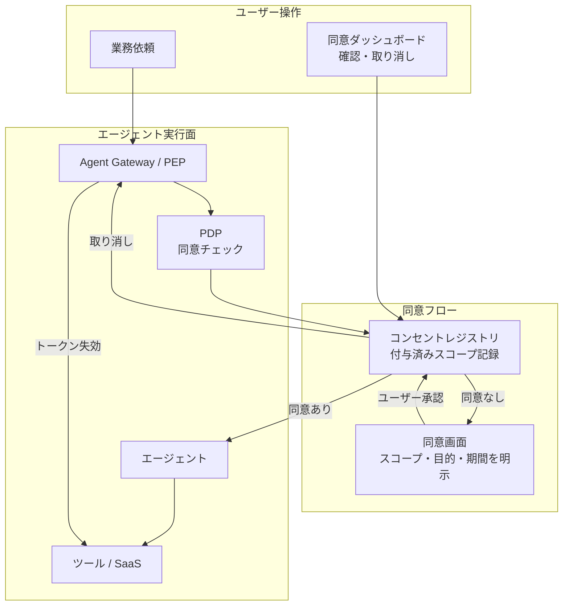

# ID-8 Consent & Access Transparency（同意・透明化）

## 概要

エージェントがユーザーの代理でSaaSやデータにアクセスするとき、ユーザー自身がそのアクセス権の内容を把握し、同意し、いつでも取り消せる仕組みを設ける。付与済みスコープ・アクセス対象システム・有効期限の一覧と取り消し操作を提供するダッシュボードが中核であり、アクセスはユーザーに可視化されていなければならない。

## 設計

エージェントが初めてユーザーの代理でリソースにアクセスする際、IdP の同意画面または内部ポータルでスコープ・目的・有効期間を明示してユーザーの同意を取得する。同意後はコンセントレジストリに記録する。ユーザーはダッシュボードで付与済み同意の一覧を確認でき、任意の同意を取り消すと即時にトークンを失効させる。

同意は一度取れば永続ではなく、目的ごと・スコープごとに個別管理する。「契約書レビュー業務のためのBox読み取り」と「顧客フォローアップのためのSalesforce書き込み」は別個の同意エントリとして記録する。

## 解決する企業課題

「エージェントが自分のIDで勝手に何でもできる状態になっている」という不信は、エージェント採用の大きな障壁になる。特に委譲スコープが目に見えない場合、ユーザーは使用を控えるか IT 部門が全エージェントを止める判断をする。また GDPR・各国プライバシー法では、個人データへのアクセスに対するユーザー同意と取り消し権を要求するケースがある。コンセント管理の実装はコンプライアンス上の要件でもある。

## 向き／不向き

| 向き | 不向き |
|---|---|
| 従業員自身のデータ（メール/カレンダー/ドキュメント）にエージェントがアクセスする | エージェントがシステムデータのみを扱い個人のデータに触れない場合 |
| プライバシー規制（GDPR/APPI等）でユーザー同意と取り消し権が求められる | 完全に内部バッチ処理で人間の操作起点がない自律ジョブ（[ID-3](id3-workload-agent-identity.md) が適する） |
| ユーザーが付与スコープを認識することで信頼醸成を図りたい | PoC で同意フローを実装する工数が取れない初期段階 |

## 要素技術・既存システム連携

- **IdP 同意画面**：Okta Consent、Entra ID Admin Consent / User Consent
- **OAuth 2.0 スコープ管理**：スコープの細粒度定義と取り消し（RFC 7009 Token Revocation）
- **内部コンセントポータル**：付与済みスコープ一覧・取り消し操作を提供する社内ダッシュボード
- **コンセントレジストリ**：DB またはポリシーストアに同意エントリ（subject・scope・purpose・expiry）を記録
- **監査連携**：[OB-2 統一監査・系譜](../ob-observability/ob2-unified-audit-lineage.md) に同意取得・取り消しイベントを記録

## 落とし穴／選定の勘所

!!! warning "一度の同意でスコープが永続化するスコープクリープ"
    初回同意時に「将来の業務拡張のため広めに取っておく」設計は、時間とともにエージェントが必要以上の権限を持ち続ける原因になる。同意は目的・期間を限定し、期限切れ後は再同意を要求する。

!!! warning "取り消しが即時に反映されない実装"
    ユーザーがダッシュボードで取り消しを操作しても、キャッシュされたトークンが有効期限まで使い続けられる実装は同意制御として機能しない。取り消しはトークン失効（Revocation）と結合し、Gateway・ツール呼び出し時に同意状態を再検証する。

- 同意画面を「全部許可」の確認ボタン1つにすると意味をなさない。スコープを個別に選択可能にし、各スコープにユーザーが理解できる説明文を添える。
- 同意ログ自体も改ざん不能な形で保管し、監査・コンプライアンス調査で利用できるようにする。

## 関連パターン

- [ID-2 Identity Federation & OBO](id2-identity-federation-obo.md) — 同意に基づく委譲トークン発行の基盤
- [ID-4 Permission Mirror & Least-of](id4-permission-mirror-least-of.md) — 委譲スコープの最小化と整合
- [KM-4 Scoped Memory Hierarchy](../km-knowledge/km4-scoped-memory-hierarchy.md) — 同意スコープとメモリアクセス範囲の整合
- [OB-2 統一監査・系譜](../ob-observability/ob2-unified-audit-lineage.md) — 同意取得・取り消しイベントの監査記録
