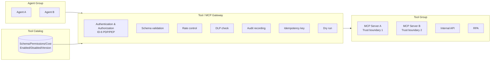

# IN-1 Enterprise Tool / MCP Gateway

## Overview

When agents directly call Salesforce APIs or internal REST APIs, API keys become scattered and authorization and logging become fragmented. In this pattern, all tool calls are centralized through a company-managed Tool Gateway, handling authentication, authorization, schema validation, rate control, DLP, auditing, and idempotency checks in one place. Even as MCP servers multiply, the Gateway maintains governance. This is, in effect, the Enterprise Service Bus of the AI era.

## Enterprise Problem Addressed

When agents directly call SaaS, authentication credential management becomes distributed across each agent, increasing API key leak risks. With authorization differing per tool, it becomes impossible to know which agent is calling which API with what permissions, making security auditing and incident investigation difficult.

The proliferation of MCP (Model Context Protocol) has caused an explosive increase in the types of tools agents can call. When MCP servers proliferate with uncontrolled connections, trust boundary management collapses. Prompt injection attacks where agents are manipulated into calling unintended tools have no defense mechanism in direct tool connection configurations. Excessive permissions (broader API scope than needed), audit inconsistencies across SaaS (records only remaining for some SaaS calls) — all these are comprehensively solved by "making all calls go through the Gateway."

!!! tip "Minimum Viable Configuration (MVP)"
    Place one MCP server behind an existing API Gateway (Kong/Envoy, etc.) and centralize authentication checks and call log recording at the Gateway. Tool catalogs and dry-run functionality can be added later.

## Value Hypothesis

Standardizing tool connections reduces the cost of adding new SaaS integrations and improves deployment speed. Increasing tools available to agents directly translates to expanding the scope of automatable business operations.

## Solution and Design

Manage a tool catalog (schema, permissions, cost) and control enabling/disabling/versioning in operations. Bundle MCP server groups isolated by trust boundary. Centrally apply authentication, authorization, schema validation, rate control, DLP, auditing, idempotency, and dry-runs at the Gateway.



The tool catalog defines schemas in JSON Schema, managing the list of tools agents can call, input specifications, required permissions, and estimated costs. The Gateway validates the request's schema conformance and evaluates authorization with [ID-6 PDP/PEP](../id-identity/id6-zero-trust-pdp-pep.md). Only passing requests are forwarded to backend tools. API keys and credentials are not passed to agents; Secret Manager holds them on the Gateway side.

## When to Use / When Not to Use

| When to Use | When Not to Use |
|---|---|
| Many tool integrations; multiple agents using common tools | Single LLM chat without tool use |
| Environments with multiple MCP servers | PoC with only one tool |
| Tool calls requiring auditing and authorization | Fully isolated experimental environments |

## Component Technologies and System Integration

- **Gateway**: MCP Gateway, API Gateway
- **Catalog**: Tool Registry (schema definition in JSON Schema)
- **Authorization**: [ID-6 Zero-Trust PDP/PEP](../id-identity/id6-zero-trust-pdp-pep.md)
- **Secret management**: Secret Manager (not passing API keys to agents)
- **DLP**: [KM-6 DLP & Redaction Boundary](../km-knowledge/km6-dlp-redaction-boundary.md)
- **Idempotency**: Idempotency Key (preventing double execution)

## Pitfalls and Selection Criteria

!!! danger "Confusing 'can connect' with 'permitted to connect'"
    The biggest pitfall is prioritizing "can connect" while lacking governance of "permitted to connect." Tool enabling should go through review with authorization enforced at the Gateway. "Enable all tools for development progress" does not work in production.

- Separate MCP servers by trust boundary. Do not run internal and customer-facing in the same process. Always route communication crossing trust boundaries through the Gateway.
- Enable dry-run functionality to preview execution results without side effects, supporting verification of high-risk operations. Incorporating a dry-run as a human approval step before production execution is also an effective operation.
- Prevent unintended behavior changes from tool schema changes with tool version management ([GV-6](../gv-governance/gv6-version-registry.md)). Tool schema changes affect all agents, so either maintain backward compatibility or migrate gradually.

## Interfaces

The following are the key interfaces for implementing this pattern. Coding agents can generate stub code from these definitions.

```yaml
interfaces:
  - name: Tool Catalog
    description: "JSON Schema-based registry managing schema, required permissions, estimated cost, version, and enabled/disabled state for each tool."
    input:
      request: object
    output:
      response: object
    errors:
      - code: GENERAL_ERROR
        description: "Error occurred during Tool Catalog processing"
    protocol: "REST / gRPC"
    implementation_hints:
      - "See the Solution and Design section for details"
    code_examples:
      typescript: |
        interface ToolCatalogRequest {
          toolId: string;
          version: string;
        }
        interface ToolCatalogResponse {
          schema: object;
          requiredPermissions: string[];
          estimatedCost: number;
          enabled: boolean;
        }
        interface ToolCatalog {
          toolCatalog(req: ToolCatalogRequest): Promise<ToolCatalogResponse>;
        }
      python: |
        @dataclass
        class ToolCatalogRequest:
            tool_id: str
            version: str
        
        @dataclass
        class ToolCatalogResponse:
            schema: dict
            required_permissions: list[str]
            estimated_cost: float
            enabled: bool
        
        class ToolCatalog(Protocol):
            async def tool_catalog(self, req: ToolCatalogRequest) -> ToolCatalogResponse: ...
  - name: Auth / Authz Layer (ID-6 PDP/PEP)
    description: "Validates agent identity and evaluates per-tool authorization policy before forwarding the request; credentials are held in Secret Manager not passed to agents."
    input:
      request: object
    output:
      response: object
    errors:
      - code: GENERAL_ERROR
        description: "Error occurred during Auth / Authz Layer (ID-6 PDP/PEP) processing"
    protocol: "REST / gRPC"
    implementation_hints:
      - "See the Solution and Design section for details"
    code_examples:
      typescript: |
        interface AuthAuthzLayerRequest {
          agentId: string;
          toolId: string;
          oboToken: string;
        }
        interface AuthAuthzLayerResponse {
          authorized: boolean;
          forwardHeaders: object;
          reason: string;
        }
        interface AuthAuthzLayer {
          authAuthzLayer(req: AuthAuthzLayerRequest): Promise<AuthAuthzLayerResponse>;
        }
      python: |
        @dataclass
        class AuthAuthzLayerRequest:
            agent_id: str
            tool_id: str
            obo_token: str
        
        @dataclass
        class AuthAuthzLayerResponse:
            authorized: bool
            forward_headers: dict
            reason: str
        
        class AuthAuthzLayer(Protocol):
            async def auth_authz_layer(self, req: AuthAuthzLayerRequest) -> AuthAuthzLayerResponse: ...
  - name: Audit Recorder
    description: "Records every tool invocation with its input, output, actor, agent ID, and correlation ID for cross-system tracing."
    input:
      request: object
    output:
      response: object
    errors:
      - code: GENERAL_ERROR
        description: "Error occurred during Audit Recorder processing"
    protocol: "REST / gRPC"
    implementation_hints:
      - "See the Solution and Design section for details"
    code_examples:
      typescript: |
        interface AuditRecorderRequest {
          actorId: string;
          agentId: string;
          correlationId: string;
          action: string;
          resource: string;
        }
        interface AuditRecorderResponse {
          auditId: string;
          recordedAt: Date;
        }
        interface AuditRecorder {
          auditRecorder(req: AuditRecorderRequest): Promise<AuditRecorderResponse>;
        }
      python: |
        @dataclass
        class AuditRecorderRequest:
            actor_id: str
            agent_id: str
            correlation_id: str
            action: str
            resource: str
        
        @dataclass
        class AuditRecorderResponse:
            audit_id: str
            recorded_at: datetime
        
        class AuditRecorder(Protocol):
            async def audit_recorder(self, req: AuditRecorderRequest) -> AuditRecorderResponse: ...
```

## Related Patterns

- [IN-2 SaaS Connector Adapter](in2-saas-connector-adapter.md) — Complementary: adapter layer under the Gateway absorbing each SaaS-specific differences
- [IN-3 Rate / Quota Broker](in3-rate-quota-broker.md) — Complementary: centralized arbitration of SaaS API rate limits within or downstream of the Gateway
- [ID-6 Zero-Trust PDP/PEP](../id-identity/id6-zero-trust-pdp-pep.md) — Complementary: zero-trust evaluation of tool call authorization
- [ID-5 JIT Scoped Credentials](../id-identity/id5-jit-scoped-credentials.md) — Complementary: issuance of short-lived, scope-limited credentials for tools
- [GV-1 Agent Control Plane](../gv-governance/gv1-agent-control-plane.md) — Complementary: overall agent governance infrastructure including the tool catalog
