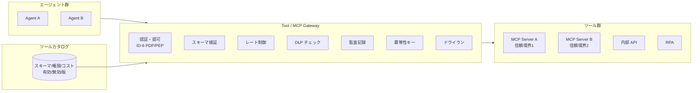

# IN-1 Enterprise Tool / MCP Gateway

## 概要

エージェントが SaaS / 内部 API / MCP / DB / RPA を直接呼ばず、企業管理の Gateway 経由で呼ぶ。AI 時代の Enterprise Service Bus に近い役割を担う。ツール呼び出しの認証・認可・スキーマ検証・レート制御・DLP・監査・冪等性・ドライランを一元適用する。

## 設計

ツールカタログ（スキーマ・権限・コスト）を管理し、有効化/無効化/版を運用制御する。MCP サーバ群を信頼境界ごとに分離して束ねる。

## 解決する企業課題

MCP/ツールの野良接続、API キー漏洩、過剰権限、SaaS ごとの監査差、プロンプトインジェクションによるツール悪用。これらを Gateway で一元的に防ぐ。

## 向き／不向き

| 向き | 不向き |
|---|---|
| ツール連携が多い・複数エージェントが共通ツールを使う | 単一 LLM チャットでツール不使用 |
| MCP サーバが複数存在する環境 | ツールが1つだけの PoC |
| 監査・認可が求められるツール呼び出し | 完全閉域の実験環境 |

## 要素技術・既存システム連携

- **Gateway**：MCP Gateway、API Gateway
- **カタログ**：Tool Registry（JSON Schema でスキーマ定義）
- **認可**：[ID-6 Zero-Trust PDP/PEP](../id-identity/id6-zero-trust-pdp-pep.md)
- **秘密管理**：Secret Manager（API キーをエージェントに渡さない）
- **DLP**：[KM-6 DLP & Redaction Boundary](../km-knowledge/km6-dlp-redaction-boundary.md)
- **冪等性**：Idempotency Key（二重実行防止）

## 落とし穴／選定の勘所

!!! danger "「接続できること」と「接続してよいこと」の混同"
    「接続できること」を優先し「接続してよいこと」の統制を欠くのが最大の落とし穴。ツールの有効化は審査を経て、認可を Gateway で強制する。

- MCP サーバは信頼境界ごとに分離する。社内用と顧客面用を同一プロセスで動かさない。
- ドライラン機能で副作用なしに実行結果をプレビューできるようにし、高リスク操作の検証を支援する。
- ツールの版管理（[GV-6](../gv-governance/gv6-version-registry.md)）で、ツールスキーマの変更による意図しない動作変化を防ぐ。

## 関連パターン

- [IN-2 SaaS Connector Adapter](in2-saas-connector-adapter.md) — Gateway 配下の SaaS 差吸収
- [IN-3 Rate / Quota Broker](in3-rate-quota-broker.md) — SaaS API レート制限の調停
- [ID-6 Zero-Trust PDP/PEP](../id-identity/id6-zero-trust-pdp-pep.md) — ツール呼び出しの認可
- [ID-5 JIT Scoped Credentials](../id-identity/id5-jit-scoped-credentials.md) — ツール用の短命資格情報
- [GV-1 Agent Control Plane](../gv-governance/gv1-agent-control-plane.md) — ツールカタログの統制
