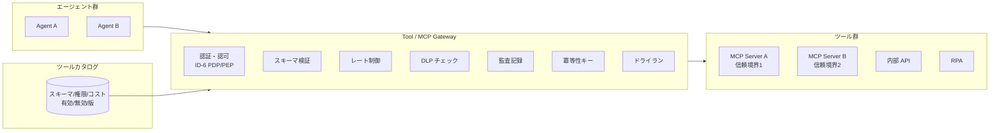

# IN-1 Enterprise Tool / MCP Gateway

## 概要

エージェントが SaaS / 内部 API / MCP / DB / RPA を直接呼ばず、企業管理の Gateway 経由で呼ぶ。AI 時代の Enterprise Service Bus に近い役割を担い、ツール呼び出しの認証・認可・スキーマ検証・レート制御・DLP・監査・冪等性・ドライランを一元適用する。

## 解決する企業課題

エージェントが SaaS を直接呼ぶと、認証情報の管理が各エージェントに分散し、API キーの漏洩リスクが高まる。加えて、ツールごとに認可が異なる状況では、どのエージェントが何の権限でどの API を呼んでいるかを把握できず、セキュリティ監査も障害調査も困難になる。

MCP（Model Context Protocol）の普及により、エージェントが呼び出せるツールの種類が爆発的に増えた。MCP サーバが野良接続で増殖すると、信頼境界の管理が崩れる。プロンプトインジェクションによってエージェントが意図しないツールを呼び出す攻撃も、ツール直接接続の状況では防ぐ手段がない。過剰権限（必要以上に広い API スコープ）、SaaS ごとの監査差（一部 SaaS の呼び出しだけ記録が残る）——これらを「すべての呼び出しを Gateway 経由にする」という構造で一括解決する。

## 解決策と設計

ツールカタログ（スキーマ・権限・コスト）を管理し、有効化/無効化/版を運用制御する。MCP サーバ群を信頼境界ごとに分離して束ねる。認証・認可・スキーマ検証・レート制御・DLP・監査・冪等性・ドライランをすべて Gateway で一元適用する。

ツールカタログは JSON Schema でスキーマを定義し、エージェントが呼び出せるツールの一覧・入力仕様・必要権限・推定コストを管理する。Gateway はリクエストのスキーマ適合性を検証し、[ID-6 PDP/PEP](../id-identity/id6-zero-trust-pdp-pep.md) で認可を評価し、通過したリクエストのみをバックエンドのツールに転送する。API キーや認証情報はエージェントには渡さず、Secret Manager が Gateway 側で保持する。

## 向き／不向き

| 向き | 不向き |
|---|---|
| ツール連携が多い・複数エージェントが共通ツールを使う | 単一 LLM チャットでツール不使用 |
| MCP サーバが複数存在する環境 | ツールが1つだけの PoC |
| 監査・認可が求められるツール呼び出し | 完全閉域の実験環境 |

## 要素技術・既存システム連携

- **Gateway**：MCP Gateway、API Gateway
- **カタログ**：Tool Registry（JSON Schema でスキーマ定義）
- **認可**：[ID-6 Zero-Trust PDP/PEP](../id-identity/id6-zero-trust-pdp-pep.md)
- **秘密管理**：Secret Manager（API キーをエージェントに渡さない）
- **DLP**：[KM-6 DLP & Redaction Boundary](../km-knowledge/km6-dlp-redaction-boundary.md)
- **冪等性**：Idempotency Key（二重実行防止）

## 落とし穴／選定の勘所

!!! danger "「接続できること」と「接続してよいこと」の混同"
    「接続できること」を優先し「接続してよいこと」の統制を欠くのが最大の落とし穴である。ツールの有効化は審査を経て、認可を Gateway で強制する。「とりあえず全ツールを有効化して開発を進める」は本番環境では通用しない。

- MCP サーバは信頼境界ごとに分離する。社内用と顧客面用を同一プロセスで動かさない。信頼境界をまたぐ通信は Gateway を必ず経由させる。
- ドライラン機能で副作用なしに実行結果をプレビューできるようにし、高リスク操作の検証を支援する。本番実行の前にドライランを人間承認ステップとして挟む運用も有効である。
- ツールの版管理（[GV-6](../gv-governance/gv6-version-registry.md)）で、ツールスキーマの変更による意図しない動作変化を防ぐ。ツールスキーマの変更は全エージェントに影響するため、後方互換性を保つか段階的に移行する。

## 関連パターン

- [IN-2 SaaS Connector Adapter](in2-saas-connector-adapter.md) — 補完：Gateway 配下の各 SaaS 固有差を吸収するアダプタ層
- [IN-3 Rate / Quota Broker](in3-rate-quota-broker.md) — 補完：Gateway 内または Gateway 後段での SaaS API レート制限の集中調停
- [ID-6 Zero-Trust PDP/PEP](../id-identity/id6-zero-trust-pdp-pep.md) — 補完：ツール呼び出しの認可をゼロトラストで評価する
- [ID-5 JIT Scoped Credentials](../id-identity/id5-jit-scoped-credentials.md) — 補完：ツール用の短命・スコープ限定資格情報の発行
- [GV-1 Agent Control Plane](../gv-governance/gv1-agent-control-plane.md) — 補完：ツールカタログを含むエージェント全体の統制基盤
