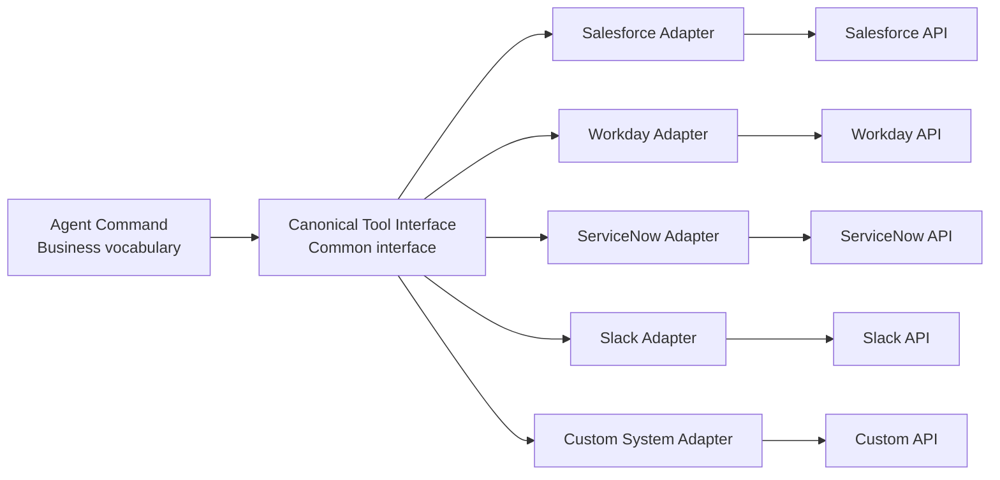

# IN-2 SaaS Connector Adapter (Anti-Corruption Layer)

## Overview

Salesforce uses REST, Workday uses SOAP, ServiceNow uses Table API — when SaaS-specific differences seep into prompts and logic, maintenance becomes a nightmare. This pattern confines SaaS-specific differences in adapters and exposes only business vocabulary like `get_customer` and `create_ticket` to agents — an Anti-Corruption Layer. Even when SaaS is replaced, the impact is contained within the adapter.

## Enterprise Problem Addressed

Building agent systems that span multiple SaaS creates "maintenance hell" where each SaaS's proprietary specifications seep into prompts and orchestration logic. Salesforce's REST API, Workday's SOAP, ServiceNow's Table API — each has different authentication methods, rate limits, error codes, and pagination specifications. When these differences are exposed upstream, SaaS specification changes propagate as prompt and logic modifications.

When SaaS replacement or addition (e.g., migrating from ServiceNow to Jira Service Management) becomes necessary without an adapter layer, the impact scope extends to all agents and prompts. The Anti-Corruption Layer contains this change impact within the adapter. By absorbing authentication method differences (OAuth 2.0 / API Key / SAML) as well, the upstream can focus on business logic.

!!! tip "Minimum Viable Configuration (MVP)"
    For the most frequently used SaaS, create one adapter with three primary operations (e.g., get / create / update) defined in a common interface. Prioritize "removing SaaS-specific vocabulary from prompts" over comprehensive coverage of the common model.

## Value Hypothesis

Absorbing SaaS-specific API differences and expanding agent business coverage at low cost. As the number of connected SaaS platforms increases, the value of cross-system business automation grows non-linearly.

## Solution and Design

Agent commands are written in business vocabulary, and SaaS Adapters convert to each SaaS's proprietary specifications. Skills/prompts are written in business vocabulary, localizing the impact of SaaS replacement.

Each adapter encapsulates the target SaaS's authentication, pagination, rate limits, and error format. The common interface is defined in business vocabulary (e.g., `get_customer`, `create_ticket`, `update_opportunity`), with adapters resolving differences between SaaS internal concepts (e.g., Salesforce Account ID vs. Workday Worker ID). Error normalization (converting each SaaS's error codes to a common error type) is also handled by adapters.

## When to Use / When Not to Use

| When to Use | When Not to Use |
|---|---|
| Spanning multiple SaaS with potential for future replacement | Deeply dependent on a single SaaS with no need for replacement |
| Operating multiple SaaS with the same business vocabulary | When fully utilizing SaaS-specific functionality |
| Keeping agent prompts SaaS-independent | When adapter layer overhead is not acceptable |

## Component Technologies and System Integration

- **Design patterns**: Adapter Pattern, Anti-Corruption Layer
- **API standards**: OpenAPI, GraphQL Federation
- **SDK**: Connector SDK (per SaaS)
- **Error normalization**: Error Normalization (common format conversion of SaaS-specific errors)
- **Rate control**: Rate Limit Handler (absorbing SaaS-specific limits)
- **Target SaaS**: Salesforce, Workday, ServiceNow, Slack, Google Workspace

## Pitfalls and Selection Criteria

!!! warning "Over-engineering the common model"
    Over-engineering the common model causes divergence from reality. Translate thinly and only as needed, allowing passthrough for cases where SaaS-specific functionality is needed. Start with "standardizing three primary operations" and avoid excessive abstraction.

- Coarse authorization granularity in adapters breaks permission fidelity ([ID-4](../id-identity/id4-permission-mirror-least-of.md)). Running adapters with a single all-powerful service account causes access with full permissions regardless of which agent user is involved. Design to faithfully propagate the SaaS permission model.
- Absorb SaaS API version upgrades in the adapter without impacting upstream agents. Maintain version management in the adapter and complete migration from old to new APIs within the adapter.
- Test adapters in SaaS sandbox environments to prevent side effects on production APIs.

## Related Patterns

- [IN-1 Tool / MCP Gateway](in1-tool-mcp-gateway.md) — Complementary: governing adapters under the Gateway and centrally applying authentication, authorization, and auditing
- [IN-4 Existing iPaaS Reuse](in4-existing-ipaas-reuse.md) — Similar: approach of reusing existing integration assets (MuleSoft/Workato, etc.) as adapters
- [RT-5 Command Envelope](../rt-runtime/rt5-command-envelope.md) — Complementary: command description in business vocabulary and execution envelope
- [KM-3 Canonical Object](../km-knowledge/km3-canonical-object-knowledge-graph.md) — Complementary: converting each SaaS data to canonical objects
- [ID-2 Identity Federation & OBO](../id-identity/id2-identity-federation-obo.md) — Complementary: propagating OBO tokens through adapters to faithfully pass permissions
