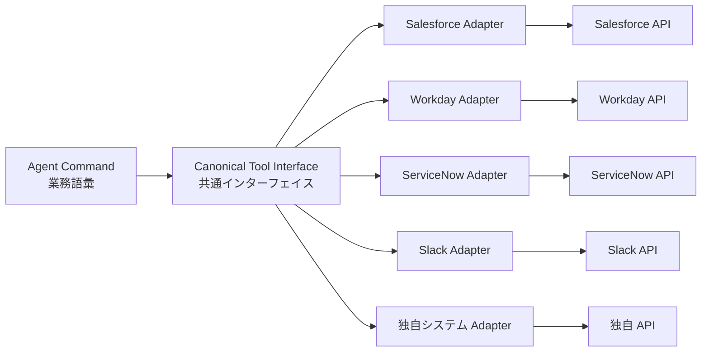

# IN-2 SaaS Connector Adapter（腐敗防止）

## 概要

Salesforce は REST、Workday は SOAP、ServiceNow は Table API——SaaS ごとに API 仕様がバラバラで、その差がプロンプトやロジックに染み出すと保守が地獄になります。このパターンは SaaS 固有の差をアダプタに閉じ込め、エージェントには `get_customer`・`create_ticket` のような業務語彙だけを見せる腐敗防止層（Anti-Corruption Layer）です。SaaS を差し替えても影響はアダプタ内部で完結します。

## 解決する企業課題

複数の SaaS を横断するエージェントシステムを構築すると、各 SaaS の独自仕様がプロンプトやオーケストレーションロジックに染み出す「保守地獄」が生じます。Salesforce の REST API、Workday の SOAP、ServiceNow の Table API——それぞれ認証方式・レート制限・エラーコード・ページネーション仕様が異なります。これらの差異が上流に露出すると、SaaS 仕様変更のたびにプロンプトやロジックへの修正が波及してしまいます。

SaaS の差し替えや追加（例：ServiceNow から Jira Service Management への移行）が必要になったとき、アダプタ層がなければ影響範囲が全エージェント・全プロンプトに及びます。腐敗防止層はこの変更の影響をアダプタ内部に閉じ込める利点があります。認証方式の差異（OAuth 2.0 / API Key / SAML）も吸収するため、上流はビジネスロジックに専念できます。

!!! tip "最小成立条件（MVP）"
    最も利用頻度の高い SaaS 1つに対し、3つの主要操作（例：get / create / update）を共通インターフェイスで定義したアダプタを1本作ります。共通モデルの網羅性より「プロンプトから SaaS 固有語彙を排除する」ことを優先します。

## 価値仮説

SaaS固有のAPI差異を吸収し、エージェントの業務カバー範囲を低コストで拡張します。接続先SaaSが増えるほど、横断的な業務自動化の価値が非線形に増大します。

## 解決策と設計

エージェントのコマンドは業務語彙で記述し、SaaS Adapter が各 SaaS の固有仕様に変換します。スキル/プロンプトは業務語彙で書き、SaaS 差し替え時の影響を局所化します。



各アダプタは対象 SaaS の認証・ページネーション・レート制限・エラー形式をカプセル化します。共通インターフェイスは業務語彙（例：`get_customer`、`create_ticket`、`update_opportunity`）で定義します。Salesforce の Account ID と Workday の Worker ID のような内部概念の差異はアダプタが吸収し、エラー正規化（各 SaaS のエラーコードを共通エラー型に変換）もアダプタの責務となります。

## 向き／不向き

| 向き | 不向き |
|---|---|
| 複数 SaaS 横断・将来差し替えの可能性 | 単一 SaaS に深く依存し差し替え不要 |
| 同じ業務語彙で複数 SaaS を操作 | SaaS 固有機能を全面的に使い切る場合 |
| エージェントのプロンプトを SaaS 非依存に保ちたい | アダプタ層のオーバーヘッドが許容できない場合 |

## 要素技術・既存システム連携

- **設計パターン**：Adapter Pattern、Anti-Corruption Layer
- **API 標準**：OpenAPI、GraphQL Federation
- **SDK**：Connector SDK（各 SaaS 向け）
- **エラー正規化**：Error Normalization（SaaS 固有エラーの共通形式変換）
- **レート制御**：Rate Limit Handler（SaaS 固有の制限吸収）
- **対象 SaaS**：Salesforce、Workday、ServiceNow、Slack、Google Workspace

## 落とし穴／選定の勘所

!!! warning "共通モデルの作り込みすぎ"
    共通モデルを作り込みすぎると実態と乖離します。薄く必要分だけ翻訳し、SaaS 固有の機能が必要な場合はパススルーも許容します。最初は「3つの主要操作を共通化する」程度から始め、過剰な抽象化を避けます。

- アダプタの認可粒度が粗いと権限忠実性（[ID-4](../id-identity/id4-permission-mirror-least-of.md)）が崩れます。万能サービスアカウント1個でアダプタを動かすと、エージェントのユーザーに関係なく全権限でアクセスしてしまいます。SaaS 側の権限モデルを忠実に伝播する設計が必要です。
- SaaS の API バージョンアップをアダプタで吸収し、上流のエージェントに影響を波及させません。アダプタにバージョン管理を持ち、旧 API から新 API への移行はアダプタ内で完結させます。
- アダプタのテストは SaaS の Sandbox 環境で行い、本番 API への副作用を防いでください。

## Interfaces

以下はこのパターンを実装する際の主要インターフェイスです。コーディングエージェントはこの定義からスタブコードを生成できます。

```yaml
interfaces:
  - name: Canonical Tool Interface
    description: "Business-vocabulary API (e.g., get_customer, create_ticket, update_opportunity) that agents use regardless of the underlying SaaS."
    input:
      request: object
    output:
      response: object
    errors:
      - code: GENERAL_ERROR
        description: "Canonical Tool Interface の処理中にエラーが発生"
    protocol: "REST / gRPC"
    implementation_hints:
      - "詳細は本文の「解決策と設計」節を参照"
    code_examples:
      typescript: |
        interface CanonicalToolInterfaceRequest {
          operation: string;
          entityId: string;
          parameters: object;
          oboToken: string;
        }
        interface CanonicalToolInterfaceResponse {
          result: object;
          canonicalType: string;
          sourceSystem: string;
        }
        interface CanonicalToolInterface {
          canonicalToolInterface(req: CanonicalToolInterfaceRequest): Promise<CanonicalToolInterfaceResponse>;
        }
      python: |
        @dataclass
        class CanonicalToolInterfaceRequest:
            operation: str
            entity_id: str
            parameters: dict
            obo_token: str
        
        @dataclass
        class CanonicalToolInterfaceResponse:
            result: dict
            canonical_type: str
            source_system: str
        
        class CanonicalToolInterface(Protocol):
            async def canonical_tool_interface(self, req: CanonicalToolInterfaceRequest) -> CanonicalToolInterfaceResponse: ...
  - name: SaaS-Specific Adapter
    description: "Encapsulates authentication method, pagination, rate limit handling, and error normalization for one SaaS; changes to SaaS API are absorbed here."
    input:
      request: object
    output:
      response: object
    errors:
      - code: GENERAL_ERROR
        description: "SaaS-Specific Adapter の処理中にエラーが発生"
    protocol: "REST / gRPC"
    implementation_hints:
      - "詳細は本文の「解決策と設計」節を参照"
    code_examples:
      typescript: |
        interface SaasSpecificAdapterRequest {
          canonicalOperation: string;
          parameters: object;
          authToken: string;
        }
        interface SaasSpecificAdapterResponse {
          rawResponse: object;
          normalizedResponse: object;
          statusCode: number;
        }
        interface SaasSpecificAdapter {
          saasSpecificAdapter(req: SaasSpecificAdapterRequest): Promise<SaasSpecificAdapterResponse>;
        }
      python: |
        @dataclass
        class SaasSpecificAdapterRequest:
            canonical_operation: str
            parameters: dict
            auth_token: str
        
        @dataclass
        class SaasSpecificAdapterResponse:
            raw_response: dict
            normalized_response: dict
            status_code: int
        
        class SaasSpecificAdapter(Protocol):
            async def saas_specific_adapter(self, req: SaasSpecificAdapterRequest) -> SaasSpecificAdapterResponse: ...
  - name: Error Normalizer
    description: "Converts SaaS-specific error codes into a common error type so agents and orchestrators handle errors uniformly."
    input:
      request: object
    output:
      response: object
    errors:
      - code: GENERAL_ERROR
        description: "Error Normalizer の処理中にエラーが発生"
    protocol: "REST / gRPC"
    implementation_hints:
      - "詳細は本文の「解決策と設計」節を参照"
    code_examples:
      typescript: |
        interface ErrorNormalizerRequest {
          saasName: string;
          rawError: object;
          httpStatus: number;
        }
        interface ErrorNormalizerResponse {
          errorCode: string;
          message: string;
          retryable: boolean;
        }
        interface ErrorNormalizer {
          errorNormalizer(req: ErrorNormalizerRequest): Promise<ErrorNormalizerResponse>;
        }
      python: |
        @dataclass
        class ErrorNormalizerRequest:
            saas_name: str
            raw_error: dict
            http_status: int
        
        @dataclass
        class ErrorNormalizerResponse:
            error_code: str
            message: str
            retryable: bool
        
        class ErrorNormalizer(Protocol):
            async def error_normalizer(self, req: ErrorNormalizerRequest) -> ErrorNormalizerResponse: ...
```

## 関連パターン

- [IN-1 Tool / MCP Gateway](in1-tool-mcp-gateway.md) — 補完：アダプタを Gateway 配下で統制し認証・認可・監査を一元適用します
- [IN-4 Existing iPaaS Reuse](in4-existing-ipaas-reuse.md) — 類似：既存統合資産（MuleSoft/Workato 等）をアダプタとして再利用するアプローチ
- [RT-5 Command Envelope](../rt-runtime/rt5-command-envelope.md) — 補完：業務語彙でのコマンド記述と実行エンベロープ
- [KM-3 Canonical Object](../km-knowledge/km3-canonical-object-knowledge-graph.md) — 補完：各 SaaS のデータを正準オブジェクトに変換します
- [ID-2 Identity Federation & OBO](../id-identity/id2-identity-federation-obo.md) — 補完：アダプタ経由でも OBO トークンを伝播して権限を忠実に渡します

## Decision Summary

```yaml
decision_summary:
  pattern: IN-2
  participates_in:
    - decision: TO-9
      role: option_a
  recommended_if:
    - "複数SaaSのAPI差異を吸収したい"
    - "SaaS APIの変更に追従する保守コストを下げたい"
  avoid_if:
    - "単一SaaSのみでアダプター不要"
  combines_with: [IN-1, IN-3, ID-2]
  conflicts_with: []
  value_outcome:
    drivers: [automation, revenue_growth]
    kpis: [SaaS接続成功率, API変更追従リードタイム]
  mvp: "主要SaaS 2〜3本にアダプター層を構築"
  cost: M
```
