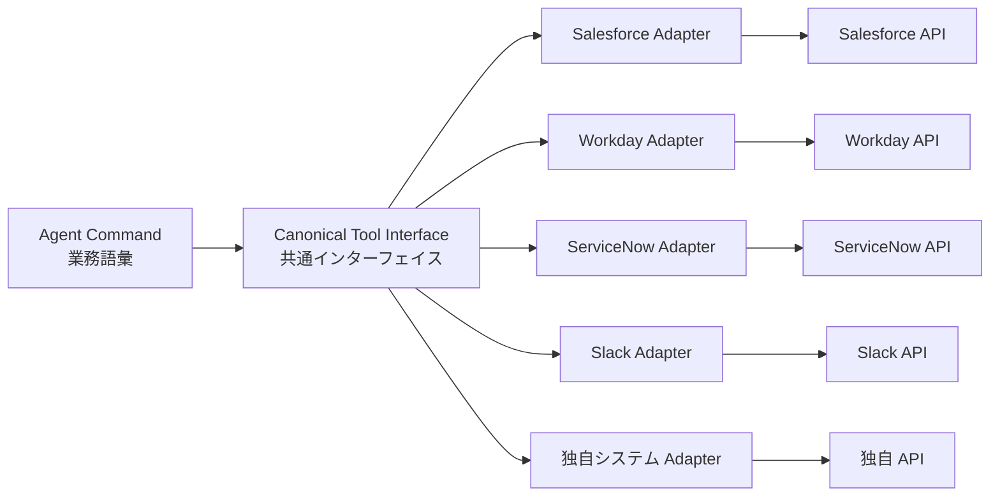

# IN-2 SaaS Connector Adapter（腐敗防止）

## 概要

各 SaaS の独自 API 仕様・認証・データモデル・レート・エラー形式を、エージェントが扱う共通インターフェイス（業務語彙）に変換する。SaaS 固有差をアダプタに閉じ込め上流に漏らさない腐敗防止層である。

## 設計

エージェントのコマンドは業務語彙で記述し、SaaS Adapter が各 SaaS の固有仕様に変換する。スキル/プロンプトは業務語彙で書き、SaaS 差し替え時の影響を局所化する。

## 解決する企業課題

SaaS 仕様差・変更がプロンプトやロジックに染み出す保守地獄、SaaS 差し替え時の全面影響。アダプタ層で固有差を吸収し、上流の安定性を保つ。

## 向き／不向き

| 向き | 不向き |
|---|---|
| 複数 SaaS 横断・将来差し替えの可能性 | 単一 SaaS に深く依存し差し替え不要 |
| 同じ業務語彙で複数 SaaS を操作 | SaaS 固有機能を全面的に使い切る場合 |
| エージェントのプロンプトを SaaS 非依存に保ちたい | アダプタ層のオーバーヘッドが許容できない場合 |

## 要素技術・既存システム連携

- **設計パターン**：Adapter Pattern、Anti-Corruption Layer
- **API 標準**：OpenAPI、GraphQL Federation
- **SDK**：Connector SDK（各 SaaS 向け）
- **エラー正規化**：Error Normalization（SaaS 固有エラーの共通形式変換）
- **レート制御**：Rate Limit Handler（SaaS 固有の制限吸収）
- **対象 SaaS**：Salesforce、Workday、ServiceNow、Slack、Google Workspace

## 落とし穴／選定の勘所

!!! warning "共通モデルの作り込みすぎ"
    共通モデルを作り込みすぎると実態と乖離する。薄く必要分だけ翻訳し、SaaS 固有の機能が必要な場合はパススルーも許容する。

- アダプタの認可粒度が粗いと権限忠実性（[ID-4](../id-identity/id4-permission-mirror-least-of.md)）が崩れる。SaaS 側の権限モデルを忠実に伝播する設計にする。
- SaaS の API バージョンアップをアダプタで吸収し、上流のエージェントに影響させない。
- アダプタのテストは SaaS の Sandbox 環境で行い、本番 API への副作用を防ぐ。

## 関連パターン

- [IN-1 Tool / MCP Gateway](in1-tool-mcp-gateway.md) — アダプタを Gateway 配下で統制
- [IN-4 Existing iPaaS Reuse](in4-existing-ipaas-reuse.md) — 既存統合資産をアダプタとして再利用
- [RT-5 Command Envelope](../rt-runtime/rt5-command-envelope.md) — 業務語彙でのコマンド記述
- [KM-3 Canonical Object](../km-knowledge/km3-canonical-object-knowledge-graph.md) — 正準オブジェクトへの変換
- [ID-2 Identity Federation & OBO](../id-identity/id2-identity-federation-obo.md) — アダプタ経由でも OBO トークンを伝播
