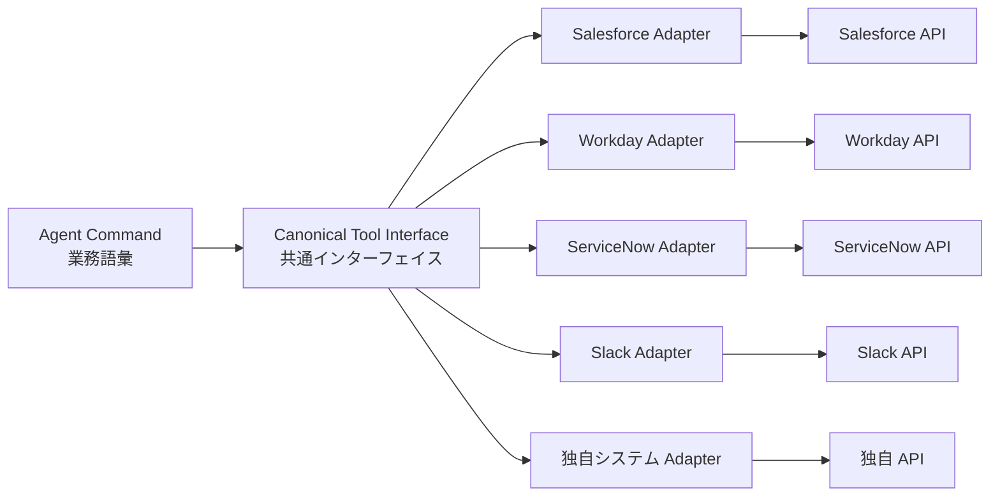

# IN-2 SaaS Connector Adapter（腐敗防止）

## 概要

Salesforce は REST、Workday は SOAP、ServiceNow は Table API——SaaS ごとに API 仕様がバラバラで、その差がプロンプトやロジックに染み出すと保守が地獄になる。このパターンは、SaaS 固有の差をアダプタに閉じ込め、エージェントには `get_customer`・`create_ticket` のような業務語彙だけを見せる腐敗防止層（Anti-Corruption Layer）である。SaaS を差し替えても影響はアダプタ内部で完結する。

## 解決する企業課題

複数の SaaS を横断するエージェントシステムを構築すると、各 SaaS の独自仕様がプロンプトやオーケストレーションロジックに染み出す「保守地獄」が発生する。Salesforce の REST API、Workday の SOAP、ServiceNow の Table API——それぞれ認証方式・レート制限・エラーコード・ページネーション仕様が異なる。これらの差異が上流に露出すると、SaaS 仕様変更のたびにプロンプトやロジックの修正が波及する。

SaaS の差し替えや追加（例：ServiceNow から Jira Service Management への移行）が必要になったとき、アダプタ層がなければ影響範囲が全エージェント・全プロンプトに及ぶ。腐敗防止層はこの変更の影響を「アダプタ内部だけ」に閉じ込める。また、認証方式の差異（OAuth 2.0 / API Key / SAML）も吸収することで、上流はビジネスロジックに集中できる。

## 解決策と設計

エージェントのコマンドは業務語彙で記述し、SaaS Adapter が各 SaaS の固有仕様に変換する。スキル/プロンプトは業務語彙で書き、SaaS 差し替え時の影響を局所化する。

各アダプタは対象 SaaS の認証・ページネーション・レート制限・エラー形式をカプセル化する。共通インターフェイスは業務語彙（例：`get_customer`、`create_ticket`、`update_opportunity`）で定義し、SaaS の内部概念（例：Salesforce の Account ID と Workday の Worker ID）の違いをアダプタが解決する。エラー正規化（各 SaaS のエラーコードを共通エラー型に変換）もアダプタが担う。

## 向き／不向き

| 向き | 不向き |
|---|---|
| 複数 SaaS 横断・将来差し替えの可能性 | 単一 SaaS に深く依存し差し替え不要 |
| 同じ業務語彙で複数 SaaS を操作 | SaaS 固有機能を全面的に使い切る場合 |
| エージェントのプロンプトを SaaS 非依存に保ちたい | アダプタ層のオーバーヘッドが許容できない場合 |

## 要素技術・既存システム連携

- **設計パターン**：Adapter Pattern、Anti-Corruption Layer
- **API 標準**：OpenAPI、GraphQL Federation
- **SDK**：Connector SDK（各 SaaS 向け）
- **エラー正規化**：Error Normalization（SaaS 固有エラーの共通形式変換）
- **レート制御**：Rate Limit Handler（SaaS 固有の制限吸収）
- **対象 SaaS**：Salesforce、Workday、ServiceNow、Slack、Google Workspace

## 落とし穴／選定の勘所

!!! warning "共通モデルの作り込みすぎ"
    共通モデルを作り込みすぎると実態と乖離する。薄く必要分だけ翻訳し、SaaS 固有の機能が必要な場合はパススルーも許容する。最初は「3つの主要操作を共通化する」程度から始め、過剰な抽象化を避ける。

- アダプタの認可粒度が粗いと権限忠実性（[ID-4](../id-identity/id4-permission-mirror-least-of.md)）が崩れる。万能サービスアカウント1個でアダプタを動かすと、エージェントのユーザーに関係なく全権限でアクセスしてしまう。SaaS 側の権限モデルを忠実に伝播する設計にする。
- SaaS の API バージョンアップをアダプタで吸収し、上流のエージェントに影響させない。アダプタにバージョン管理を持ち、旧 API から新 API への移行をアダプタ内で完結させる。
- アダプタのテストは SaaS の Sandbox 環境で行い、本番 API への副作用を防ぐ。

## 関連パターン

- [IN-1 Tool / MCP Gateway](in1-tool-mcp-gateway.md) — 補完：アダプタを Gateway 配下で統制し認証・認可・監査を一元適用する
- [IN-4 Existing iPaaS Reuse](in4-existing-ipaas-reuse.md) — 類似：既存統合資産（MuleSoft/Workato 等）をアダプタとして再利用するアプローチ
- [RT-5 Command Envelope](../rt-runtime/rt5-command-envelope.md) — 補完：業務語彙でのコマンド記述と実行エンベロープ
- [KM-3 Canonical Object](../km-knowledge/km3-canonical-object-knowledge-graph.md) — 補完：各 SaaS のデータを正準オブジェクトに変換する
- [ID-2 Identity Federation & OBO](../id-identity/id2-identity-federation-obo.md) — 補完：アダプタ経由でも OBO トークンを伝播して権限を忠実に渡す
