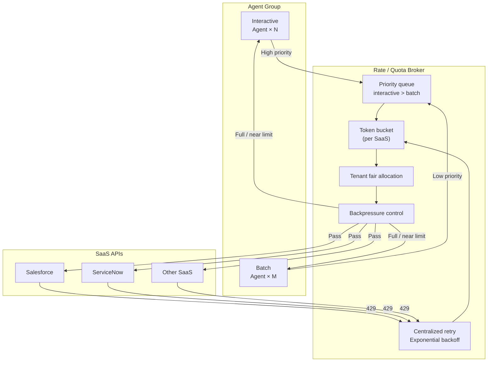

# IN-3 Rate / Quota Broker (Rate/Quota Arbitration)

## Overview

In an enterprise where tens of thousands of employees use the same Salesforce, when a batch process in one department exhausts all API rate limits, all employees receive 429 (Too Many Requests). This pattern maintains a token bucket per SaaS, fairly allocates quota between interactive (high priority) and batch (low priority) usage, and controls centralized retries when 429 occurs. Designs where each agent independently retries are the cause of knocking out SaaS.

## Enterprise Problem Addressed

As agents proliferate, situations arise where "overnight batch jobs exhaust Salesforce's API quota, leaving sales staff unable to use agents at all the following morning." SaaS API rate quotas are shared resources directly tied to enterprise business continuity, and stable operation is impossible without planned allocation.

When individual agents each implement their own 429 retry logic, synchronized retry storms occur and further pressure SaaS. "Each retrying with backoff" is a classic case where the intuitive implementation is counterproductive. Without guaranteed inter-departmental fairness, processing by some departments impedes others' operations — an organizational problem. Centralized broker management structurally resolves these issues.

!!! tip "Minimum Viable Configuration (MVP)"
    Implement a Redis-based token bucket and priority queue (2 tiers: interactive > batch) for the one SaaS with the strictest rate limits. Tenant fair allocation can be added after the number of usage departments grows.

## Value Hypothesis

Proper management of API limits prevents processing delays from throttling during business peaks. Ensuring stable processing throughput maintains SLA compliance and user experience.

## Solution and Design

All agent SaaS API calls pass through the Rate Broker. The Broker manages token buckets per SaaS, returning backpressure (delay or rejection) upstream as buckets approach exhaustion. When 429 is received, the Broker handles centralized retry with exponential backoff, not delegating retries to individual agents.

Token bucket settings are configured per SaaS. Define bucket capacity (burst allowance), replenishment rate (steady-state limit), and maximum tenant share. Tenant fair allocation sets an upper limit on the token ratio a single tenant can consume (e.g., maximum 30% of total for one tenant). When approaching limits, return delay notifications or rejections as backpressure to upstream agents, encouraging autonomous flow control.

## When to Use / When Not to Use

| When to Use | When Not to Use |
|---|---|
| 1,000+ users accessing the same SaaS through agents | PoC / small scale (~dozens of people) with sufficient SaaS API quota |
| Mixed batch jobs and interactive use | Agents calling only internal APIs with no SaaS API limits |
| SaaS has a monthly quota (total request count limit) | No SaaS with strict rate limits |
| Guaranteed inter-departmental fair allocation is needed | |

## Component Technologies and System Integration

- **Token bucket implementation**: Redis (atomic bucket operations via Lua scripts), Envoy Rate Limit service
- **API Gateway features**: Kong Rate Limiting plugin, Apigee Quota policy
- **Per-SaaS API limits**: Salesforce API Request Limits, ServiceNow Rate Limiting, Slack API Tier
- **Centralized retry**: exponential backoff + jitter (preventing thundering herd)
- **Priority queue**: AMQP priority queue (RabbitMQ), Redis Sorted Set

## Pitfalls and Selection Criteria

!!! danger "Design where individual agents retry 429 independently"
    When individual agents independently retry on 429, retries concentrate synchronously, causing retry storms that further pressure SaaS. Always centralize 429 retries at the Rate Broker; the agent side should only receive backpressure (delay notifications) from the Broker.

!!! warning "Assigning equal priority to batch jobs"
    Setting batch jobs at the same priority as interactive use causes batches to consume quota and impede real-time use. Explicitly set batch to lower priority and combine with scheduling to run during off-peak hours.

- Know per-SaaS rate limits from both documentation and actual measurement. Some SaaS have discrepancies between stated and actual throttling.
- Since the Rate Broker itself becomes a single point of failure, Active-Standby or distributed availability design is needed. If fallback to direct SaaS calls is possible when the Broker goes down, also govern that fallback path.

## Related Patterns

- [IN-1 Tool / MCP Gateway](in1-tool-mcp-gateway.md) — Complementary: tool call integration entry point incorporating the Rate Broker
- [IN-2 SaaS Connector / Adapter](in2-saas-connector-adapter.md) — Complementary: SaaS connection layer managed by the Rate Broker
- [GV-8 Cost / Quota Chargeback](../gv-governance/gv8-cost-quota-chargeback.md) — Complementary: utilizing Rate Broker measurement data for per-tenant API consumption billing and chargeback
- [EX-1 Enterprise Agent Gateway](../ex-experience/ex1-enterprise-agent-gateway.md) — Complementary: entry point responsible for rate control in coordination with the Rate Broker
