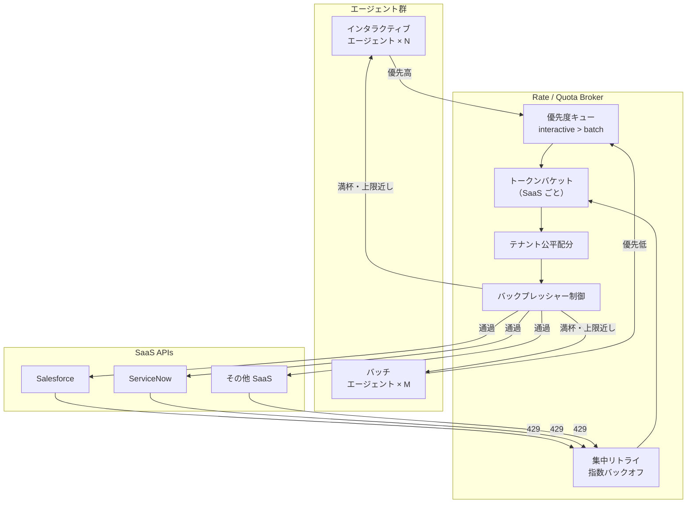

# IN-3 Rate / Quota Broker（レート/クォータ調停）

## 概要

SaaS API には組織全体で共有されるレート上限（例：Salesforce は1組織あたり X リクエスト/秒）がある。エージェントが数千〜数万人規模で利用されると、一部門のバッチジョブが全社の枠を使い切り、全員が 429（Too Many Requests）を受け取る事態が起きる。Rate / Quota Broker は SaaS システムごとにトークンバケットを持ち、インタラクティブ（優先高）とバッチ（優先低）の優先度付きキュー、テナント間の公平配分、429 受信時の集中リトライを実装する集中調停レイヤーである。

## 解決する企業課題

エージェントが普及すると「夜間バッチが Salesforce の API 枠を使い切って、翌朝の営業担当が一切エージェントを使えない」という事態が発生する。SaaS API レート枠は企業の業務継続性に直結する共有リソースであり、計画的な配分なしには安定した運用ができない。

個々のエージェントが各自で 429 リトライを実装すると、同期的なリトライストームが発生して SaaS をさらに圧迫する。これは「バックオフしながら各自でリトライ」という直感的な実装が逆効果になる典型例である。さらに、部門間の公平性が保証されなければ、一部部門の処理が他部門の業務を妨げるという組織的な問題に発展する。集中ブローカーによる管理はこれらを構造的に解決する。

## 解決策と設計

全エージェントの SaaS API 呼び出しは Rate Broker を経由する。Broker は SaaS ごとのトークンバケットを管理し、枯渇に近づくとバックプレッシャー（遅延・拒否）を上流に返す。429 を受けた場合は Broker が指数バックオフで集中リトライし、個々のエージェントに再試行させない。

トークンバケットの設定は SaaS ごとに行う。バケット容量（バースト許容量）・補充レート（定常上限）・テナント最大シェアを定義する。テナント公平配分は、一テナントが消費できるトークン比率に上限を設ける（例：1テナント最大全体の30%）。上限接近時はバックプレッシャーとして遅延通知または拒否を上流エージェントに返し、自律的な流量制御を促す。

## 向き／不向き

| 向き | 不向き |
|---|---|
| 1000人以上のユーザーが同一SaaSをエージェント経由で利用する | PoC・小規模（〜数十人）で SaaS API 枠に余裕がある |
| バッチジョブとインタラクティブ利用が混在する | エージェントが内部APIのみを呼び SaaS API 制限がない |
| SaaS API の月間クォータ（リクエスト数上限）がある | レート制限の厳しい SaaS が1つもない |
| 部門間の公平配分を保証したい | |

## 要素技術・既存システム連携

- **トークンバケット実装**：Redis（Lua スクリプトによる原子的バケット操作）、Envoy Rate Limit サービス
- **API Gateway 機能**：Kong Rate Limiting プラグイン、Apigee Quota ポリシー
- **SaaS ごとの API 上限**：Salesforce API Request Limits、ServiceNow Rate Limiting、Slack API Tier
- **集中リトライ**：指数バックオフ + ジッター（thundering herd 防止）
- **優先度キュー**：AMQP 優先キュー（RabbitMQ）、Redis Sorted Set

## 落とし穴／選定の勘所

!!! danger "個々のエージェントが各自で 429 リトライする設計"
    個々のエージェントが 429 を受けて独自にリトライすると、リトライが同期的に集中してリトライストームが発生し SaaS をさらに圧迫する。429 のリトライは必ず Rate Broker に集中させ、エージェント側は Broker からのバックプレッシャー（遅延通知）を受け取るだけにする。

!!! warning "バッチジョブへの同等優先度付与"
    バッチジョブをインタラクティブ利用と同等の優先度にすると、バッチが枠を消費してリアルタイム利用を妨げる。バッチは明示的に低優先度に設定し、閑散時間帯に実行するスケジューリングと組み合わせる。

- SaaS ごとのレート上限はドキュメントと実測の両方で把握する。公称値と実際の制御が異なる SaaS が存在する。
- Rate Broker 自体が単一障害点になるため、Active-Standby または分散型の可用性設計が必要である。Broker がダウンしても SaaS への直接呼び出しにフォールバックできる仕組みを持つ場合は、そのフォールバック経路も統制する。

## 関連パターン

- [IN-1 Tool / MCP Gateway](in1-tool-mcp-gateway.md) — 補完：Rate Broker を組み込むツール呼び出し統合入口
- [IN-2 SaaS Connector / Adapter](in2-saas-connector-adapter.md) — 補完：Rate Broker が管理する SaaS 接続層
- [GV-8 Cost / Quota Chargeback](../gv-governance/gv8-cost-quota-chargeback.md) — 補完：テナント別のAPI消費量の課金・チャージバックに Rate Broker の計測データを活用する
- [EX-1 Enterprise Agent Gateway](../ex-experience/ex1-enterprise-agent-gateway.md) — 補完：Rate Broker と連携するレート制御を担うエントリポイント
