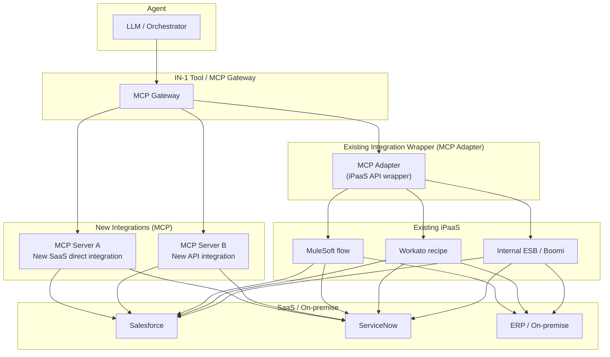

# IN-4 Existing iPaaS Reuse (Reusing Existing Integration Assets)

## Overview

Rebuilding SaaS integrations from scratch with each agent deployment ignores already-running MuleSoft or Workato flows — it's duplicate investment. This pattern takes a hybrid configuration that reuses existing iPaaS integration flows, transformation logic, and authentication settings as-is and adds only newly needed integrations via MCP. However, whether the iPaaS authorization granularity satisfies per-user permission fidelity requires prior verification.

## Enterprise Problem Addressed

iPaaS integration flows in operation are assets with four built-in components: connection settings, transformation logic, error handling, and monitoring. Rebuilding these with each agent deployment results in maintaining the same SaaS connection in two places, doubling all changes, incident responses, and security patch applications.

In organizations where integration teams and AI teams are separated, internal knowledge of existing flows (SaaS behavioral quirks, context for transformation logic, special cases in error handling) is concentrated in the integration team. Reimplementing from scratch incurs the cost of re-acquiring that knowledge. Hybrid reuse eliminates this duplication and carries over the maintenance skills and operational knowledge of existing teams. The security-audited track record of existing flows is also inherited as-is.

!!! tip "Minimum Viable Configuration (MVP)"
    Wrap the most frequently used existing iPaaS flow in an MCP adapter and enable calling through the Tool Gateway. Keep the adapter to interface conversion only, leaving logic on the iPaaS side.

## Value Hypothesis

Reusing existing iPaaS assets compresses the construction cost and duration of agent infrastructure. Rapid deployment leveraging existing investments shortens time to value realization.

## Solution and Design

Agent tool calls go through [IN-1 Tool/MCP Gateway](in1-tool-mcp-gateway.md). The Gateway directly calls new integrations as MCP servers. For existing integrations, calls go through MCP adapters wrapping the iPaaS API (or Trigger Webhook). Updates to existing iPaaS flows do not affect the agent side.

When wrapping existing iPaaS flows in MCP adapters, only format the flow's input/output interface for agents; leave business logic, transformation, and error handling on the iPaaS side. Keeping adapters to interface conversion only, with logic remaining on the iPaaS side, prevents double maintenance.

## When to Use / When Not to Use

| When to Use | When Not to Use |
|---|---|
| MuleSoft/Workato/Boomi, etc. are already operational with many integration flows | First integration with agents where no iPaaS itself exists |
| Integration teams and AI teams are separated and existing flow handover is difficult | Cases where existing flow quality is low and rebuilding is more rational than reuse |
| Phased migration (keeping existing flows while adding agent support) is needed | SaaS connections are only a few and MCP direct implementation effort is minimal |

## Component Technologies and System Integration

- **MuleSoft Anypoint Platform**: publishing flows as APIs and calling from MCP adapters
- **Workato**: accepting external calls via webhook triggers or API recipes
- **Boomi AtomSphere**: publishing processes as API endpoints
- **Internal ESB (IBM MQ / Apache Camel, etc.)**: wrapping while maintaining existing service interface specifications
- **Apigee / Kong**: utilizing existing API Management placed before iPaaS as-is
- **MCP Adapter**: thin wrapper converting iPaaS APIs to MCP tool specifications

## Pitfalls and Selection Criteria

!!! warning "iPaaS authorization granularity is too coarse, breaking permission fidelity (ID-4)"
    If existing iPaaS flows run with "all-powerful service accounts," having agents call those flows results in unintentionally broad access. Before adopting existing flows, verify the scope of credentials used by the flows and validate alignment with [ID-4 Permission Mirror & Least-of](../id-identity/id4-permission-mirror-least-of.md) principles.

!!! warning "iPaaS throttling not transparent to agents"
    Existing iPaaS flows are often designed for human-level call frequency. High-frequency agent calls may hit the flow side's rate limits or concurrent execution limits. Control call frequency with [IN-3 Rate/Quota Broker](in3-rate-quota-broker.md).

- Writing business logic into MCP adapters results in double maintenance with iPaaS after all. Keep adapters to interface conversion only, with logic remaining on the iPaaS side.
- Changes to existing flows (iPaaS side) affect agent behavior. Set up consumer-driven contract tests in the MCP adapter and automate regression verification when flows change.

## Related Patterns

- [IN-1 Tool / MCP Gateway](in1-tool-mcp-gateway.md) — Complementary: unified entry point for all tool calls including iPaaS adapters
- [IN-2 SaaS Connector / Adapter](in2-saas-connector-adapter.md) — Contrast: usage distinction with MCP direct implementation for new SaaS connections
- [ID-4 Permission Mirror & Least-of](../id-identity/id4-permission-mirror-least-of.md) — Complementary: verification of permission fidelity via iPaaS and application of least privilege
- [ID-2 Identity Federation & OBO](../id-identity/id2-identity-federation-obo.md) — Complementary: delegation design for propagating person's own permissions through iPaaS flows
