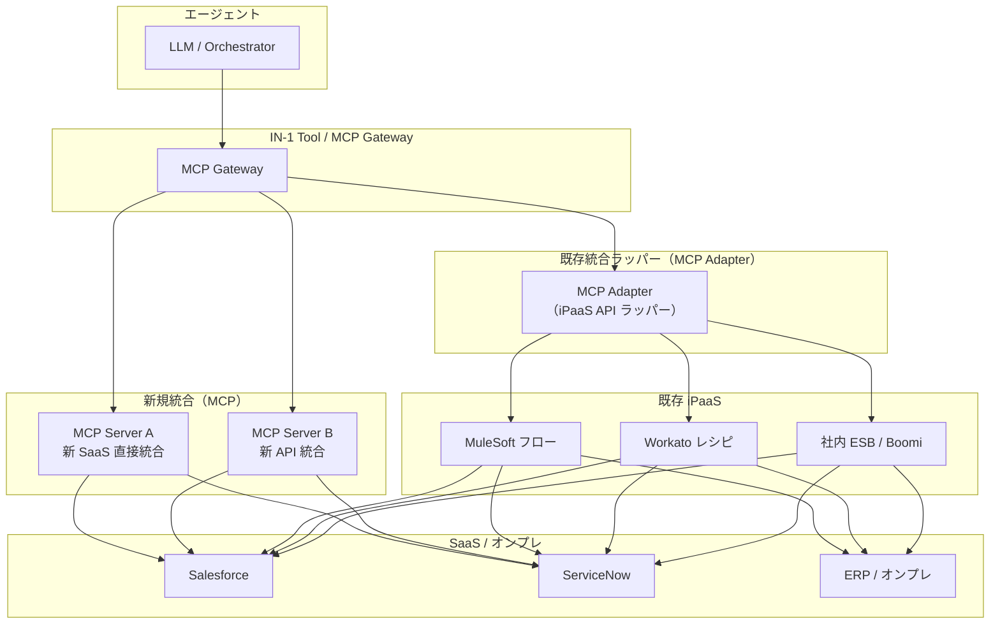

# IN-4 Existing iPaaS Reuse（既存統合資産の再利用）

## 概要

エージェント導入のたびに SaaS 統合をゼロから作り直すのは、既に動いている MuleSoft や Workato のフローを無視した二重投資だ。このパターンは、既存の iPaaS 統合フロー・変換ロジック・認証設定をそのまま再利用し、新規に必要な統合だけ MCP で追加するハイブリッド構成を取る。ただし、iPaaS の認可粒度がユーザー単位の権限忠実性を満たすかは事前に検証が必要である。

## 解決する企業課題

iPaaS で運用中の統合フローは、接続設定・変換ロジック・エラーハンドリング・監視の4つが作り込まれた資産だ。これをエージェント導入のたびに作り直すと、同じ SaaS 接続を2箇所で保守する状態になり、変更・障害対応・セキュリティパッチの適用がすべて二重化する。

統合チームと AI チームが分離している組織では、既存フローの内部知識（SaaS の挙動の癖、変換ロジックの経緯、エラー処理の特殊ケース）が統合チームに集中している。ゼロから再実装すると、その知識を再度習得するコストが発生する。ハイブリッド再利用はこの重複を排除し、既存チームの保守スキルと運用知識を引き継ぐ。既存フローのセキュリティ監査済みの実績もそのまま継承できる。

!!! tip "最小成立条件（MVP）"
    既存 iPaaS の最も利用頻度の高いフロー1本を MCP アダプターでラップし、Tool Gateway 経由で呼び出せるようにする。アダプターはインターフェース変換のみとし、ロジックは iPaaS 側に残す。

## 価値仮説

既存iPaaS資産の再利用により、エージェント基盤の構築コストと期間を圧縮する。既存投資を活かした迅速な展開は、価値実現までの時間を短縮する。

## 解決策と設計

エージェントのツール呼び出しは [IN-1 Tool/MCP Gateway](in1-tool-mcp-gateway.md) を経由する。Gateway は新規統合を MCP サーバーとして直接呼ぶ。既存統合については iPaaS の API（または Trigger Webhook）をラップした MCP アダプターを介して呼び出す。既存 iPaaS フローの更新はエージェント側に影響しない。

既存 iPaaS フローを MCP アダプターでラップする際は、フローの入出力インターフェースのみをエージェント向けに整形し、フロー内部のビジネスロジック・変換・エラーハンドリングは iPaaS 側に残す。アダプターはインターフェース変換のみを担い、ロジックは iPaaS 側に留めることで、二重保守を防ぐ。

## 向き／不向き

| 向き | 不向き |
|---|---|
| 既に MuleSoft/Workato/Boomi 等が稼働しており統合フローが多数ある | エージェント導入が初めての統合であり iPaaS 自体がない |
| 統合チームと AI チームが分離しており既存フローの引き継ぎが困難 | 既存フローの品質が低く再利用より作り直しが合理的な場合 |
| 段階的移行（既存フローは残しつつエージェント対応を追加）が必要 | SaaS 接続が数件しかなく MCP 直接実装の工数が少ない |

## 要素技術・既存システム連携

- **MuleSoft Anypoint Platform**：フローをAPIとして公開し MCP アダプターから呼び出す
- **Workato**：Webhook トリガーまたは API レシピで外部呼び出しを受け付ける
- **Boomi AtomSphere**：プロセスをAPI エンドポイントとして公開
- **社内 ESB（IBM MQ / Apache Camel等）**：既存のサービスインターフェース仕様を維持してラップ
- **Apigee / Kong**：既存 iPaaS の前段に配置された API Management をそのまま活用
- **MCP Adapter**：iPaaS の API を MCP ツール仕様に変換する薄いラッパー

## 落とし穴／選定の勘所

!!! warning "iPaaS の認可粒度が粗く権限忠実性（ID-4）が崩れる"
    既存 iPaaS フローが「全権サービスアカウント」で動いている場合、エージェントがそのフローを呼ぶと意図せず広いアクセスを行うことになる。既存フローを採用する前に、フローが使う認証情報のスコープを確認し、[ID-4 Permission Mirror & Least-of](../id-identity/id4-permission-mirror-least-of.md) の原則との整合を検証する。

!!! warning "iPaaS のスロットリングがエージェントに透過しない"
    既存 iPaaS フローは人間向けの呼び出し頻度を前提に設計されているケースが多い。エージェントによる高頻度呼び出しでフロー側のレート制限や同時実行制限に当たることがある。[IN-3 Rate/Quota Broker](in3-rate-quota-broker.md) で呼び出し頻度を制御する。

- MCP アダプターにビジネスロジックを書き込むと、結局 iPaaS と二重保守になる。アダプターはインターフェース変換のみを担い、ロジックは iPaaS 側に留める。
- 既存フローの変更（iPaaS 側）がエージェントの動作に影響する。MCP アダプターに契約テスト（Consumer-Driven Contract Test）を設け、フロー変更時の回帰検証を自動化する。

## 関連パターン

- [IN-1 Tool / MCP Gateway](in1-tool-mcp-gateway.md) — 補完：iPaaS アダプターを含む全ツール呼び出しの統合入口
- [IN-2 SaaS Connector / Adapter](in2-saas-connector-adapter.md) — 対比：新規 SaaS 接続における MCP 直接実装との使い分け
- [ID-4 Permission Mirror & Least-of](../id-identity/id4-permission-mirror-least-of.md) — 補完：iPaaS 経由時の権限忠実性の確認と最小権限の適用
- [ID-2 Identity Federation & OBO](../id-identity/id2-identity-federation-obo.md) — 補完：iPaaS フロー経由でも本人権限を伝播するための委譲設計
