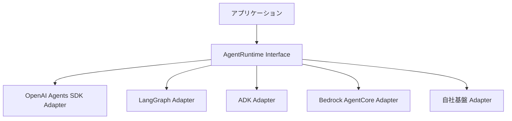

# J-1 Agent Runtime Abstraction（実行基盤の抽象化）

## 概要

エージェント実行基盤を抽象化し、SDK/ランタイムを差し替え可能にする。

## 設計

`AgentRuntime` インターフェイスに以下のメソッドを定義し、実装をprovider adapterとして切り替える。

- `start_session`
- `resume_session`
- `invoke_tool`
- `checkpoint`
- `stream_events`
- `cancel`

## 解決する課題

- 特定ベンダー/SDKへのロックイン
- 移行時の大規模改修

## ユースケース

- エンタープライズAI基盤
- BYOC
- マルチクラウドSaaS

## 向き

長期運用・複数基盤併用に適する。

## 不向き

単一プロバイダ前提の小規模アプリには過剰である。

## 要素技術

- **設計パターン**：adapter / ports-and-adapters
- **管理**：provider registry
- **選定**：capability matrix

## 関連パターン

- [J-2 Model Behavior Compatibility Layer](j2-model-compatibility-layer.md) — モデルレベルの互換性吸収
- [J-3 Agent Capability Registry](j3-capability-registry.md) — 能力の管理と選定
- [H-4 Graceful Degradation & Fallback](../h-cost-performance/h4-graceful-degradation.md) — プロバイダ切替によるフォールバック
- [I-4 Version Pinning & Change Management](../i-observability/i4-version-pinning.md) — ランタイム版の管理
