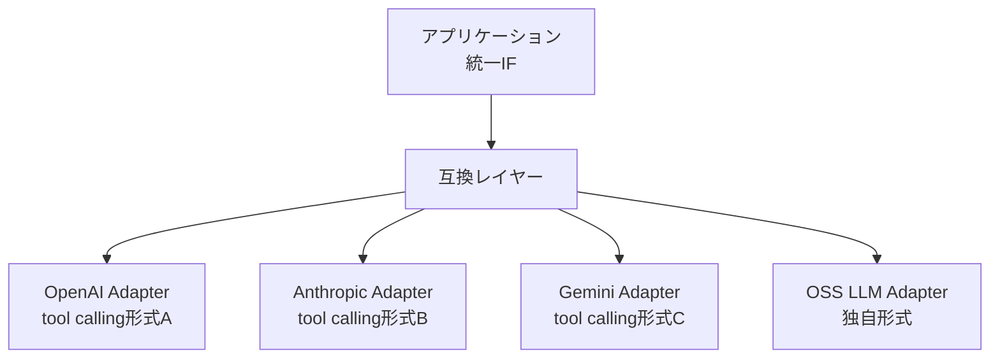

# J-2 Model Behavior Compatibility Layer（モデル挙動互換レイヤー）

## 概要

モデルごとの癖（tool calling形式、structured output、context length、安全拒否、streaming形式、token会計）を吸収する互換レイヤー。

## 設計

モデル別差異をadapterで吸収し、上位アプリは統一インターフェイスを使う。

## 解決する課題

同じプロンプトでもモデルが変わると挙動が変わる問題を解決する。

## ユースケース

- OpenAI / Anthropic / Gemini / OSS LLMを併用する環境

## 向き

複数モデルを使い分ける/乗り換える運用に適する。

## 不向き

単一モデル固定で長期運用する場合には過剰である。

## 要素技術

- **アダプタ**：model adapter
- **変換**：prompt transpiler
- **正規化**：schema normalizer
- **検出**：capability detection

## 関連パターン

- [J-1 Agent Runtime Abstraction](j1-runtime-abstraction.md) — ランタイムレベルの抽象化
- [H-1 Cost-Aware Model Router](../h-cost-performance/h1-cost-aware-router.md) — モデル選択との連携
- [I-4 Version Pinning & Change Management](../i-observability/i4-version-pinning.md) — モデル版の管理
- [J-3 Agent Capability Registry](j3-capability-registry.md) — モデルの能力管理
