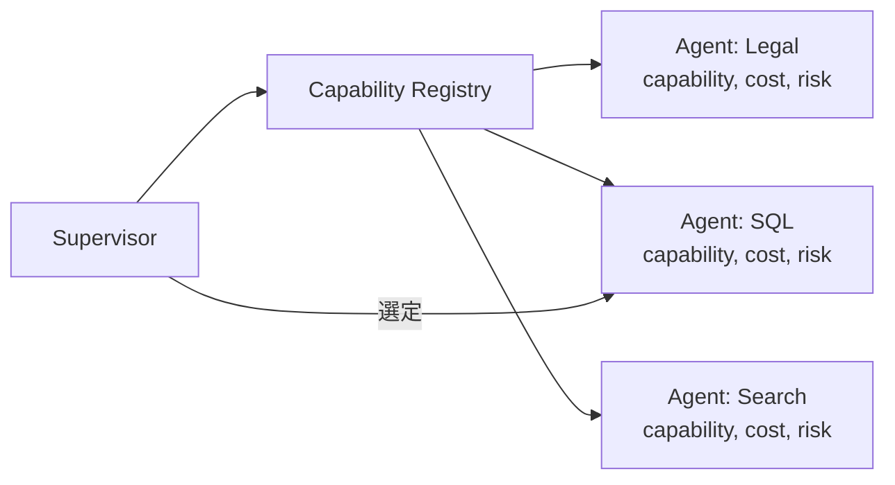

# J-3 Agent Capability Registry（能力レジストリ）

## 概要

各エージェント/ツール/モデルが何をできるかをレジストリで管理し、選定の根拠にする。

## 設計

以下の属性を登録する。

- `capability`：能力
- `required_permissions`：必要権限
- `cost_profile`：コスト特性
- `latency_profile`：レイテンシ特性
- `risk_level`：リスクレベル
- `supported_models`：対応モデル
- `owner`：管理者
- `version`：バージョン

Supervisor（B-3）が参照して委譲先を選ぶ。

## 解決する課題

エージェント/ツールが増えると「誰に何を任せるか」が不明になる問題を解決する。

## ユースケース

- 企業内エージェント基盤
- 複数部署利用
- MCPマーケットプレイス

## 向き

多数のエージェント/ツールを抱える組織に適する。

## 不向き

単一エージェントの小規模アプリには不要である。

## 要素技術

- **管理**：service catalog、tool registry、metadata DB
- **分類**：capability ontology
- **検索**：discovery API

## 関連パターン

- [B-3 Supervisor & Specialist](../b-composition/b3-supervisor-specialist.md) — レジストリを参照して委譲先を選ぶ
- [J-1 Agent Runtime Abstraction](j1-runtime-abstraction.md) — ランタイムの抽象化
- [D-1 Tool Gateway](../d-tools-mcp/d1-tool-gateway.md) — ツールカタログとの統合
- [J-2 Model Behavior Compatibility Layer](j2-model-compatibility-layer.md) — モデルの能力管理
