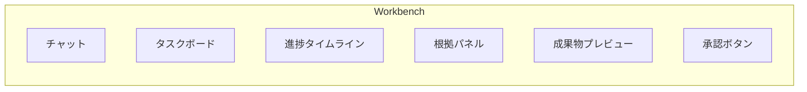

# K-1 Agent Workbench（エージェント・ワークベンチ）

## 概要

計画・進捗・成果・根拠・承認を一画面で管理する作業台型UI。

## 設計

チャットに加え、以下の要素を持つ。

- タスクボード
- 進捗タイムライン
- 根拠パネル
- 成果物プレビュー
- 承認ボタン
- 差分表示

## 解決する課題

チャットUIだけでは長時間・多段階・副作用付き作業を管理しにくい問題を解決する。

## ユースケース

- 資料作成
- コード修正
- 調査
- 業務自動化
- 社内AI

## 向き

作業型・長尺タスクに適する。

## 不向き

単純FAQには過剰である。

## 要素技術

- **UI**：task UI、timeline
- **表示**：artifact preview
- **承認**：approval panel
- **デバッグ**：trace viewer

## 関連パターン

- [A-3 Streaming Progress](../a-execution/a3-streaming-progress.md) — 進捗情報のストリーミング
- [K-2 Editable Plan](k2-editable-plan.md) — 計画の編集UI
- [F-5 Human Approval Checkpoint](../f-reliability/f5-human-approval.md) — 承認ボタンの実装
- [I-1 Agent Trace & Observability](../i-observability/i1-trace-observability.md) — トレースの可視化
