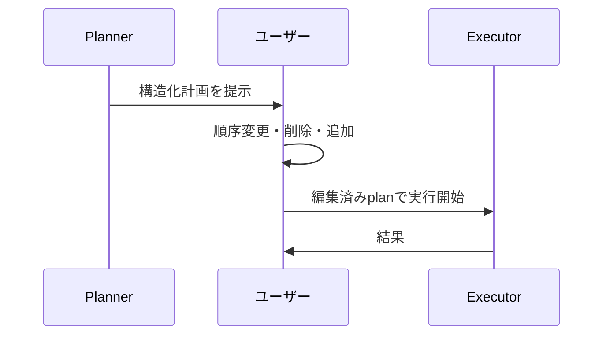

# K-2 Editable Plan（編集可能な計画）

## 概要

実行前に計画を提示し、人間が編集してから実行する。

## 設計

計画を `steps[]` として構造化し、ユーザーが順序変更・削除・追加・制約付与できる。編集後のplanを実行する（B-2のPlannerと連携）。

## 解決する課題

計画が意図とずれたまま長時間実行される問題を解決する。

## ユースケース

- 設計
- 調査
- コード生成
- 営業資料
- プロジェクト計画

## 向き

計画品質が成果を左右するタスクに適する。

## 不向き

即時応答が必要な処理には不向きである。

## 要素技術

- **データ構造**：plan schema
- **UI**：UI editor
- **変換**：workflow compiler
- **フィードバック**：human feedback

## 関連パターン

- [B-2 Planner–Executor–Reviewer](../b-composition/b2-planner-executor-reviewer.md) — 計画生成の基盤
- [K-1 Agent Workbench](k1-agent-workbench.md) — 計画を編集するUI
- [A-4 Interruptible Agent](../a-execution/a4-interruptible-agent.md) — 実行中の方針変更
- [F-5 Human Approval Checkpoint](../f-reliability/f5-human-approval.md) — 計画承認との統合
