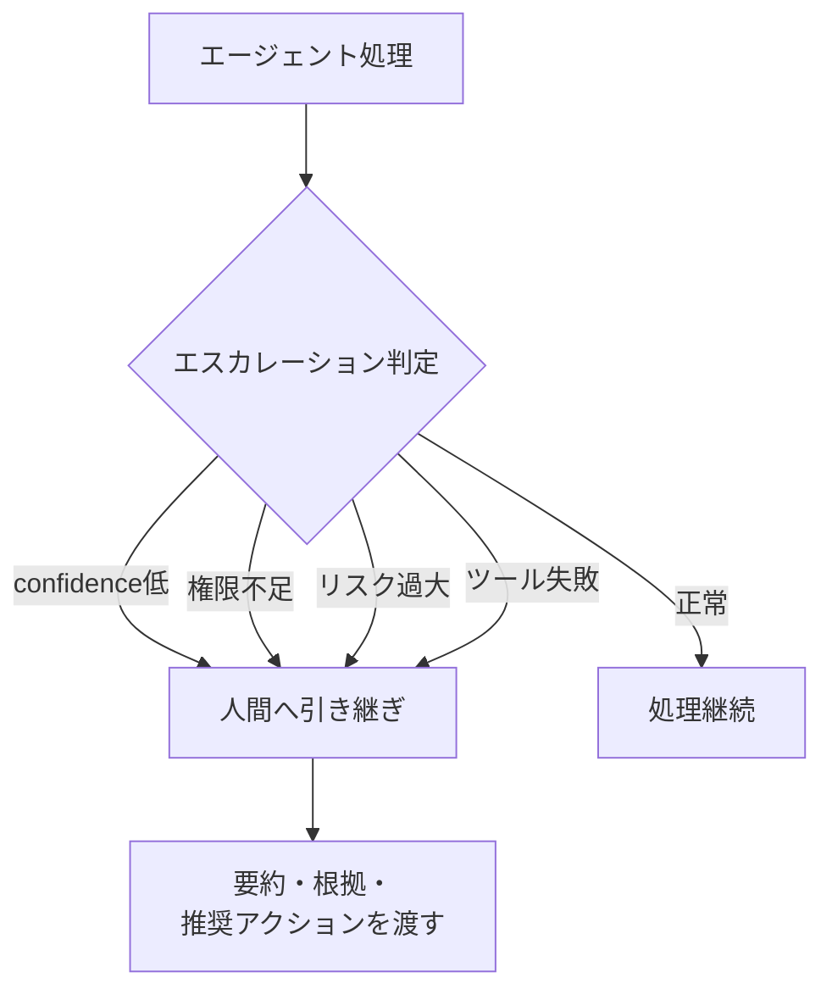

# K-3 Agent-to-Human Escalation（人間へのエスカレーション）

## 概要

自信不足・権限不足・リスク過大のとき、人間へ自然に引き継ぐ。

## 設計

confidence・risk・policy違反・missing data・tool failureをもとにescalationを判断する。人間には要約・試行済み手順・根拠・推奨アクションを渡す。

## 解決する課題

AIが無理に完了しようとして誤回答・誤実行する問題を解決する。

## ユースケース

- カスタマーサポート
- 社内ヘルプデスク
- 運用監視
- 法務・経理

## 向き

人間オペレーターと協働する運用に適する。

## 不向き

人間が存在しない完全自動サービスには適用できない。

## 要素技術

- **引き継ぎ**：handoff queue、case management
- **通知**：Slack/Teams integration
- **判定**：confidence threshold

## 関連パターン

- [F-5 Human Approval Checkpoint](../f-reliability/f5-human-approval.md) — 承認ゲート（エスカレーションとは異なる）
- [H-4 Graceful Degradation & Fallback](../h-cost-performance/h4-graceful-degradation.md) — 最終段のフォールバック先
- [A-5 Time-Budgeted Agent Loop](../a-execution/a5-time-budgeted-loop.md) — 予算超過時のエスカレーション
- [C-4 Ambiguity Negotiation](../c-io-contract/c4-ambiguity-negotiation.md) — 曖昧すぎる場合の引き継ぎ
