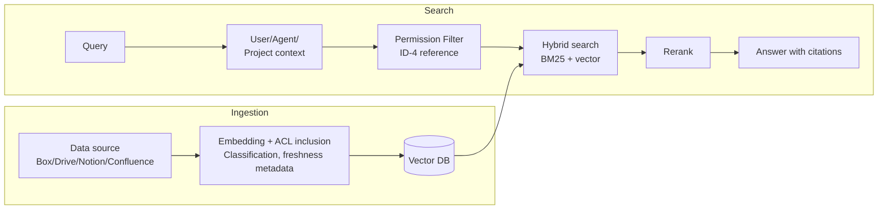

# KM-1 Access-Controlled Enterprise RAG (Permission-Aware RAG)

## Overview

Building an AI that can "search everything" by putting all company documents into a vector DB causes documents that the user should not be able to see to appear in answers. The access permissions are lost the moment data is copied into an index — this is the biggest pitfall of enterprise RAG. This pattern embeds each chunk's source ACL, classification, and freshness at ingestion time, and re-evaluates against the requester's latest permissions at each search, preventing the problem where departed or transferred employees can see things they should not.

## Enterprise Problem Addressed

The fundamental danger of enterprise RAG is that access controls from the original source are lost the moment documents are copied to the vector DB. SharePoint view permissions, Box folder permissions, Confluence space restrictions — these are meaningless unless considered during index creation. The problem of departed or transferred employees continuing to access documents related to previous roles also stems from this inability to propagate ACL revocation.

Stale document references (freshness problem), answers without attribution (no citations), and permission mismatches across multiple SaaS — these all stem from "not managing permissions and freshness at the copy destination." Enterprise information governance presupposes that search infrastructure faithfully inherits access controls.

!!! tip "Minimum Viable Configuration (MVP)"
    Attach ACL metadata to chunks from a single data source (e.g., SharePoint) and pre-filter by the user's group membership at search time. Freshness and reranking can be deferred, but ACL inclusion and search-time filtering are mandatory from day one.

## Value Hypothesis

Permission-preserving internal knowledge search dramatically reduces employees' information-seeking time. Immediate access to needed knowledge directly translates to improved decision-making speed and work quality.

## Solution and Design

Embed the source's ACL, classification, and freshness in chunks at ingestion time, and evaluate against the latest entitlements at search time. ACL evaluation is based on on-demand judgment rather than caching as a baseline, reflecting permission revocations in real time.

The Permission Filter integrates with [ID-4 Permission Mirror](../id-identity/id4-permission-mirror-least-of.md) to evaluate the requester's entitlements at search time. Hybrid search (BM25 + vector) combines keyword matching with semantic similarity, and a reranker computes the final score. Answers must always include source citations to ensure evidence transparency. Freshness ranking automatically lowers the priority of older documents.

## When to Use / When Not to Use

| When to Use | When Not to Use |
|---|---|
| Cross-search of documents, tickets, CRM, and chat | Data sources where access control is impossible |
| Integrated search across many SaaS platforms | Real-time DB source of truth (should be queried directly) |
| Frequent permission changes due to departures and transfers | Only public information visible to all employees (ACL not needed) |

## Component Technologies and System Integration

- **Search**: Hybrid Search (BM25 + vector), Reranker
- **Vector DB**: Pinecone, Weaviate, Qdrant, Elasticsearch
- **ACL filter**: integrated with [ID-4 Permission Mirror](../id-identity/id4-permission-mirror-least-of.md)
- **Citations**: citation-included answers (ensuring evidence transparency)
- **Freshness**: Freshness Ranking (lowering priority of older documents)
- **Target SaaS**: Box, Google Drive, Notion, Confluence, SharePoint

## Pitfalls and Selection Criteria

!!! danger "Fixing ACL at ingestion time"
    Fixing ACL at ingestion time and not re-syncing is the most dangerous anti-pattern. The problem of departed and transferred employees continuing to view documents occurs. Treat ingestion-time ACL as a reference value and make re-evaluation against the latest entitlements at search time mandatory.

- "Indexing all company data in one vector DB for fast search" is prohibited. ACL inclusion is mandatory, and data that cannot have ACL included should be JIT-fetched via federation ([KM-2](km2-context-mesh.md)).
- Always include source citations in search results to ensure evidence transparency. Answers without citations make it impossible to trace "why that answer was produced."
- Use freshness ranking to lower the priority of older documents, preventing incorrect answers from stale information. The freshness filter becomes especially important after organizational restructuring and policy changes.

## Related Patterns

- [ID-4 Permission Mirror & Least-of](../id-identity/id4-permission-mirror-least-of.md) — Complementary: access control evaluation layer responsible for permission assessment at search time
- [KM-2 Context Mesh](km2-context-mesh.md) — Complementary: federation-type JIT retrieval for data sources where ACL inclusion is difficult
- [KM-5 Purpose-Bound Context](km5-purpose-bound-context.md) — Complementary: further narrowing search results by business purpose
- [KM-6 DLP & Redaction Boundary](km6-dlp-redaction-boundary.md) — Complementary: masking sensitive information in search results
- [ID-2 Identity Federation & OBO](../id-identity/id2-identity-federation-obo.md) — Complementary: delegation token for calling SaaS with the requester's own permissions at search time
