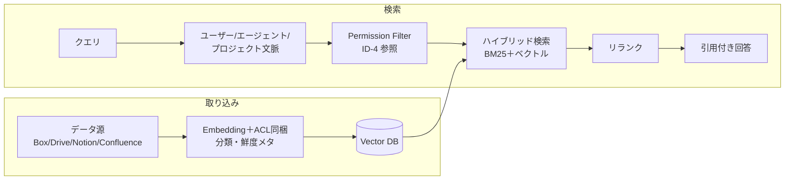

# KM-1 Access-Controlled Enterprise RAG（権限認識RAG）

## 概要

検索/RAG の結果を、データ源のアクセス制御を保ったまま、依頼者が見てよいものだけに絞る。企業 RAG 最大の落とし穴——「インデックスにコピーした瞬間に源のアクセス制御が無効化される」——を構造的に解決する。

## 設計

取り込み時にソースの ACL・分類・鮮度を同梱し、検索時点の最新エンタイトルメントで評価する。剥奪を即反映するため、ACL はキャッシュではなく都度判定を基本とする。

## 解決する企業課題

「インデックスにコピーした瞬間に源のアクセス制御が無効化される」ことが企業 RAG 最大のリスクである。古い文書の参照、根拠不明の回答、退職者・異動者が見続ける問題も含めて解決する。

## 向き／不向き

| 向き | 不向き |
|---|---|
| 文書/チケット/CRM/チャットの横断検索 | 権限制御不能なデータ源 |
| 多数の SaaS からの統合検索 | リアルタイム DB 正本（直接クエリすべき） |
| 退職・異動に伴う権限変更が頻繁 | 全社員が見てよい公開情報のみ（ACL 不要） |

## 要素技術・既存システム連携

- **検索**：Hybrid Search（BM25＋ベクトル）、Reranker
- **Vector DB**：Pinecone、Weaviate、Qdrant、Elasticsearch
- **ACL フィルタ**：[ID-4 Permission Mirror](../id-identity/id4-permission-mirror-least-of.md) と連携
- **引用**：Citation 付き回答（根拠の透明化）
- **鮮度**：Freshness Ranking（古い文書の優先度低下）
- **対象 SaaS**：Box、Google Drive、Notion、Confluence、SharePoint

## 落とし穴／選定の勘所

!!! danger "ACL の取り込み時固定"
    ACL を取り込み時に固定し再同期しないのは最も危険なアンチパターン。退職者・異動者が見続ける。取り込み時の ACL は参考値とし、検索時に最新エンタイトルメントで再評価する。

- 「全社データを1つのベクトル DB に入れて速く検索」は禁忌。ACL 同梱を必須とし、同梱できないデータはフェデレーション（[KM-2](km2-context-mesh.md)）で JIT 取得する。
- 検索結果の引用（Citation）を必ず含め、根拠の透明性を確保する。
- 鮮度ランキングにより古い文書の優先度を下げ、陳腐化した情報による誤回答を防ぐ。

## 関連パターン

- [ID-4 Permission Mirror & Least-of](../id-identity/id4-permission-mirror-least-of.md) — 検索時のアクセス制御判定
- [KM-2 Context Mesh](km2-context-mesh.md) — ACL 同梱が困難なデータ源のフェデレーション型取得
- [KM-5 Purpose-Bound Context](km5-purpose-bound-context.md) — 検索結果を目的に限定して絞り込む
- [KM-6 DLP & Redaction Boundary](km6-dlp-redaction-boundary.md) — 検索結果に含まれる機密のマスキング
- [ID-2 Identity Federation & OBO](../id-identity/id2-identity-federation-obo.md) — 検索時に本人権限で SaaS を呼ぶ
