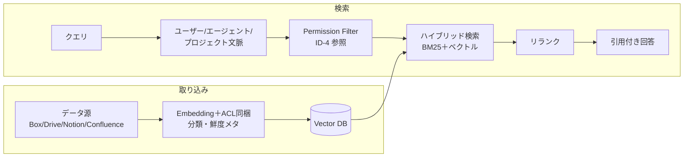

# KM-1 Access-Controlled Enterprise RAG（権限認識RAG）

## 概要

全社文書をベクトル DB に入れて「何でも検索できる AI」を作ると、本来そのユーザーには見えないはずの文書まで回答に含まれてしまう。インデックスにコピーした瞬間に元のアクセス権限が消える——これが企業 RAG 最大の落とし穴だ。このパターンは、取り込み時に各チャンクにソースの ACL・分類・鮮度を同梱し、検索のたびに依頼者の最新権限で再評価することで、退職者・異動者の「見えてはいけないものが見える」問題を防ぐ。

## 解決する企業課題

エンタープライズ RAG の根本的な危険は、ドキュメントをベクトル DB にコピーした時点で元のアクセス制御が失われることだ。SharePoint の閲覧権限、Box のフォルダ権限、Confluence のスペース制限——これらはインデックス作成時に考慮されなければ意味をなさない。退職者・異動者が以前の職責に関わる文書を参照し続ける問題も、この ACL 剥奪の伝播不能から生じる。

古い文書への参照（鮮度問題）、根拠不明の回答（引用なし）、複数 SaaS 横断での権限不一致——これらはすべて「コピー先で権限と鮮度を管理していない」ことに起因する。企業の情報ガバナンスは、検索インフラがアクセス制御を忠実に継承することを前提として成立する。

## 解決策と設計

取り込み時にソースの ACL・分類・鮮度をチャンクに同梱し、検索時点の最新エンタイトルメントで評価する。ACL はキャッシュではなく都度判定を基本とし、権限剥奪をリアルタイムで反映する。

Permission Filter は [ID-4 Permission Mirror](../id-identity/id4-permission-mirror-least-of.md) と連携し、依頼者のエンタイトルメントを検索時に評価する。ハイブリッド検索（BM25＋ベクトル）でキーワード適合と意味的類似を組み合わせ、リランカーが最終スコアを算出する。回答には出典 Citation を必ず含め、根拠の透明性を確保する。鮮度ランキングにより古いドキュメントの優先度を自動的に下げる。

## 向き／不向き

| 向き | 不向き |
|---|---|
| 文書/チケット/CRM/チャットの横断検索 | 権限制御不能なデータ源 |
| 多数の SaaS からの統合検索 | リアルタイム DB 正本（直接クエリすべき） |
| 退職・異動に伴う権限変更が頻繁 | 全社員が見てよい公開情報のみ（ACL 不要） |

## 要素技術・既存システム連携

- **検索**：Hybrid Search（BM25＋ベクトル）、Reranker
- **Vector DB**：Pinecone、Weaviate、Qdrant、Elasticsearch
- **ACL フィルタ**：[ID-4 Permission Mirror](../id-identity/id4-permission-mirror-least-of.md) と連携
- **引用**：Citation 付き回答（根拠の透明化）
- **鮮度**：Freshness Ranking（古い文書の優先度低下）
- **対象 SaaS**：Box、Google Drive、Notion、Confluence、SharePoint

## 落とし穴／選定の勘所

!!! danger "ACL の取り込み時固定"
    ACL を取り込み時に固定し再同期しないのは最も危険なアンチパターンである。退職者・異動者が見続ける問題が発生する。取り込み時の ACL は参考値とし、検索時に最新エンタイトルメントで再評価することを必須とする。

- 「全社データを1つのベクトル DB に入れて速く検索」は禁忌である。ACL 同梱を必須とし、同梱できないデータはフェデレーション（[KM-2](km2-context-mesh.md)）で JIT 取得する。
- 検索結果の引用（Citation）を必ず含め、根拠の透明性を確保する。引用なしの回答は「なぜその答えになったか」の追跡を不可能にする。
- 鮮度ランキングにより古い文書の優先度を下げ、陳腐化した情報による誤回答を防ぐ。特に組織改編・制度変更後は鮮度フィルタが重要になる。

## 関連パターン

- [ID-4 Permission Mirror & Least-of](../id-identity/id4-permission-mirror-least-of.md) — 補完：検索時のアクセス制御判定を担う権限評価層
- [KM-2 Context Mesh](km2-context-mesh.md) — 補完：ACL 同梱が困難なデータ源のフェデレーション型 JIT 取得
- [KM-5 Purpose-Bound Context](km5-purpose-bound-context.md) — 補完：検索結果を業務目的に限定してさらに絞り込む
- [KM-6 DLP & Redaction Boundary](km6-dlp-redaction-boundary.md) — 補完：検索結果に含まれる機密情報のマスキング処理
- [ID-2 Identity Federation & OBO](../id-identity/id2-identity-federation-obo.md) — 補完：検索時に本人権限で SaaS を呼ぶ委譲トークン
