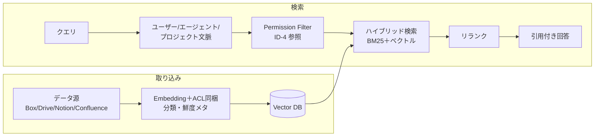

# KM-1 Access-Controlled Enterprise RAG（権限認識RAG）

## 概要

全社文書をベクトル DB に入れて「何でも検索できる AI」を作ると、本来そのユーザーには見えないはずの文書まで回答に含まれてしまいます。インデックスにコピーした瞬間に元のアクセス権限が消える——これが企業 RAG 最大の落とし穴です。このパターンは取り込み時に各チャンクへソースの ACL・分類・鮮度を同梱し、検索のたびに依頼者の最新権限で再評価します。退職者・異動者に「見えてはいけないものが見える」問題を根本から防ぐためのパターンです。

## 解決する企業課題

エンタープライズ RAG の根本的な危険は、ドキュメントをベクトル DB にコピーした時点で元のアクセス制御が失われることです。SharePoint の閲覧権限・Box のフォルダ権限・Confluence のスペース制限——これらはインデックス作成時に考慮されなければ意味をなしません。退職者・異動者が以前の職責に関わる文書を参照し続ける問題も、この「ACL 剥奪が伝播しない」構造から生じてしまいます。

古い文書への参照（鮮度問題）・根拠不明の回答（引用なし）・複数 SaaS 横断での権限不一致——これらはすべて「コピー先で権限と鮮度を管理していない」ことに起因します。企業の情報ガバナンスは、検索インフラがアクセス制御を忠実に継承することを前提として成立するものです。

!!! tip "最小成立条件（MVP）"
    単一データ源（例：SharePoint）のチャンクに ACL メタデータを付与し、検索時にユーザーの所属グループで pre-filter する構成。鮮度やリランクは後回しでよいですが、ACL 同梱と検索時フィルタの2点は初日から必須です。

## 価値仮説

権限を維持した社内知識検索により、従業員の情報探索時間を大幅に削減します。必要な知識への即時アクセスは意思決定速度と業務品質の向上に直結します。

## 解決策と設計

取り込み時にソースの ACL・分類・鮮度をチャンクに同梱し、検索時点の最新エンタイトルメントで評価します。ACL はキャッシュではなく都度判定を基本とし、権限剥奪をリアルタイムに反映させることが重要になります。



Permission Filter は [ID-4 Permission Mirror](../id-identity/id4-permission-mirror-least-of.md) と連携し、依頼者のエンタイトルメントを検索時に評価します。ハイブリッド検索（BM25＋ベクトル）でキーワード適合と意味的類似を組み合わせ、リランカーが最終スコアを算出します。回答には出典 Citation を必ず含め、根拠の透明性を確保します。鮮度ランキングにより古いドキュメントの優先度は自動的に下がります。

## 向き／不向き

| 向き | 不向き |
|---|---|
| 文書/チケット/CRM/チャットの横断検索 | 権限制御不能なデータ源 |
| 多数の SaaS からの統合検索 | リアルタイム DB 正本（直接クエリすべき） |
| 退職・異動に伴う権限変更が頻繁 | 全社員が見てよい公開情報のみ（ACL 不要） |

## 要素技術・既存システム連携

- **検索**：Hybrid Search（BM25＋ベクトル）、Reranker
- **Vector DB**：Pinecone、Weaviate、Qdrant、Elasticsearch
- **ACL フィルタ**：[ID-4 Permission Mirror](../id-identity/id4-permission-mirror-least-of.md) と連携
- **引用**：Citation 付き回答（根拠の透明化）
- **鮮度**：Freshness Ranking（古い文書の優先度低下）
- **対象 SaaS**：Box、Google Drive、Notion、Confluence、SharePoint

## 落とし穴／選定の勘所

!!! danger "ACL の取り込み時固定"
    ACL を取り込み時に固定し再同期しないのは最も危険なアンチパターンです。退職者・異動者が見続ける問題が発生します。取り込み時の ACL は参考値とし、検索時に最新エンタイトルメントで再評価することを必須とします。

- 「全社データを1つのベクトル DB に入れて速く検索」は禁忌です。ACL 同梱を必須とし、同梱できないデータはフェデレーション（[KM-2](km2-context-mesh.md)）で JIT 取得します。
- 検索結果の引用（Citation）を必ず含め、根拠の透明性を確保してください。引用なしの回答は「なぜその答えになったか」の追跡を不可能にします。
- 鮮度ランキングにより古い文書の優先度を下げ、陳腐化した情報による誤回答を防いでください。特に組織改編・制度変更後は鮮度フィルタが重要になります。

## Interfaces

以下はこのパターンを実装する際の主要インターフェイスです。コーディングエージェントはこの定義からスタブコードを生成できます。

```yaml
interfaces:
  - name: Ingest Pipeline with ACL Embedding
    description: "Embeds source ACL, classification label, and freshness timestamp into each chunk at ingestion time; ACL is treated as a reference value for refresh not a fixed copy."
    input:
      request: object
    output:
      response: object
    errors:
      - code: GENERAL_ERROR
        description: "Ingest Pipeline with ACL Embedding の処理中にエラーが発生"
    protocol: "REST / gRPC"
    implementation_hints:
      - "詳細は本文の「解決策と設計」節を参照"
    code_examples:
      typescript: |
        interface IngestPipelineWithAclEmbeddingRequest {
          documentId: string;
          content: string;
          sourceAcl: object;
          classificationLabel: string;
        }
        interface IngestPipelineWithAclEmbeddingResponse {
          chunkIds: string[];
          embeddedAt: Date;
          freshnessTimestamp: Date;
        }
        interface IngestPipelineWithAclEmbedding {
          ingestPipelineWithAclEmbedding(req: IngestPipelineWithAclEmbeddingRequest): Promise<IngestPipelineWithAclEmbeddingResponse>;
        }
      python: |
        @dataclass
        class IngestPipelineWithAclEmbeddingRequest:
            document_id: str
            content: str
            source_acl: dict
            classification_label: str
        
        @dataclass
        class IngestPipelineWithAclEmbeddingResponse:
            chunk_ids: list[str]
            embedded_at: datetime
            freshness_timestamp: datetime
        
        class IngestPipelineWithAclEmbedding(Protocol):
            async def ingest_pipeline_with_acl_embedding(self, req: IngestPipelineWithAclEmbeddingRequest) -> IngestPipelineWithAclEmbeddingResponse: ...
  - name: Permission Filter (ID-4)
    description: "Evaluates the requester's current entitlements against chunk ACLs at query time, filtering inaccessible documents before ranking."
    input:
      request: object
    output:
      response: object
    errors:
      - code: GENERAL_ERROR
        description: "Permission Filter (ID-4) の処理中にエラーが発生"
    protocol: "REST / gRPC"
    implementation_hints:
      - "詳細は本文の「解決策と設計」節を参照"
    code_examples:
      typescript: |
        interface PermissionFilterRequest {
          userId: string;
          candidateChunkIds: string[];
          queryContext: string;
        }
        interface PermissionFilterResponse {
          permittedChunkIds: string[];
          filteredCount: number;
        }
        interface PermissionFilter {
          permissionFilter(req: PermissionFilterRequest): Promise<PermissionFilterResponse>;
        }
      python: |
        @dataclass
        class PermissionFilterRequest:
            user_id: str
            candidate_chunk_ids: list[str]
            query_context: str
        
        @dataclass
        class PermissionFilterResponse:
            permitted_chunk_ids: list[str]
            filtered_count: int
        
        class PermissionFilter(Protocol):
            async def permission_filter(self, req: PermissionFilterRequest) -> PermissionFilterResponse: ...
  - name: Hybrid Search + Reranker
    description: "Combines BM25 keyword matching with vector similarity; reranker produces final scored results including freshness penalty for stale documents."
    input:
      request: object
    output:
      response: object
    errors:
      - code: GENERAL_ERROR
        description: "Hybrid Search + Reranker の処理中にエラーが発生"
    protocol: "REST / gRPC"
    implementation_hints:
      - "詳細は本文の「解決策と設計」節を参照"
    code_examples:
      typescript: |
        interface HybridSearchRerankerRequest {
          query: string;
          vectorQuery: object;
          topK: number;
          userId: string;
        }
        interface HybridSearchRerankerResponse {
          results: object[];
          scores: number[];
          staleFiltered: number;
        }
        interface HybridSearchReranker {
          hybridSearchReranker(req: HybridSearchRerankerRequest): Promise<HybridSearchRerankerResponse>;
        }
      python: |
        @dataclass
        class HybridSearchRerankerRequest:
            query: str
            vector_query: dict
            top_k: int
            user_id: str
        
        @dataclass
        class HybridSearchRerankerResponse:
            results: list[dict]
            scores: list[float]
            stale_filtered: int
        
        class HybridSearchReranker(Protocol):
            async def hybrid_search_reranker(self, req: HybridSearchRerankerRequest) -> HybridSearchRerankerResponse: ...
```

## 関連パターン

- [ID-4 Permission Mirror & Least-of](../id-identity/id4-permission-mirror-least-of.md) — 補完：検索時のアクセス制御判定を担う権限評価層
- [KM-2 Context Mesh](km2-context-mesh.md) — 補完：ACL 同梱が困難なデータ源のフェデレーション型 JIT 取得
- [KM-5 Purpose-Bound Context](km5-purpose-bound-context.md) — 補完：検索結果を業務目的に限定してさらに絞り込む
- [KM-6 DLP & Redaction Boundary](km6-dlp-redaction-boundary.md) — 補完：検索結果に含まれる機密情報のマスキング処理
- [ID-2 Identity Federation & OBO](../id-identity/id2-identity-federation-obo.md) — 補完：検索時に本人権限で SaaS を呼ぶ委譲トークン

## Decision Summary

```yaml
decision_summary:
  pattern: KM-1
  participates_in:
    - decision: TO-2
      role: option_a
    - decision: DC-4
      role: primary
  recommended_if:
    - "社内文書を権限付きで検索させたい"
    - "ACLが明確に定義されている文書ストアがある"
  avoid_if:
    - "全文書が全社公開で権限制御不要"
  combines_with: [ID-2, ID-4, KM-2, KM-5]
  conflicts_with: []
  value_outcome:
    drivers: [employee_efficiency, decision_quality]
    kpis: [検索精度(MRR), 権限フィルタ漏れ率]
  mvp: "1文書ストア＋ACL同梱インデックスでRAG構築"
  cost: M
```
