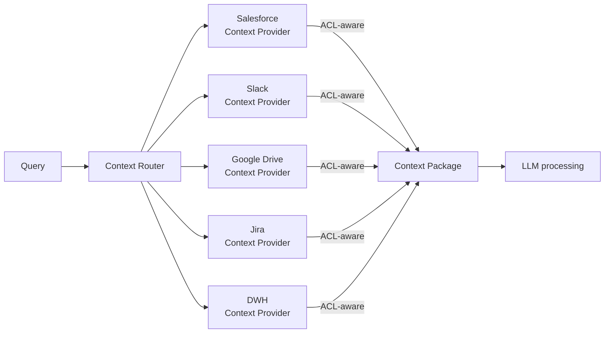

# KM-2 Access-Controlled Context Mesh (Federated Context)

## Overview

Salesforce opportunity data and Workday HR data may look convenient to "collect in one place," but copying them breaks the original permission model. This pattern does not aggregate data but instead queries each SaaS in a distributed fashion (federation) using the person's own OBO token to retrieve context in real time. A hybrid configuration that indexes public information in a central vector DB while JIT-fetching confidential SaaS data is the practical solution. It also facilitates compliance with data residency regulations.

## Enterprise Problem Addressed

Aggregating sensitive data in a company-wide data lake or unified vector DB simultaneously causes multiple problems. First, the original permission model is lost the moment data is copied (the ACL problem from [KM-1](km1-access-controlled-rag.md)). Second, Salesforce opportunity data, Workday HR data, and internal HR data mixed in a single index can all become reference targets regardless of the user's department or role. Furthermore, the more copies exist, the more complex auditing, data cataloging, and change tracking become.

From the perspective of data residency regulations (GDPR, personal information protection laws), copying data to infrastructure outside the country of origin may also be restricted in some cases. The federation type makes "not aggregating" a design principle, solving all three challenges of permissions, regulations, and auditing at once. As for the division of use with KM-1: document-type data where ACL can be reliably included is indexed with KM-1, while confidential SaaS data is JIT-fetched with this pattern — a hybrid is the practical solution.

!!! tip "Minimum Viable Configuration (MVP)"
    Prepare Context Providers for 2–3 SaaS and JIT-fetch using the person's own OBO token. Context Router parallelization and caching can be added later; first demonstrate the principle of "retrieve on-demand without copying" for one business workflow.

## Value Hypothesis

Cross-integrating context from multiple SaaS realizes high-quality decision support utilizing knowledge across departments. Integration of siloed information improves management decision precision and reduces opportunity losses.

## Solution and Design

The Context Router distributes queries to each Context Provider, and each provider collects results while maintaining permissions through ACL-aware retrieval. Sensitive data is not aggregated but retrieved on-demand using the person's own OBO token.



Each Context Provider calls SaaS with the person's own OBO token ([ID-2](../id-identity/id2-identity-federation-obo.md)) and returns only the data they are permitted to see. For SaaS that do not support OBO, permission filters are applied with [ID-4 Permission Mirror](../id-identity/id4-permission-mirror-least-of.md). The Context Router executes queries to each provider in parallel and waits for responses with independent timeouts per provider. The retrieved results are assembled into a Context Package, which is finally filtered by [KM-5](km5-purpose-bound-context.md) purpose policy before being passed to the LLM.

## When to Use / When Not to Use

| When to Use | When Not to Use |
|---|---|
| Permission preservation is a priority; data residency/regulations are important | Only public data with no permission requirements |
| Cross-utilization of confidential SaaS data | Extreme low-latency requirements (federation is slower) |
| Avoiding audit complexity from copying | Large-scale statistical/BI analysis (central lake is more appropriate) |

## Component Technologies and System Integration

- **Federation**: Federated Search, Context Router
- **Retrieval proxy**: Retrieval Proxy (abstracting each SaaS API)
- **Index**: Embedding Index per Scope (scope-specific index)
- **JIT retrieval**: Just-in-time Retrieval (on-demand retrieval using person's own token)
- **Target SaaS**: Salesforce, Slack, Google Drive, Jira, ServiceNow, Notion

## Pitfalls and Selection Criteria

!!! warning "The trap of reverting to aggregation to avoid latency"
    If latency aversion leads back to copying and ACL inclusion is neglected, permission guarantees collapse. Address latency improvement through caching (short TTL), parallel retrieval, and prefetching; treat copying as a last resort. If copying is necessary, always include ACL ([KM-1](km1-access-controlled-rag.md)) and implement re-evaluation at search time.

- Public internal policies go into the central vector DB; confidential SaaS data goes to JIT retrieval using the person's own token — a hybrid is the practical solution. Organize "which data source is classified as which" at the initial design stage.
- "Indexing sensitive data too because it's fast" is prohibited. Even when indexing, ACL inclusion ([KM-1](km1-access-controlled-rag.md)) is mandatory.
- As the number of Context Providers grows, latency may increase linearly. Design parallel retrieval and independent timeouts per provider so that delays from some providers do not block the whole operation.

## Interfaces

The following are the key interfaces for implementing this pattern. Coding agents can generate stub code from these definitions.

```yaml
interfaces:
  - name: Context Router
    description: "Dispatches queries in parallel to each Context Provider with independent timeouts so one slow provider does not block others."
    input:
      request: object
    output:
      response: object
    errors:
      - code: GENERAL_ERROR
        description: "Error occurred during Context Router processing"
    protocol: "REST / gRPC"
    implementation_hints:
      - "See the Solution and Design section for details"
    code_examples:
      typescript: |
        interface ContextRouterRequest {
          query: string;
          userId: string;
          providers: string[];
          timeoutMs: number;
        }
        interface ContextRouterResponse {
          providerResults: object;
          timedOut: string[];
        }
        interface ContextRouter {
          contextRouter(req: ContextRouterRequest): Promise<ContextRouterResponse>;
        }
      python: |
        @dataclass
        class ContextRouterRequest:
            query: str
            user_id: str
            providers: list[str]
            timeout_ms: int
        
        @dataclass
        class ContextRouterResponse:
            provider_results: dict
            timed_out: list[str]
        
        class ContextRouter(Protocol):
            async def context_router(self, req: ContextRouterRequest) -> ContextRouterResponse: ...
  - name: Context Provider (per SaaS)
    description: "Calls the target SaaS with the requester's OBO token (ID-2) and returns only the data the requester is permitted to see."
    input:
      request: object
    output:
      response: object
    errors:
      - code: GENERAL_ERROR
        description: "Error occurred during Context Provider (per SaaS) processing"
    protocol: "REST / gRPC"
    implementation_hints:
      - "See the Solution and Design section for details"
    code_examples:
      typescript: |
        interface ContextProviderRequest {
          query: string;
          oboToken: string;
          saasTarget: string;
        }
        interface ContextProviderResponse {
          data: object[];
          retrievedAt: Date;
          permissionBased: boolean;
        }
        interface ContextProvider {
          contextProvider(req: ContextProviderRequest): Promise<ContextProviderResponse>;
        }
      python: |
        @dataclass
        class ContextProviderRequest:
            query: str
            obo_token: str
            saas_target: str
        
        @dataclass
        class ContextProviderResponse:
            data: list[dict]
            retrieved_at: datetime
            permission_based: bool
        
        class ContextProvider(Protocol):
            async def context_provider(self, req: ContextProviderRequest) -> ContextProviderResponse: ...
  - name: Context Package Builder
    description: "Assembles the collected provider results and passes them through KM-5 purpose policy for final filtering before sending to the LLM."
    input:
      request: object
    output:
      response: object
    errors:
      - code: GENERAL_ERROR
        description: "Error occurred during Context Package Builder processing"
    protocol: "REST / gRPC"
    implementation_hints:
      - "See the Solution and Design section for details"
    code_examples:
      typescript: |
        interface ContextPackageBuilderRequest {
          providerResults: object;
          purpose: string;
          tokenBudget: number;
        }
        interface ContextPackageBuilderResponse {
          contextPackage: object;
          tokenCount: number;
          purposeTag: string;
        }
        interface ContextPackageBuilder {
          contextPackageBuilder(req: ContextPackageBuilderRequest): Promise<ContextPackageBuilderResponse>;
        }
      python: |
        @dataclass
        class ContextPackageBuilderRequest:
            provider_results: dict
            purpose: str
            token_budget: int
        
        @dataclass
        class ContextPackageBuilderResponse:
            context_package: dict
            token_count: int
            purpose_tag: str
        
        class ContextPackageBuilder(Protocol):
            async def context_package_builder(self, req: ContextPackageBuilderRequest) -> ContextPackageBuilderResponse: ...
```

## Related Patterns

- [KM-1 Access-Controlled RAG](km1-access-controlled-rag.md) — Contrast: the ACL inclusion approach when indexing (aggregation vs. federation usage distinction)
- [ID-2 Identity Federation & OBO](../id-identity/id2-identity-federation-obo.md) — Complementary: delegation token issuance supporting JIT retrieval using person's own token
- [ID-4 Permission Mirror](../id-identity/id4-permission-mirror-least-of.md) — Complementary: permission filter application for SaaS not supporting OBO
- [KM-5 Purpose-Bound Context](km5-purpose-bound-context.md) — Complementary: limiting federation retrieval results by business purpose
- [IN-2 SaaS Connector Adapter](../in-integration/in2-saas-connector-adapter.md) — Complementary: adapter layer absorbing SaaS-specific differences for each Context Provider
