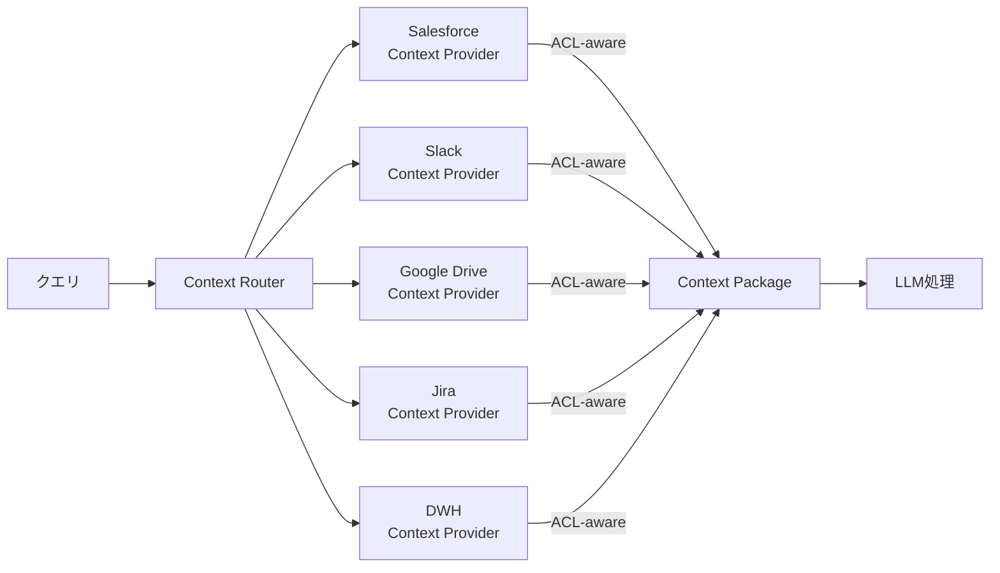

# KM-2 Access-Controlled Context Mesh（フェデレーテッド文脈）

## 概要

Salesforce の案件情報も Workday の人事データも「一箇所に集めれば便利」に見える。だがコピーした時点で元の権限モデルは崩れる。このパターンはデータを集約せず、本人の OBO トークンで各 SaaS に分散問い合わせ（フェデレーション）してリアルタイムに文脈を取得する。公開情報は中央ベクトル DB でインデックス化し、機密 SaaS データは JIT 取得するハイブリッド構成が実務的な解だ。データ所在地規制への対応もしやすい。

## 解決する企業課題

全社データレイクや統一ベクトル DB に機密データを集約すると、複数の問題が同時に発生する。まずデータをコピーした時点で元の権限モデルが失われる（[KM-1](km1-access-controlled-rag.md) の ACL 問題）。次に、Salesforce の案件情報・Workday の人事データが一つのインデックスに混在すると、ユーザーの所属や役職に関係なく全データが参照対象になりうる。コピーが増えるほど監査・データカタログ・変更追跡も複雑になる。

データ所在地規制（GDPR、個人情報保護法）の観点でも、データを本国外インフラにコピーすることが制約となるケースがある。フェデレーション型は「集約しない」を設計原則とし、権限・規制・監査の三課題を一度に解決する。KM-1 との使い分けとしては、ACL を確実に同梱できる文書系は KM-1 でインデックス化し、機密 SaaS データは本パターンで JIT 取得するハイブリッドが実務的な解だ。

!!! tip "最小成立条件（MVP）"
    2〜3 の SaaS に対する Context Provider を用意し、本人の OBO トークンで JIT 取得する構成。Context Router の並列化やキャッシュは後続で追加すればよく、まずは「コピーせず都度取得」の原則を1業務で実証する。

## 価値仮説

複数SaaSの文脈を横断統合することで、部門を越えた知見を活用した高品質な判断支援を実現する。サイロ化された情報の統合は経営判断の精度向上と機会損失の削減に効く。

## 解決策と設計

Context Router がクエリを各 Context Provider に分散し、各プロバイダが ACL-aware な取得で権限を維持したまま結果を収集する。機密データは集約せず、本人の OBO トークンで都度取得する。



各 Context Provider は本人の OBO トークン（[ID-2](../id-identity/id2-identity-federation-obo.md)）で SaaS を呼び、見てよいデータのみを返す。OBO 非対応の SaaS では [ID-4 Permission Mirror](../id-identity/id4-permission-mirror-least-of.md) で権限フィルタを適用する。Context Router は各プロバイダへの問い合わせを並列実行し、プロバイダごとに独立したタイムアウトで応答を待つ。取得した結果は Context Package にまとめ、[KM-5](km5-purpose-bound-context.md) の目的ポリシーで最終フィルタリングしてから LLM に渡す。

## 向き／不向き

| 向き | 不向き |
|---|---|
| 権限維持重視・データ所在地/規制が重要 | 権限不要の公開データのみ |
| 機密 SaaS データを横断的に利用 | 極端な低レイテンシ要件（フェデレーションは遅い） |
| コピーによる監査困難を避けたい | 大量の統計・BI 分析（中央レイクが適する） |

## 要素技術・既存システム連携

- **フェデレーション**：Federated Search、Context Router
- **取得プロキシ**：Retrieval Proxy（各 SaaS API を抽象化）
- **インデックス**：Embedding Index per Scope（スコープ別索引）
- **JIT 取得**：Just-in-time Retrieval（本人トークンで都度取得）
- **対象 SaaS**：Salesforce、Slack、Google Drive、Jira、ServiceNow、Notion

## 落とし穴／選定の勘所

!!! warning "レイテンシを嫌い集約に戻る罠"
    レイテンシを嫌い結局コピーに戻り ACL 同梱を怠ると、権限保証が崩れる。レイテンシ改善はキャッシュ（短 TTL）・並列取得・プリフェッチで対処し、コピーは最終手段とする。コピーする場合は必ず ACL を同梱し（[KM-1](km1-access-controlled-rag.md)）、検索時の再評価を実装する。

- 公開社内規程は中央ベクトル DB へ、機密 SaaS データは本人トークンでの JIT 取得へ——ハイブリッドが実務的な解である。設計初期に「各データ源をどちらに分類するか」を整理しておく。
- 「速いから機密も索引化」は禁忌。索引化する場合も ACL 同梱（[KM-1](km1-access-controlled-rag.md)）を必須にする。
- Context Provider の数が増えるとレイテンシが線形に伸びる可能性がある。並列取得とプロバイダごとの独立タイムアウトを設計し、一部プロバイダの遅延が全体をブロックしないようにする。

## Interfaces

以下はこのパターンを実装する際の主要インターフェイスである。コーディングエージェントはこの定義からスタブコードを生成できる。

```yaml
interfaces:
  - name: Context Router
    description: "Dispatches queries in parallel to each Context Provider with independent timeouts so one slow provider does not block others."
    input:
      request: object
    output:
      response: object
    errors:
      - code: GENERAL_ERROR
        description: "Context Router の処理中にエラーが発生"
    protocol: "REST / gRPC"
    implementation_hints:
      - "詳細は本文の「解決策と設計」節を参照"
  - name: Context Provider (per SaaS)
    description: "Calls the target SaaS with the requester's OBO token (ID-2) and returns only the data the requester is permitted to see."
    input:
      request: object
    output:
      response: object
    errors:
      - code: GENERAL_ERROR
        description: "Context Provider (per SaaS) の処理中にエラーが発生"
    protocol: "REST / gRPC"
    implementation_hints:
      - "詳細は本文の「解決策と設計」節を参照"
  - name: Context Package Builder
    description: "Assembles the collected provider results and passes them through KM-5 purpose policy for final filtering before sending to the LLM."
    input:
      request: object
    output:
      response: object
    errors:
      - code: GENERAL_ERROR
        description: "Context Package Builder の処理中にエラーが発生"
    protocol: "REST / gRPC"
    implementation_hints:
      - "詳細は本文の「解決策と設計」節を参照"
```

## 関連パターン

- [KM-1 Access-Controlled RAG](km1-access-controlled-rag.md) — 対比：索引化する場合の ACL 同梱アプローチ（集約型 vs. フェデレーション型の使い分け）
- [ID-2 Identity Federation & OBO](../id-identity/id2-identity-federation-obo.md) — 補完：本人トークンでの JIT 取得を支える委譲トークン発行
- [ID-4 Permission Mirror](../id-identity/id4-permission-mirror-least-of.md) — 補完：OBO 非対応 SaaS での権限フィルタ適用
- [KM-5 Purpose-Bound Context](km5-purpose-bound-context.md) — 補完：フェデレーション取得結果を業務目的に限定する
- [IN-2 SaaS Connector Adapter](../in-integration/in2-saas-connector-adapter.md) — 補完：各 Context Provider の SaaS 固有差を吸収するアダプタ層
