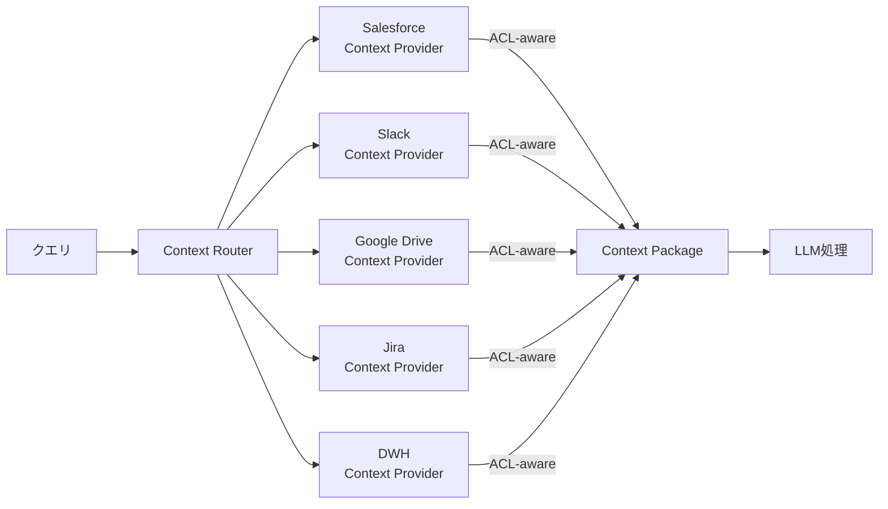

# KM-2 Access-Controlled Context Mesh（フェデレーテッド文脈）

## 概要

各データ源を一箇所に集約せず、権限制御を維持したまま分散問い合わせ（フェデレーション）で文脈を供給する。機密データは本人トークンで JIT 取得し、コピーを最小化する。

## 設計

Context Router がクエリを各 Context Provider に分散し、ACL-aware retrieval で権限を維持したまま結果を収集する。機密データは集約せず、本人トークンで都度取得する。

各 Context Provider は本人の OBO トークン（[ID-2](../id-identity/id2-identity-federation-obo.md)）で SaaS を呼び、見てよいデータのみを返す。

## 解決する企業課題

全社データレイクに集めると権限が壊れる、RAG 索引に機密が混入する、最新権限を反映できない、コピー増で監査が困難になる——これらを「集約しない」設計で解決する。

## 向き／不向き

| 向き | 不向き |
|---|---|
| 権限維持重視・データ所在地/規制が重要 | 権限不要の公開データのみ |
| 機密 SaaS データを横断的に利用 | 極端な低レイテンシ要件（フェデレーションは遅い） |
| コピーによる監査困難を避けたい | 大量の統計・BI 分析（中央レイクが適する） |

## 要素技術・既存システム連携

- **フェデレーション**：Federated Search、Context Router
- **取得プロキシ**：Retrieval Proxy（各 SaaS API を抽象化）
- **インデックス**：Embedding Index per Scope（スコープ別索引）
- **JIT 取得**：Just-in-time Retrieval（本人トークンで都度取得）
- **対象 SaaS**：Salesforce、Slack、Google Drive、Jira、ServiceNow、Notion

## 落とし穴／選定の勘所

!!! warning "レイテンシを嫌い集約に戻る罠"
    レイテンシを嫌い結局コピーに戻り ACL 同梱を怠ると、権限保証が崩れる。レイテンシ改善はキャッシュ（短 TTL）・並列取得・プリフェッチで対処し、コピーは最終手段とする。

- 公開社内規程は中央ベクトル DB へ、機密 SaaS データは本人トークンでの JIT 取得へ——ハイブリッドが実務的な解である。
- 「速いから機密も索引化」は禁忌。索引化する場合も ACL 同梱（[KM-1](km1-access-controlled-rag.md)）を必須にする。
- Context Provider の数が増えるとレイテンシが線形に伸びる。並列取得とタイムアウトを設計する。

## 関連パターン

- [KM-1 Access-Controlled RAG](km1-access-controlled-rag.md) — 索引化する場合の ACL 同梱
- [ID-2 Identity Federation & OBO](../id-identity/id2-identity-federation-obo.md) — 本人トークンでの JIT 取得
- [ID-4 Permission Mirror](../id-identity/id4-permission-mirror-least-of.md) — OBO 非対応 SaaS での権限フィルタ
- [KM-5 Purpose-Bound Context](km5-purpose-bound-context.md) — 取得結果を目的に限定
- [IN-2 SaaS Connector Adapter](../in-integration/in2-saas-connector-adapter.md) — Context Provider の SaaS 差吸収
