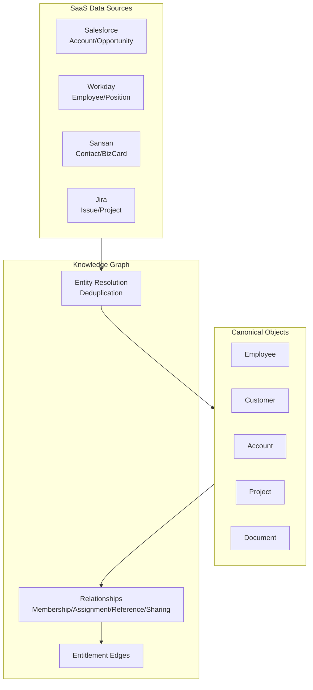

# KM-3 Canonical Enterprise Object Model & Knowledge Graph (Canonical Objects / Knowledge Graph)

## Overview

"Account" in Salesforce, "Organization" in Workday, "Project" in Jira — the same customer is referred to by different names in each SaaS. With fragmented vocabulary, agents cannot construct cross-system context even with cross-search. This pattern normalizes data into common business objects (Customer / Employee / Project / Contract, etc.), deduplicates the same person or customer across systems through entity resolution, and establishes relationships. The goal is not complete ETL integration but "semantic integration" — holding reference links to each SaaS while leaving actual data in its original location.

## Enterprise Problem Addressed

As SaaS platforms multiply, the situation of "the same concept is managed under different names" becomes more serious. Salesforce has Account, Workday has Organization, Jira has Project — if vocabulary differs for the same customer or organization, agents cannot construct cross-domain context. When customers, opportunities, contracts, and invoices are fragmented across multiple systems, it becomes impossible to answer the perfectly reasonable question "Tell me the current contract status and latest opportunity progress for this customer."

Inter-departmental vocabulary differences are also problematic. What sales calls "customer," legal calls "contracting party" and accounting calls "billing recipient." Agents treat these as separate entities, hindering integrated context generation. Canonical objects bridge this vocabulary gap through "semantic integration." Unlike complete data integration (collecting everything in one place via ETL), maintaining reference links to each system allows managing only relationships while leaving data in the original systems.

!!! tip "Minimum Viable Configuration (MVP)"
    Define only three entities — Customer, Employee, and Project — and create an ID mapping table between Salesforce and Workday. A graph DB is not needed; start with a reference table in an RDB.

!!! note "Relative Cost and Operational Burden"
    Maintaining deduplication accuracy, managing the scope of schema change impacts, and operating sync pipelines with multiple SaaS mean this falls in the higher tier of introduction and operational costs among the 7-dimension patterns. It can easily become an over-investment unless the ROI justifies the scale (5+ systems, cross-departmental use).

## Value Hypothesis

A company-wide normalized data model accelerates cross-organizational KPI aggregation and inter-departmental comparison. Unified data definitions improve analysis reliability and enhance management decision quality and speed.

## Solution and Design

Define canonical objects (Employee / Customer / Account / Opportunity / Contract / Project / Task / Ticket / Document / Invoice, etc.), deduplicate the same customer and person across systems through entity resolution, and establish relationships (membership, assignment, reference, sharing) and entitlement edges.



The graph holds only reference links and metadata, with actual data remaining in each SaaS. Agents traverse the graph to identify related entities and JIT-retrieve required data via [KM-2](km2-context-mesh.md) Context Providers. Entitlement edges also express the relationship "which users can access this entity," integrating with permission filters at search time ([KM-1](km1-access-controlled-rag.md)).

## When to Use / When Not to Use

| When to Use | When Not to Use |
|---|---|
| Many systems with distributed data; management/cross-departmental AI | Business operations completed within a single SaaS |
| Customer and personnel management requiring deduplication | Small scale where data integration ROI is not justified |
| Using org graph as a cross-cutting axis | Cases where SaaS-specific vocabulary is self-contained |

## Component Technologies and System Integration

- **Data model**: Canonical Data Model
- **Knowledge graph**: GraphRAG, Neo4j
- **MDM**: Master Data Management
- **Deduplication**: Entity Resolution, Sansan (person deduplication)
- **Target SaaS**: Salesforce, Workday, ServiceNow, Jira, Sansan

## Pitfalls and Selection Criteria

!!! danger "Copying all company data into a single graph DB"
    Copying all company data into a single graph DB creates an enormous data breach asset. Maintain the design principle of holding only reference links and metadata in the graph, premised on no-copy ([KM-2](km2-context-mesh.md)) + permission filter ([KM-1](km1-access-controlled-rag.md)).

- Over-engineering the common model leads to divergence from reality. Normalize thinly and only as needed, retaining ID mappings for each system. Start with just the primary entities (Customer / Employee / Project).
- Low deduplication accuracy causes incorrect relationships to form, with agents combining information from wrong entities. Regularly measure accuracy and prepare manual correction workflows.
- Changes to canonical objects affect all agents, so apply version management ([GV-6](../gv-governance/gv6-version-registry.md)). When making changes, either maintain backward compatibility or provide a migration period.

## Interfaces

The following are the key interfaces for implementing this pattern. Coding agents can generate stub code from these definitions.

```yaml
interfaces:
  - name: Entity Resolution Engine
    description: "Matches cross-SaaS entities (e.g., Salesforce Account == Workday Organization) using fuzzy matching and ID mapping tables; flags low-confidence matches for manual review."
    input:
      request: object
    output:
      response: object
    errors:
      - code: GENERAL_ERROR
        description: "Error occurred during Entity Resolution Engine processing"
    protocol: "REST / gRPC"
    implementation_hints:
      - "See the Solution and Design section for details"
    code_examples:
      typescript: |
        interface EntityResolutionEngineRequest {
          entityIds: object[];
          sourceSystems: string[];
          matchThreshold: number;
        }
        interface EntityResolutionEngineResponse {
          resolvedEntities: object[];
          confidenceScores: number[];
          lowConfidenceFlags: string[];
        }
        interface EntityResolutionEngine {
          entityResolutionEngine(req: EntityResolutionEngineRequest): Promise<EntityResolutionEngineResponse>;
        }
      python: |
        @dataclass
        class EntityResolutionEngineRequest:
            entity_ids: list[dict]
            source_systems: list[str]
            match_threshold: float
        
        @dataclass
        class EntityResolutionEngineResponse:
            resolved_entities: list[dict]
            confidence_scores: list[float]
            low_confidence_flags: list[str]
        
        class EntityResolutionEngine(Protocol):
            async def entity_resolution_engine(self, req: EntityResolutionEngineRequest) -> EntityResolutionEngineResponse: ...
  - name: Knowledge Graph (Neo4j)
    description: "Stores reference links and relationship metadata (member-of, owned-by, referenced-by) plus entitlement edges; actual data stays in source SaaS."
    input:
      request: object
    output:
      response: object
    errors:
      - code: GENERAL_ERROR
        description: "Error occurred during Knowledge Graph (Neo4j) processing"
    protocol: "REST / gRPC"
    implementation_hints:
      - "See the Solution and Design section for details"
    code_examples:
      typescript: |
        interface KnowledgeGraphRequest {
          entityId: string;
          relationshipTypes: string[];
          depth: number;
        }
        interface KnowledgeGraphResponse {
          nodes: object[];
          edges: object[];
          entitlementEdges: object[];
        }
        interface KnowledgeGraph {
          knowledgeGraph(req: KnowledgeGraphRequest): Promise<KnowledgeGraphResponse>;
        }
      python: |
        @dataclass
        class KnowledgeGraphRequest:
            entity_id: str
            relationship_types: list[str]
            depth: int
        
        @dataclass
        class KnowledgeGraphResponse:
            nodes: list[dict]
            edges: list[dict]
            entitlement_edges: list[dict]
        
        class KnowledgeGraph(Protocol):
            async def knowledge_graph(self, req: KnowledgeGraphRequest) -> KnowledgeGraphResponse: ...
  - name: Graph Traversal API
    description: "Enables agents to navigate related entities and then use KM-2 Context Providers to JIT-fetch actual data from source systems."
    input:
      request: object
    output:
      response: object
    errors:
      - code: GENERAL_ERROR
        description: "Error occurred during Graph Traversal API processing"
    protocol: "REST / gRPC"
    implementation_hints:
      - "See the Solution and Design section for details"
    code_examples:
      typescript: |
        interface GraphTraversalApiRequest {
          startEntityId: string;
          traversalPattern: string;
          userId: string;
        }
        interface GraphTraversalApiResponse {
          relatedEntities: object[];
          paths: object[];
        }
        interface GraphTraversalApi {
          graphTraversalApi(req: GraphTraversalApiRequest): Promise<GraphTraversalApiResponse>;
        }
      python: |
        @dataclass
        class GraphTraversalApiRequest:
            start_entity_id: str
            traversal_pattern: str
            user_id: str
        
        @dataclass
        class GraphTraversalApiResponse:
            related_entities: list[dict]
            paths: list[dict]
        
        class GraphTraversalApi(Protocol):
            async def graph_traversal_api(self, req: GraphTraversalApiRequest) -> GraphTraversalApiResponse: ...
```

## Related Patterns

- [KM-1 Access-Controlled RAG](km1-access-controlled-rag.md) — Complementary: making canonical objects the search target for RAG and applying permission filters
- [KM-2 Context Mesh](km2-context-mesh.md) — Complementary: traversing references from canonical objects to each SaaS for JIT retrieval
- [KM-4 Scoped Memory Hierarchy](km4-scoped-memory-hierarchy.md) — Complementary: memory scope determination based on org graph
- [IN-2 SaaS Connector Adapter](../in-integration/in2-saas-connector-adapter.md) — Complementary: adapter layer converting each SaaS data to canonical form
- [RT-11 Project Digital Twin](../rt-runtime/rt11-project-digital-twin.md) — Similar: normalization and state management of project context
