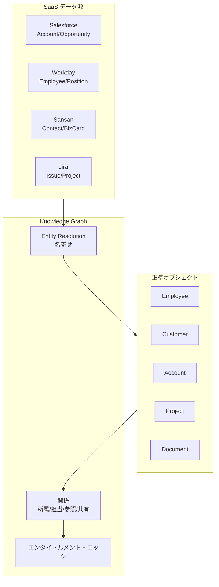

# KM-3 Canonical Enterprise Object Model & Knowledge Graph（正規オブジェクト／知識グラフ）

## 概要

Salesforce では「Account」、Workday では「Organization」、Jira では「Project」——同じ顧客を指しているのに SaaS ごとに名前が違う。語彙がバラバラでは、エージェントは横断検索しても文脈を組み立てられない。このパターンは、共通の業務オブジェクト（Customer / Employee / Project / Contract 等）に正規化し、エンティティ解決で同一人物・同一顧客を名寄せして関係を張る。完全な ETL 統合ではなく「意味的統合」——各 SaaS への参照リンクを持ち、実データは元の場所に残す——を目指す。

## 解決する企業課題

SaaS が増えるほど「同じ概念が別の名前で管理されている」状況が深刻になる。Salesforce では Account、Workday では Organization、Jira では Project——同一顧客・同一組織を指すのに語彙が異なれば、エージェントは横断文脈を構築できない。顧客/案件/契約/請求が複数システムに分断されると、「この顧客の現在の契約状況と直近の案件進捗を教えて」という当然の問いに答えられない。

部門間の語彙差も問題だ。営業が「顧客」と呼ぶものを法務は「契約当事者」、会計は「請求先」と呼ぶ。エージェントにとってこれらは別エンティティとして扱われ、統合的な文脈生成が妨げられる。正規オブジェクトはこの語彙の断絶を「意味的統合」で橋渡しする。完全なデータ統合（ETL で一箇所に集める）とは異なり、各システムへの参照リンクを保持することで、データは元システムに置いたまま関係性だけを管理できる。

!!! tip "最小成立条件（MVP）"
    Customer / Employee / Project の3エンティティだけを定義し、Salesforce と Workday の ID マッピングテーブルを作る。グラフ DB は不要で、RDB の参照テーブルから始められる。

!!! note "導入コスト・運用負荷の相対感"
    名寄せの精度維持・スキーマ変更の影響範囲管理・複数 SaaS との同期パイプライン運用により、7面のパターン中でも導入・運用コストは高い部類に入る。ROI が見合う規模（システム5つ以上・部門横断利用）でなければ過剰投資になりやすい。

## 解決策と設計

正準オブジェクト（Employee / Customer / Account / Opportunity / Contract / Project / Task / Ticket / Document / Invoice 等）を定義し、エンティティ解決で同一顧客・同一人物をシステム横断で名寄せする。関係（所属・担当・参照・共有）とエンタイトルメント・エッジを張る。

グラフには参照リンクとメタデータのみを持ち、実データは各 SaaS に残す。エージェントはグラフをたどって関連エンティティを特定し、必要なデータは [KM-2](km2-context-mesh.md) の Context Provider 経由で JIT 取得する。エンタイトルメント・エッジによって「このエンティティにアクセスできるユーザー」の関係も表現し、検索時の権限フィルタ（[KM-1](km1-access-controlled-rag.md)）と連携する。

## 向き／不向き

| 向き | 不向き |
|---|---|
| システムが多くデータが分散・経営/部門横断 AI | 単一 SaaS 完結の業務 |
| 名寄せが必要な顧客・人物管理 | データ統合の ROI が見合わない小規模 |
| 組織グラフの横断軸として利用 | SaaS 独自語彙で完結する場合 |

## 要素技術・既存システム連携

- **データモデル**：Canonical Data Model
- **知識グラフ**：GraphRAG、Neo4j
- **MDM**：Master Data Management
- **名寄せ**：Entity Resolution、Sansan（人物名寄せ）
- **対象 SaaS**：Salesforce、Workday、ServiceNow、Jira、Sansan

## 落とし穴／選定の勘所

!!! danger "全社データの単一グラフ DB コピー"
    全社データを単一のグラフ DB にコピーすると巨大な漏洩資産を作ることになる。no-copy（[KM-2](km2-context-mesh.md)）＋権限フィルタ（[KM-1](km1-access-controlled-rag.md)）を前提にし、グラフには参照リンクとメタデータのみを持つ設計を維持する。

- 共通モデルを作り込みすぎると実態と乖離する。薄く必要分だけ正規化し、各システムの ID マッピングを保持する。最初は主要エンティティ（Customer / Employee / Project）だけから始める。
- 名寄せ精度が低いと誤った関係が張られ、エージェントが間違ったエンティティの情報を組み合わせる。定期的に精度を計測し、手動修正のワークフローを用意する。
- 正準オブジェクトの変更は全エージェントに影響するため、版管理（[GV-6](../gv-governance/gv6-version-registry.md)）を適用する。変更時は下位互換性を保つか移行期間を設ける。

## 関連パターン

- [KM-1 Access-Controlled RAG](km1-access-controlled-rag.md) — 補完：正規オブジェクトを RAG の検索対象とし権限フィルタを適用する
- [KM-2 Context Mesh](km2-context-mesh.md) — 補完：正規オブジェクトから各 SaaS への参照をたどり JIT 取得する
- [KM-4 Scoped Memory Hierarchy](km4-scoped-memory-hierarchy.md) — 補完：組織グラフに基づくメモリスコープの決定
- [IN-2 SaaS Connector Adapter](../in-integration/in2-saas-connector-adapter.md) — 補完：各 SaaS のデータを正準形に変換するアダプタ層
- [RT-11 Project Digital Twin](../rt-runtime/rt11-project-digital-twin.md) — 類似：プロジェクト文脈の正規化と状態管理
