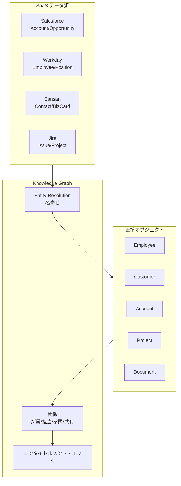

# KM-3 Canonical Enterprise Object Model & Knowledge Graph（正規オブジェクト／知識グラフ）

## 概要

多様な SaaS データを、エージェントが業務文脈を理解するための共通業務オブジェクト（語彙）に正規化し、エンティティを名寄せして関係を張る。完全統合ではなく「意味的統合」——各システムへの参照を持つ——を目指す。

## 設計

正準オブジェクト（Employee / Customer / Account / Opportunity / Contract / Project / Task / Ticket / Document / Invoice 等）を定義し、エンティティ解決で同一顧客・同一人物をシステム横断で名寄せする。関係（所属・担当・参照・共有）とエンタイトルメント・エッジを張る。

## 解決する企業課題

SaaS ごとに同概念の名前が違う（Salesforce の Account と Workday の Organization）、顧客/案件/契約/請求の分断、横断文脈の統合不能、部門間の語彙差。これらを正準オブジェクトで解決する。

## 向き／不向き

| 向き | 不向き |
|---|---|
| システムが多くデータが分散・経営/部門横断 AI | 単一 SaaS 完結の業務 |
| 名寄せが必要な顧客・人物管理 | データ統合の ROI が見合わない小規模 |
| 組織グラフの横断軸として利用 | SaaS 独自語彙で完結する場合 |

## 要素技術・既存システム連携

- **データモデル**：Canonical Data Model
- **知識グラフ**：GraphRAG、Neo4j
- **MDM**：Master Data Management
- **名寄せ**：Entity Resolution、Sansan（人物名寄せ）
- **対象 SaaS**：Salesforce、Workday、ServiceNow、Jira、Sansan

## 落とし穴／選定の勘所

!!! danger "全社データの単一グラフ DB コピー"
    全社データを単一のグラフ DB にコピーすると巨大な漏洩資産を作ることになる。no-copy（[KM-2](km2-context-mesh.md)）＋権限フィルタ（[KM-1](km1-access-controlled-rag.md)）を前提にし、グラフには参照リンクとメタデータのみを持つ。

- 共通モデルを作り込みすぎると実態と乖離する。薄く必要分だけ正規化し、各システムの ID マッピングを保持する。
- 名寄せ精度が低いと誤った関係が張られる。定期的に精度を計測し、手動修正のワークフローを用意する。
- 正準オブジェクトの変更は全エージェントに影響するため、版管理（[GV-6](../gv-governance/gv6-version-registry.md)）を適用する。

## 関連パターン

- [KM-1 Access-Controlled RAG](km1-access-controlled-rag.md) — 正規オブジェクトをRAGの検索対象にする
- [KM-2 Context Mesh](km2-context-mesh.md) — 正規オブジェクトから各 SaaS への参照をたどる
- [KM-4 Scoped Memory Hierarchy](km4-scoped-memory-hierarchy.md) — 組織グラフに基づくメモリスコープ
- [IN-2 SaaS Connector Adapter](../in-integration/in2-saas-connector-adapter.md) — 各 SaaS のデータを正準形に変換
- [RT-11 Project Digital Twin](../rt-runtime/rt11-project-digital-twin.md) — プロジェクト文脈の正規化
