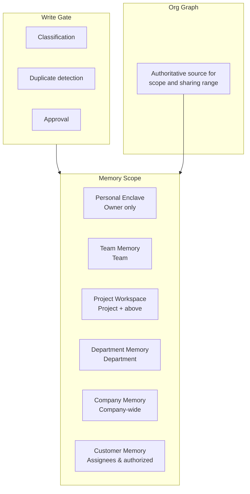

# KM-4 Scoped Memory Hierarchy (Scoped Memory Hierarchy)

## Overview

Giving agents memory is convenient but causes incidents where "personal memory is visible to the entire team" or "customer information from Project A leaks to Project B." This pattern isolates memory into personal, team, project, department, company, and customer scopes, keeping sharing scope aligned with the organizational graph. Memory and permissions are automatically expired when linked to departures or project endings, and the right for individuals to delete their own memory is included in the design.

## Enterprise Problem Addressed

Giving agents memory enables reuse of past context, but "who can access which memory" must be managed or it becomes a channel for information leakage. Personal memory visible to the entire team, customer information obtained in Project A being referenced by Project B's agent, departed employees' context visible to successors — these are typical problems occurring in scopeless designs.

Corporate organizational structure is itself an authoritative standard for information sharing. Reflecting the organizational logic of "members on the same team can see the same information" and "department heads can see project information within their department" in the memory hierarchy allows delegating permission management to the org graph — an existing authoritative source. Automatically expiring memory and permissions in conjunction with lifecycle events like project endings, departures, and transfers also prevents misuse of stale context.

!!! tip "Minimum Viable Configuration (MVP)"
    Divide Vector DB Namespaces into three layers — Personal / Team / Company — and assign scopes at write time. Org graph integration and automatic expiration can wait for subsequent phases, but scope isolation alone must be introduced from the start.

## Value Hypothesis

Team and project-level memory sharing eliminates knowledge silos. Sharing tacit knowledge contributes to reducing new hire ramp-up time and improving team productivity.

## Solution and Design

Physically and logically isolate each scope, routing writes through a gate (classification, duplicate detection, approval). Sub-projects inherit only non-confidential information from parents. Approvers differ by type (PM / department head / customer information manager).



Scope boundaries are physically isolated using Vector DB Namespaces or encryption keys. Automate the processing to expire memory and permissions at project ending, departure, and transfer. Provide a Memory Review UI where individuals can review and delete their own memory, incorporating the Right to Erasure into the design.

## When to Use / When Not to Use

| When to Use | When Not to Use |
|---|---|
| Continuously used AI spanning multiple departments/projects | Completely stateless one-time use |
| Agents handling customer information | Reference-only AI without memory needs |
| Long-term projects where context accumulation is important | One-time Q&A sessions |

## Component Technologies and System Integration

- **Storage**: Memory Store, Vector DB (Namespace isolation)
- **Access control**: ACL, Namespace, scope-specific encryption
- **Lifecycle management**: TTL, Consent (individual's right to erasure), lifecycle expiration
- **Review**: Memory Review UI (reviewing and correcting accumulated content)
- **Org graph**: scope derivation from Workday/Okta

## Pitfalls and Selection Criteria

!!! warning "The trap of company-wide shared memory"
    The biggest anti-pattern is making everything "company-wide shared memory" and mixing confidential with mundane. Isolate scopes and keep sharing range aligned with the org graph. "Share everything because it's faster to build" is not technical debt — it's a security flaw.

- Include the right for individuals to review and delete their own memory (Right to Erasure) in the design. This is needed not only for regulatory compliance (GDPR, etc.) but also as a means of correction when incorrect information accumulates.
- Automate memory archive/expiration at project end. If neglected, former project information leaks through transferred employees.
- Select what to retain and forget based on "importance × freshness × reference frequency," compressing old details into summaries. Unlimited accumulation increases noise and degrades search accuracy for useful context.

## Interfaces

The following are the key interfaces for implementing this pattern. Coding agents can generate stub code from these definitions.

```yaml
interfaces:
  - name: Memory Scope Partitioner
    description: "Physically or logically separates memory by scope using Vector DB namespaces or encryption keys; writes pass through a classification and duplicate-detection gate."
    input:
      request: object
    output:
      response: object
    errors:
      - code: GENERAL_ERROR
        description: "Error occurred during Memory Scope Partitioner processing"
    protocol: "REST / gRPC"
    implementation_hints:
      - "See the Solution and Design section for details"
    code_examples:
      typescript: |
        interface MemoryScopePartitionerRequest {
          scope: string;
          userId: string;
          projectId: string;
          classification: string;
        }
        interface MemoryScopePartitionerResponse {
          namespaceId: string;
          encryptionKeyId: string;
          partitionedAt: Date;
        }
        interface MemoryScopePartitioner {
          memoryScopePartitioner(req: MemoryScopePartitionerRequest): Promise<MemoryScopePartitionerResponse>;
        }
      python: |
        @dataclass
        class MemoryScopePartitionerRequest:
            scope: str
            user_id: str
            project_id: str
            classification: str
        
        @dataclass
        class MemoryScopePartitionerResponse:
            namespace_id: str
            encryption_key_id: str
            partitioned_at: datetime
        
        class MemoryScopePartitioner(Protocol):
            async def memory_scope_partitioner(self, req: MemoryScopePartitionerRequest) -> MemoryScopePartitionerResponse: ...
  - name: Lifecycle Event Handler
    description: "Listens for org events (project closed, employee departed, transfer) and triggers memory archive/expiry and RBAC group removal automatically."
    input:
      request: object
    output:
      response: object
    errors:
      - code: GENERAL_ERROR
        description: "Error occurred during Lifecycle Event Handler processing"
    protocol: "REST / gRPC"
    implementation_hints:
      - "See the Solution and Design section for details"
    code_examples:
      typescript: |
        interface LifecycleEventHandlerRequest {
          eventType: string;
          entityId: string;
          userId: string;
          timestamp: Date;
        }
        interface LifecycleEventHandlerResponse {
          memoryArchived: boolean;
          rbacGroupsRemoved: string[];
          processedAt: Date;
        }
        interface LifecycleEventHandler {
          lifecycleEventHandler(req: LifecycleEventHandlerRequest): Promise<LifecycleEventHandlerResponse>;
        }
      python: |
        @dataclass
        class LifecycleEventHandlerRequest:
            event_type: str
            entity_id: str
            user_id: str
            timestamp: datetime
        
        @dataclass
        class LifecycleEventHandlerResponse:
            memory_archived: bool
            rbac_groups_removed: list[str]
            processed_at: datetime
        
        class LifecycleEventHandler(Protocol):
            async def lifecycle_event_handler(self, req: LifecycleEventHandlerRequest) -> LifecycleEventHandlerResponse: ...
  - name: Memory Review UI
    description: "Allows individuals to inspect, correct, and erase their personal memory scope to satisfy Right to Erasure requirements."
    input:
      request: object
    output:
      response: object
    errors:
      - code: GENERAL_ERROR
        description: "Error occurred during Memory Review UI processing"
    protocol: "REST / gRPC"
    implementation_hints:
      - "See the Solution and Design section for details"
    code_examples:
      typescript: |
        interface MemoryReviewUiRequest {
          userId: string;
          memoryScope: string;
          action: string;
        }
        interface MemoryReviewUiResponse {
          entries: object[];
          erasedCount: number;
          updatedAt: Date;
        }
        interface MemoryReviewUi {
          memoryReviewUi(req: MemoryReviewUiRequest): Promise<MemoryReviewUiResponse>;
        }
      python: |
        @dataclass
        class MemoryReviewUiRequest:
            user_id: str
            memory_scope: str
            action: str
        
        @dataclass
        class MemoryReviewUiResponse:
            entries: list[dict]
            erased_count: int
            updated_at: datetime
        
        class MemoryReviewUi(Protocol):
            async def memory_review_ui(self, req: MemoryReviewUiRequest) -> MemoryReviewUiResponse: ...
```

## Related Patterns

- [KM-3 Canonical Object & Knowledge Graph](km3-canonical-object-knowledge-graph.md) — Complementary: foundation for org graph construction and scope derivation
- [KM-5 Purpose-Bound Context](km5-purpose-bound-context.md) — Complementary: further limiting context retrieved from memory by business purpose
- [RT-11 Project Digital Twin](../rt-runtime/rt11-project-digital-twin.md) — Similar: project-scoped shared memory and state management
- [ID-8 Consent & Access Transparency](../id-identity/id8-consent-access-transparency.md) — Complementary: individual consent and transparency for memory access
- [ID-4 Permission Mirror](../id-identity/id4-permission-mirror-least-of.md) — Complementary: permission evaluation for memory access and least privilege application
