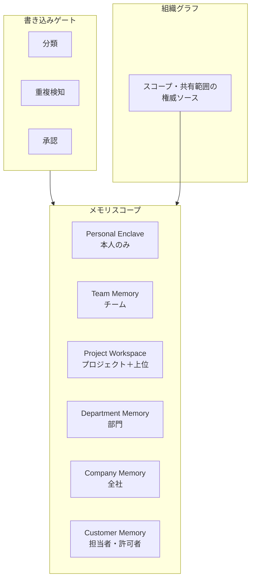

# KM-4 Scoped Memory Hierarchy（スコープ記憶階層）

## 概要

メモリを個人/チーム/プロジェクト/部門/全社/顧客/エージェント内部に分離し、共有範囲を組織グラフに従わせる。「すべてを全社共有メモリにする」ことによる機密と雑多の混在を防ぐ。

## 設計

各スコープを物理的・論理的に分離し、書き込みはゲート（分類・重複検知・承認）を通す。サブプロジェクトは親の非機密のみ継承する。

承認者は種別ごとに異なる（PM / 部門責任者 / 顧客情報管理者）。プロジェクト終了・退職・異動でメモリと権限を失効させる。

## 解決する企業課題

個人メモリのチーム漏れ、別プロジェクト/別顧客情報の混入、過去文脈の誤用。これらは共有範囲が適切に管理されないことから生じる。

## 向き／不向き

| 向き | 不向き |
|---|---|
| 継続利用・複数部署/プロジェクトに跨がる AI | 完全ステートレスの単発利用 |
| 顧客情報を扱うエージェント | メモリ不要の参照専用 AI |
| 長期プロジェクトで文脈蓄積が重要 | 一回限りの質問応答 |

## 要素技術・既存システム連携

- **ストレージ**：Memory Store、Vector DB（Namespace 分離）
- **アクセス制御**：ACL、Namespace、スコープ別暗号化
- **寿命管理**：TTL、Consent（本人の消去権）、ライフサイクル失効
- **レビュー**：Memory Review UI（蓄積内容の確認・修正）
- **組織グラフ**：Workday/Okta からのスコープ導出

## 落とし穴／選定の勘所

!!! warning "全社共有メモリの罠"
    すべてを「全社共有メモリ」にし機密と雑多を混在させるのは最大のアンチパターン。スコープを分離し、共有範囲を組織グラフに従わせる。

- 本人が自分のメモリを確認・消去できる権利（Right to Erasure）を設計に含める。
- プロジェクト終了時のメモリアーカイブ/失効を自動化する。放置すると異動者経由で漏洩する。
- メモリの保持・忘却は「重要度 × 鮮度 × 参照頻度」で選別し、古い詳細は要約へ圧縮する。

## 関連パターン

- [KM-3 Canonical Object & Knowledge Graph](km3-canonical-object-knowledge-graph.md) — 組織グラフの構築
- [KM-5 Purpose-Bound Context](km5-purpose-bound-context.md) — メモリから取り出す文脈を目的で限定
- [RT-11 Project Digital Twin](../rt-runtime/rt11-project-digital-twin.md) — プロジェクトスコープの共有メモリ
- [ID-8 Consent & Access Transparency](../id-identity/id8-consent-access-transparency.md) — メモリへのアクセス同意
- [ID-4 Permission Mirror](../id-identity/id4-permission-mirror-least-of.md) — メモリアクセスの権限評価
