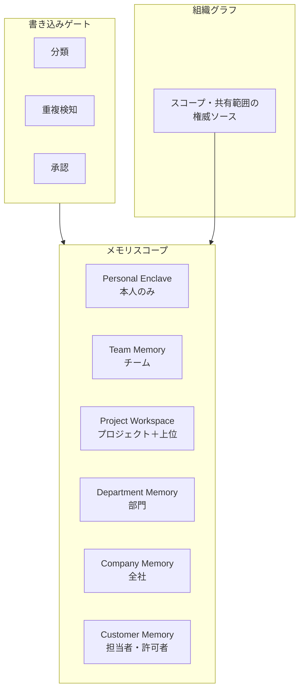

# KM-4 Scoped Memory Hierarchy（スコープ記憶階層）

## 概要

エージェントにメモリを持たせると便利だが、「個人のメモリがチーム全体に見える」「A プロジェクトの顧客情報が B プロジェクトに漏れる」という事故が起きる。このパターンは、メモリを個人・チーム・プロジェクト・部門・全社・顧客の各スコープに分離し、共有範囲を組織グラフに従わせる。退職やプロジェクト終了に連動してメモリと権限を自動で失効させ、本人が自分のメモリを消去できる権利も設計に含める。

## 解決する企業課題

エージェントにメモリを持たせると過去の文脈を再利用できる反面、「誰がどの記憶を参照できるか」を管理しなければ情報漏洩の経路となる。個人メモリがチーム全体に見える、A プロジェクトで得た顧客情報が B プロジェクトのエージェントに参照される、退職した担当者が持っていた文脈が後任に見える——これらはスコープなし設計で発生する典型的な問題だ。

企業の組織構造はそれ自体が情報共有の権威ある基準である。「同じチームのメンバーは同じ情報を見てよい」「部門長は部門内のプロジェクト情報を見てよい」という組織の論理をメモリ階層に反映させることで、権限管理を組織グラフという既存の権威ソースに委ねられる。プロジェクト終了・退職・異動といったライフサイクルイベントに連動してメモリを失効させることで、陳腐化した文脈の誤用も防ぐ。

## 解決策と設計

各スコープを物理的・論理的に分離し、書き込みはゲート（分類・重複検知・承認）を通す。サブプロジェクトは親の非機密情報のみ継承する。承認者は種別ごとに異なる（PM / 部門責任者 / 顧客情報管理者）。

スコープの境界は Vector DB の Namespace や暗号化キーで物理的に分離する。プロジェクト終了・退職・異動でメモリと権限を失効させる処理を自動化する。本人が自分のメモリを確認・消去できる Memory Review UI を提供し、Right to Erasure（消去権）を設計に組み込む。

## 向き／不向き

| 向き | 不向き |
|---|---|
| 継続利用・複数部署/プロジェクトに跨がる AI | 完全ステートレスの単発利用 |
| 顧客情報を扱うエージェント | メモリ不要の参照専用 AI |
| 長期プロジェクトで文脈蓄積が重要 | 一回限りの質問応答 |

## 要素技術・既存システム連携

- **ストレージ**：Memory Store、Vector DB（Namespace 分離）
- **アクセス制御**：ACL、Namespace、スコープ別暗号化
- **寿命管理**：TTL、Consent（本人の消去権）、ライフサイクル失効
- **レビュー**：Memory Review UI（蓄積内容の確認・修正）
- **組織グラフ**：Workday/Okta からのスコープ導出

## 落とし穴／選定の勘所

!!! warning "全社共有メモリの罠"
    すべてを「全社共有メモリ」にし機密と雑多を混在させるのは最大のアンチパターンである。スコープを分離し、共有範囲を組織グラフに従わせる。「速く作れるから全部共有」は技術負債ではなくセキュリティ上の欠陥である。

- 本人が自分のメモリを確認・消去できる権利（Right to Erasure）を設計に含める。規制要件（GDPR 等）への対応だけでなく、誤った情報が蓄積した場合の修正手段としても必要である。
- プロジェクト終了時のメモリアーカイブ/失効を自動化する。放置すると異動者経由で元のプロジェクト情報が漏洩する。
- メモリの保持・忘却は「重要度 × 鮮度 × 参照頻度」で選別し、古い詳細は要約へ圧縮する。無限に蓄積するとノイズが増え、有用な文脈の検索精度が下がる。

## 関連パターン

- [KM-3 Canonical Object & Knowledge Graph](km3-canonical-object-knowledge-graph.md) — 補完：組織グラフの構築とスコープ導出の基盤
- [KM-5 Purpose-Bound Context](km5-purpose-bound-context.md) — 補完：メモリから取り出す文脈を業務目的でさらに限定する
- [RT-11 Project Digital Twin](../rt-runtime/rt11-project-digital-twin.md) — 類似：プロジェクトスコープの共有メモリと状態管理
- [ID-8 Consent & Access Transparency](../id-identity/id8-consent-access-transparency.md) — 補完：メモリへのアクセスに対する本人の同意と透明化
- [ID-4 Permission Mirror](../id-identity/id4-permission-mirror-least-of.md) — 補完：メモリアクセスの権限評価と最小権限の適用
