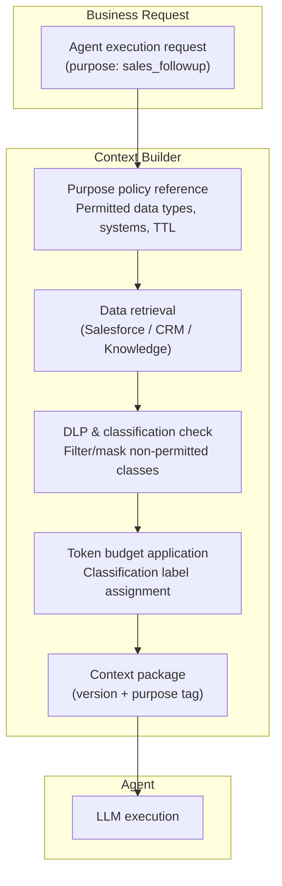

# KM-5 Purpose-Bound Context Package (Purpose-Scoped Context)

## Overview

"Packing all usable data into context" causes accuracy degradation (lost in the middle) and cost increases. This pattern defines the "minimum necessary data" as policy for each business purpose — sales follow-up, contract review, support response — and generates context packages that fit within a token budget. It prevents irrelevant HR data or information from other projects from appearing in context, ensuring only what is needed is passed.

## Enterprise Problem Addressed

"Pass everything just in case" designs cause multiple problems. Over-sharing of customer data or HR data entering LLM context without business necessity, unauthorized use (sales information mixing into accounting context), context bloat causing lost-in-the-middle (LLMs missing important information in long contexts) and cost explosion are typical problems.

Data protection regulations such as GDPR require "prohibition of use outside original purpose." When agents include "all data they can access" in context, it can constitute unauthorized use from a data protection perspective even if technically permitted. Purpose-bound context structurally prevents these issues. Compliance evidence (what data was used for what purpose) is also recorded as package version tags.

!!! tip "Minimum Viable Configuration (MVP)"
    Define one primary business purpose (e.g., sales_followup) and implement a context builder with permitted data types and token limits set. A JSON/YAML file is sufficient for purpose policy; OPA or similar tools can be introduced later.

## Value Hypothesis

Limiting to minimum necessary context improves response accuracy, ensuring quality that employees trust and use for their work. Improved accuracy reduces rework and improves decision-making speed.

## Solution and Design

When the context builder receives a business request, it references the purpose policy to determine accessible data and maximum token count. After data retrieval, the DLP/classification engine confirms data classes and filters or masks data classes not permitted for the purpose. The generated package is tagged with version and purpose and passed to the agent.



Examples of purpose definitions:

| Purpose | Permitted Data Types | Connected Systems | Retention Period | Masking Requirements |
|---|---|---|---|---|
| sales_followup | Opportunities, customer contacts, activity history | Salesforce, CRM | Within session | Direct display of personal contacts prohibited |
| contract_review | Contracts, terms tables | Box, CLM system | Until task completion | Tokenize personal information sections |
| support_response | Ticket history, FAQ, product KB | ServiceNow, KB | Within session | Mask customer PII |
| security_investigation | Logs, alerts, CMDB | SIEM, CMDB | Until investigation close | Exclude credentials |

## When to Use / When Not to Use

| When to Use | When Not to Use |
|---|---|
| Organizations reusing agents for multiple business purposes | Cases where agents specialize in a single business workflow with a fixed data scope |
| Handling highly classified data such as customer PII, HR data, and contract information | Stages where purpose is undetermined in prototype phase and design should not yet be fixed |
| Compliance requirements for data unauthorized use (GDPR, etc.) exist | Low-risk internal tools handling only internal technical documentation |
| Thorough token cost management is needed | Exploratory research business that always requires comprehensive reference to all data (separate controls needed) |

## Component Technologies and System Integration

- **Purpose policy store**: OPA (Open Policy Agent) or custom policy DB
- **Data classification**: Microsoft Purview, Google DLP, Macie (AWS) classification label assignment
- **DLP / filtering**: integrated with [KM-6 DLP & Redaction Boundary](km6-dlp-redaction-boundary.md)
- **Context builder**: service interpreting purpose, scope, and TTL to select data
- **Token budget management**: per-purpose context limit (e.g., sales_followup is 8K tokens)
- **Retention and expiration**: automatic expiration of context cache (at session end / TTL elapsed)

## Pitfalls and Selection Criteria

!!! warning "Context bloat from packing with relevance scores"
    RAG implementations that "include everything with high relevance" pack information to the token limit, causing lost-in-the-middle and cost explosion. Define limits with purpose policy and exclude non-purpose data even with high relevance.

!!! warning "Purpose definition becoming hollow"
    Configuring purpose policy once without maintenance causes drift from actual business as business changes. Purpose definitions should be regularly reviewed with data owners and version-managed.

- Mixing multiple purposes in one package eliminates purpose boundaries. Separate packages by purpose.
- If purpose policy changes are not immediately reflected in context packages, old policies continue to pass excess data. Tag packages with version and force regeneration on policy updates.

## Interfaces

The following are the key interfaces for implementing this pattern. Coding agents can generate stub code from these definitions.

```yaml
interfaces:
  - name: Purpose Policy Store
    description: "Stores per-purpose definitions of allowed data types, connected systems, token limits, and TTL; versioned and regularly reviewed with data owners."
    input:
      request: object
    output:
      response: object
    errors:
      - code: GENERAL_ERROR
        description: "Error occurred during Purpose Policy Store processing"
    protocol: "REST / gRPC"
    implementation_hints:
      - "See the Solution and Design section for details"
    code_examples:
      typescript: |
        interface PurposePolicyStoreRequest {
          purpose: string;
          version: string;
        }
        interface PurposePolicyStoreResponse {
          allowedDataTypes: string[];
          connectedSystems: string[];
          tokenLimit: number;
          ttlSeconds: number;
        }
        interface PurposePolicyStore {
          purposePolicyStore(req: PurposePolicyStoreRequest): Promise<PurposePolicyStoreResponse>;
        }
      python: |
        @dataclass
        class PurposePolicyStoreRequest:
            purpose: str
            version: str
        
        @dataclass
        class PurposePolicyStoreResponse:
            allowed_data_types: list[str]
            connected_systems: list[str]
            token_limit: int
            ttl_seconds: int
        
        class PurposePolicyStore(Protocol):
            async def purpose_policy_store(self, req: PurposePolicyStoreRequest) -> PurposePolicyStoreResponse: ...
  - name: Context Builder
    description: "Fetches data according to the purpose policy, passes it through DLP/classification checks, applies token budget, and attaches version and purpose tags."
    input:
      request: object
    output:
      response: object
    errors:
      - code: GENERAL_ERROR
        description: "Error occurred during Context Builder processing"
    protocol: "REST / gRPC"
    implementation_hints:
      - "See the Solution and Design section for details"
    code_examples:
      typescript: |
        interface ContextBuilderRequest {
          purpose: string;
          userId: string;
          rawDataSources: string[];
        }
        interface ContextBuilderResponse {
          contextPackage: object;
          tokenCount: number;
          versionTag: string;
          purposeTag: string;
        }
        interface ContextBuilder {
          contextBuilder(req: ContextBuilderRequest): Promise<ContextBuilderResponse>;
        }
      python: |
        @dataclass
        class ContextBuilderRequest:
            purpose: str
            user_id: str
            raw_data_sources: list[str]
        
        @dataclass
        class ContextBuilderResponse:
            context_package: dict
            token_count: int
            version_tag: str
            purpose_tag: str
        
        class ContextBuilder(Protocol):
            async def context_builder(self, req: ContextBuilderRequest) -> ContextBuilderResponse: ...
  - name: DLP / Classification Filter (KM-6)
    description: "Detects and masks or removes any data whose classification is not permitted by the current purpose before the package is handed to the LLM."
    input:
      request: object
    output:
      response: object
    errors:
      - code: GENERAL_ERROR
        description: "Error occurred during DLP / Classification Filter (KM-6) processing"
    protocol: "REST / gRPC"
    implementation_hints:
      - "See the Solution and Design section for details"
    code_examples:
      typescript: |
        interface DlpClassificationFilterRequest {
          contextPackage: object;
          purpose: string;
          maxClassification: string;
        }
        interface DlpClassificationFilterResponse {
          filteredPackage: object;
          redactedCount: number;
          classificationBreaches: string[];
        }
        interface DlpClassificationFilter {
          dlpClassificationFilter(req: DlpClassificationFilterRequest): Promise<DlpClassificationFilterResponse>;
        }
      python: |
        @dataclass
        class DlpClassificationFilterRequest:
            context_package: dict
            purpose: str
            max_classification: str
        
        @dataclass
        class DlpClassificationFilterResponse:
            filtered_package: dict
            redacted_count: int
            classification_breaches: list[str]
        
        class DlpClassificationFilter(Protocol):
            async def dlp_classification_filter(self, req: DlpClassificationFilterRequest) -> DlpClassificationFilterResponse: ...
```

## Related Patterns

- [KM-1 Access-Controlled RAG](km1-access-controlled-rag.md) — Complementary: access control serving as the prerequisite for narrowing RAG retrieval results with purpose policy
- [KM-4 Scoped Memory Hierarchy](km4-scoped-memory-hierarchy.md) — Complementary: alignment between memory scope and purpose-bound context
- [KM-6 DLP & Redaction Boundary](km6-dlp-redaction-boundary.md) — Complementary: sensitive information detection and masking processing during context generation
- [ID-7 Policy-as-Code Guardrail](../id-identity/id7-policy-as-code-guardrail.md) — Complementary: codifying purpose policy and automating its application
