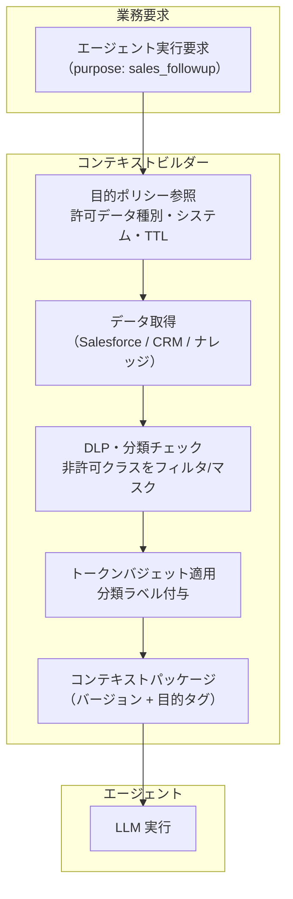

# KM-5 Purpose-Bound Context Package（目的限定コンテキスト）

## 概要

「使えるデータを全部コンテキストに詰め込む」のは、精度低下（lost in the middle）とコスト増の原因だ。このパターンは、営業フォローアップ・契約レビュー・サポート対応などの業務目的ごとに「必要な最小データ」をポリシーで定義し、トークン予算内に収まるコンテキストパッケージを生成する。目的に無関係な人事データや別プロジェクトの情報が文脈に紛れ込むことを防ぎ、必要なものだけを渡す。

## 解決する企業課題

「とりあえず全部渡す」設計は複数の問題を引き起こす。顧客データや人事データが業務上の必要性なしに LLM コンテキストに入る過剰共有、目的外利用（営業情報が経理業務のコンテキストに混入するなど）、そしてコンテキスト肥大化による lost-in-the-middle（長いコンテキストで LLM が重要情報を見失う現象）とコスト爆発——これらが典型的な問題だ。

GDPR などのデータ保護規制は「目的外利用の禁止」を要求する。エージェントが「アクセスできるすべてのデータ」をコンテキストに含めると、技術的に権限があってもデータ保護の観点では目的外利用となりうる。目的限定コンテキストはこれらを構造的に防ぐ。何の目的でどのデータを使ったかというコンプライアンスの証跡も、パッケージのバージョンタグとして記録する。

!!! tip "最小成立条件（MVP）"
    主要業務目的（例：sales_followup）を1つ定義し、許可データ種別とトークン上限を設定したコンテキストビルダーを実装する。目的ポリシーは JSON/YAML ファイルで十分であり、OPA 等の導入は後続でよい。

## 価値仮説

必要最小限の文脈に絞ることで応答精度を高め、従業員がエージェント出力を信頼して業務に使える品質を確保する。精度向上は手戻り削減と判断速度向上に効く。

## 解決策と設計

コンテキストビルダーは業務要求を受けると、目的ポリシーを参照してアクセス可能なデータと最大トークン数を決定する。データ取得後は DLP/分類エンジンでデータクラスを確認し、目的に許可されていないクラスのデータをフィルタリングまたはマスキングする。生成したパッケージにはバージョンと目的タグを付与してエージェントに渡す。



目的定義の例を以下に示す。

| 目的 | 許可データ種別 | 接続システム | 保持期間 | マスキング要件 |
|---|---|---|---|---|
| sales_followup | 商談・顧客連絡先・活動履歴 | Salesforce、CRM | セッション内 | 個人連絡先の直接表示禁止 |
| contract_review | 契約書・条件テーブル | Box、CLM システム | タスク完了まで | 個人情報部分はトークナイズ |
| support_response | チケット履歴・FAQ・製品KB | ServiceNow、KB | セッション内 | 顧客 PII はマスク |
| security_investigation | ログ・アラート・CMDB | SIEM、CMDB | 調査クローズまで | 認証情報は除外 |

## 向き／不向き

| 向き | 不向き |
|---|---|
| 複数業務目的でエージェントを使い回す組織 | エージェントが単一業務のみに特化していてデータ範囲が固定の場合 |
| 顧客PII・人事データ・契約情報など高分類データを扱う | プロトタイプで目的が未確定のうちに設計を固めたくない段階 |
| データ目的外利用のコンプライアンス要件（GDPR等）がある | 内部技術ドキュメントのみを扱う低リスクな社内ツール |
| トークンコスト管理を徹底したい | 常に全データを網羅的に参照する探索的調査業務（別途制御が必要） |

## 要素技術・既存システム連携

- **目的ポリシーストア**：OPA（Open Policy Agent）またはカスタムポリシーDB
- **データ分類**：Microsoft Purview、Google DLP、Macie（AWS）による分類ラベル付与
- **DLP / フィルタリング**：[KM-6 DLP & Redaction Boundary](km6-dlp-redaction-boundary.md) と連携
- **コンテキストビルダー**：目的・スコープ・TTL を解釈してデータを取捨選択するサービス
- **トークンバジェット管理**：目的ごとのコンテキスト上限（例：sales_followup は 8K tokens）
- **保持・失効**：コンテキストキャッシュの自動失効（セッション終了時・TTL 経過時）

## 落とし穴／選定の勘所

!!! warning "関連性スコアで詰め込むコンテキストブロート"
    「関連度が高ければ全部入れる」RAG 実装は、トークン上限まで情報を詰め込み lost-in-the-middle とコスト爆発を引き起こす。目的ポリシーで上限を定め、関連度が高くても目的外データは除外する。

!!! warning "目的定義の形骸化"
    目的ポリシーを最初だけ設定してメンテナンスしないと、ビジネス変化に伴い実際の業務と乖離する。目的定義はデータオーナーと定期的にレビューし、バージョン管理する。

- 複数目的を一つのパッケージに混在させると目的境界が消える。パッケージは目的単位で分離する。
- 目的ポリシーの変更が即座にコンテキストパッケージに反映されないと、古いポリシーで過剰データが渡り続ける。パッケージにバージョンタグを付与し、ポリシー更新時は再生成を強制する。

## Interfaces

以下はこのパターンを実装する際の主要インターフェイスである。コーディングエージェントはこの定義からスタブコードを生成できる。

```yaml
interfaces:
  - name: Purpose Policy Store
    description: "Stores per-purpose definitions of allowed data types, connected systems, token limits, and TTL; versioned and regularly reviewed with data owners."
    input:
      request: object
    output:
      response: object
    errors:
      - code: GENERAL_ERROR
        description: "Purpose Policy Store の処理中にエラーが発生"
    protocol: "REST / gRPC"
    implementation_hints:
      - "詳細は本文の「解決策と設計」節を参照"
  - name: Context Builder
    description: "Fetches data according to the purpose policy, passes it through DLP/classification checks, applies token budget, and attaches version and purpose tags."
    input:
      request: object
    output:
      response: object
    errors:
      - code: GENERAL_ERROR
        description: "Context Builder の処理中にエラーが発生"
    protocol: "REST / gRPC"
    implementation_hints:
      - "詳細は本文の「解決策と設計」節を参照"
  - name: DLP / Classification Filter (KM-6)
    description: "Detects and masks or removes any data whose classification is not permitted by the current purpose before the package is handed to the LLM."
    input:
      request: object
    output:
      response: object
    errors:
      - code: GENERAL_ERROR
        description: "DLP / Classification Filter (KM-6) の処理中にエラーが発生"
    protocol: "REST / gRPC"
    implementation_hints:
      - "詳細は本文の「解決策と設計」節を参照"
```

## 関連パターン

- [KM-1 Access-Controlled RAG](km1-access-controlled-rag.md) — 補完：RAG 取得結果を目的ポリシーで絞り込む前提となるアクセス制御
- [KM-4 Scoped Memory Hierarchy](km4-scoped-memory-hierarchy.md) — 補完：メモリスコープと目的限定コンテキストの整合
- [KM-6 DLP & Redaction Boundary](km6-dlp-redaction-boundary.md) — 補完：コンテキスト生成時の機密情報検出・マスキング処理
- [ID-7 Policy-as-Code Guardrail](../id-identity/id7-policy-as-code-guardrail.md) — 補完：目的ポリシーのコード化と自動適用
