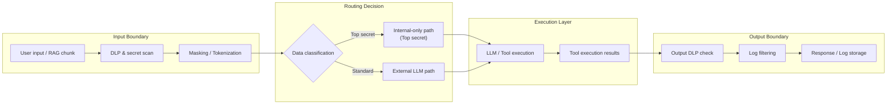

# KM-6 DLP & Redaction Boundary (DLP & Masking)

## Overview

The confidentiality leak paths of agents are not limited to "LLM input." Unless masking is placed at all five boundaries — LLM output, RAG results, tool execution results, and log storage — gaps remain. This pattern detects PII, secret keys, and contract amounts with DLP and removes them via masking or tokenization. For the most highly classified data, transmission to external LLMs is prohibited entirely, routing to an internal inference infrastructure.

## Enterprise Problem Addressed

Customer personal information and contract information retrieved by RAG being sent to external LLMs, agent output accidentally containing secret keys, detailed debug logs recording personal information in plaintext — these are actual leak paths that can occur in enterprise agents.

The assumption "only checking input is sufficient" is the greatest risk. Documents retrieved by RAG may contain sensitive information from the original documents, and tool execution results (database responses, etc.) carry the same risk. LLM output can expose input sensitive information in transformed form, and prompts and responses sent to log infrastructure for debugging can leave sensitive information in plaintext. A structure placing controls at all five boundaries is necessary.

!!! tip "Minimum Viable Configuration (MVP)"
    Place regex-based PII detection and masking at the two LLM input and output boundaries. Boundaries for tool results and logs are added in the next phase; first dramatically reduce leak risk with the two input/output boundaries.

## Value Hypothesis

Automatic masking of sensitive information prevents the costs of information leak incidents (fines, reputation damage, response effort) before they occur. A safe information usage environment enables expansion of agent application scope.

## Solution and Design

Data passes through five boundaries in order: "Input → DLP/Secret scan → Masking/Tokenization → LLM/Tool → Output DLP → Response/Log." The type and treatment of sensitive information detected at each boundary is recorded as events and sent to [OB-1 Observability Lake](../ob-observability/ob1-observability-lake.md).

There are two masking approaches. One is irreversible masking (replacing PII with `[REDACTED]` for storage in logs in a form that cannot be restored). The other is tokenization (replacing PII with a substitute token, stored in a vault for restoration when needed). The latter is for use cases requiring aggregation and search, and restoration requires a separate authorization check.

## When to Use / When Not to Use

| When to Use | When Not to Use |
|---|---|
| All enterprise use cases that may handle PII, sensitive information, or secret keys | Internal tools handling only public information (may become excessive control) |
| Using external LLM APIs (Claude/GPT, etc.) | Fully isolated, internal-only infrastructure where external transmission is physically impossible |
| GDPR/APPI require control evidence for PII processing | Very strict real-time latency processing (DLP scanning may become a bottleneck) |
| Risk of sensitive data mixing into log infrastructure | |

## Component Technologies and System Integration

- **Microsoft Purview**: tenant-wide information protection policy and labeling
- **Google Cloud DLP / Sensitive Data Protection**: API-based PII detection and masking
- **Presidio (Microsoft OSS)**: customizable PII detection and anonymization library
- **Secret scanning**: GitGuardian API / truffleHog secret detection logic integration
- **Tokenization**: HashiCorp Vault Transit Secrets Engine, Format-Preserving Encryption (FPE)
- **Output filtering**: custom regex + ML classifier post-scan of LLM output
- **Log filtering**: masking plugins in log collection pipelines (Fluentd/Logstash)

## Pitfalls and Selection Criteria

!!! danger "Only checking input and missing output and logs"
    "As long as user input is checked, there won't be leaks" is incorrect. RAG-retrieved documents, tool execution results, LLM outputs — each is an independent leak path. Sensitive information is also recorded in plaintext during log storage. Apply controls at all five boundaries.

!!! warning "Service outage from DLP rule over-detection"
    Excessively strict DLP rules mask normal business information and render agents practically unusable. Adjust detection rules by business type and regularly measure false positive rates for tuning.

- If access controls for restoring masked tokens are absent, masking is meaningless. Require a separate authorization check for restoration.
- When DLP scan latency is a problem, choose between async scanning (returning the response first then post-scanning and recording later) and sync scanning (blocking) by use case. However, do not make high-risk operations that require synchronous scanning asynchronous.

## Related Patterns

- [GV-5 Central Model Gateway](../gv-governance/gv5-central-model-gateway.md) — Complementary: model gateway integrating input/output filtering
- [KM-7 Ephemeral Secure Context Bus](km7-ephemeral-secure-context-bus.md) — Similar: top-secret processing pattern that volatilizes context itself for even higher confidentiality requirements
- [KM-1 Access-Controlled RAG](km1-access-controlled-rag.md) — Complementary: access control serving as the prerequisite for applying DLP to RAG chunks
- [OB-1 Observability Lake](../ob-observability/ob1-observability-lake.md) — Complementary: observability infrastructure as the destination for DLP event recording
- [ID-1 Workforce/Customer Split](../id-identity/id1-workforce-customer-split.md) — Complementary: setting different confidentiality boundaries per dimension
