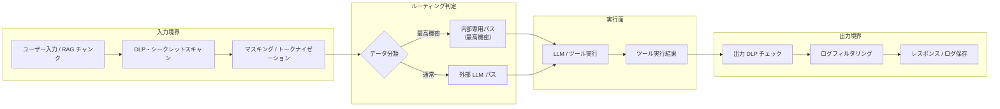

# KM-6 DLP & Redaction Boundary（DLP・マスキング）

## 概要

エージェントシステムにおける機密情報の漏洩経路は、LLMへの入力・LLMからの出力・RAGで取得したチャンクのLLM送信・ツール実行結果・ログ保存の5つがある。このパターンは、これらすべての境界に DLP（Data Loss Prevention）検出・マスキング・トークナイゼーションを配置する。最高機密は外部 LLM へのルーティングを禁止し、内部パスへ転送する。モデルゲートウェイ（[GV-5](../gv-governance/gv5-central-model-gateway.md)）と連携して入出力フィルタリングを一元適用する。

## 設計

データは「入力 → DLP/シークレットスキャン → マスキング/トークナイゼーション → LLM/ツール → 出力 DLP → レスポンス/ログ」の順に5つの境界を通過する。各境界で検出した機密情報の種類と処置をイベントとして記録し、[OB-1 Observability Lake](../ob-observability/ob1-observability-lake.md) へ送信する。

マスキングには二種類のアプローチがある。一つは不可逆マスキング（PII を `[REDACTED]` に置換、ログには元に戻らない形で保存）。もう一つはトークナイゼーション（PII を代替トークンに置換し、必要時に復元できるようボールトに保管）。後者は集計・検索が必要なユースケース向けで、復元には別途権限チェックを要する。

## 解決する企業課題

RAGで取得した顧客の個人情報や契約情報が外部LLMに送信される事故、エージェントの出力にシークレットキーが含まれてしまう事故、詳細なデバッグログに個人情報が平文で記録される事故——これらはエンタープライズエージェントで実際に起きうる漏洩経路である。「入力だけチェックすればよい」という思い込みが最大のリスクであり、5境界すべてに制御を置く構造が必要である。

## 向き／不向き

| 向き | 不向き |
|---|---|
| PII・機密情報・シークレットキーを扱う可能性がある全エンタープライズ用途 | 公開情報のみを扱う内部ツール（過剰制御になる可能性） |
| 外部 LLM API（Claude/GPT 等）を使用する | 完全閉域・自社インフラのみで外部送信が物理的に不可能な環境 |
| GDPR/APPI 等でPII処理の制御証跡が求められる | 非常にレイテンシが厳しいリアルタイム処理（DLP スキャンがボトルネックになりうる） |
| ログ基盤に機密データが混入するリスクがある | |

## 要素技術・既存システム連携

- **Microsoft Purview**：テナント全体の情報保護ポリシーとラベリング
- **Google Cloud DLP / Sensitive Data Protection**：API ベースの PII 検出・マスキング
- **Presidio（Microsoft OSS）**：カスタマイズ可能なPII検出・匿名化ライブラリ
- **シークレットスキャン**：GitGuardian API / truffleHog などのシークレット検出ロジックを組み込み
- **トークナイゼーション**：HashiCorp Vault Transit Secrets Engine、Format-Preserving Encryption（FPE）
- **出力フィルタリング**：カスタム正規表現 + ML 分類器によるLLM出力のポストスキャン
- **ログフィルタリング**：ログ収集パイプライン（Fluentd/Logstash）でのマスキングプラグイン

## 落とし穴／選定の勘所

!!! danger "入力だけチェックして出力・ログを見落とす"
    「ユーザー入力さえチェックすれば漏洩しない」は誤りである。RAGで取得したドキュメント、ツール実行結果、LLMの出力——それぞれが独立した漏洩経路である。ログ保存時も平文で機密情報が記録される。5つの境界すべてに制御を適用する。

!!! warning "DLP ルールの過検知でサービス不能になる"
    過剰に厳しいDLPルールは正常なビジネス情報をマスキングしてエージェントを実質的に使えなくする。検知ルールは業務種別ごとに調整し、定期的に誤検知率を計測してチューニングする。

- マスキングしたトークンの復元ロジックにアクセス制御がないと、意味がない。復元には別途認可チェックを必須とする。
- DLP スキャンのレイテンシが問題になる場合、非同期スキャン（先にレスポンスを返しつつ後でポストスキャンで記録する）と同期スキャン（ブロッキング）を用途で使い分ける。ただし同期が必要な高リスク操作では非同期化しない。

## 関連パターン

- [GV-5 Central Model Gateway](../gv-governance/gv5-central-model-gateway.md) — 入出力フィルタリングの統合先モデルゲートウェイ
- [KM-7 Ephemeral Secure Context Bus](km7-ephemeral-secure-context-bus.md) — 機密コンテキストの安全な一時保管と転送
- [KM-1 Access-Controlled RAG](km1-access-controlled-rag.md) — RAGチャンクへのDLP適用の前提
- [OB-1 Observability Lake](../ob-observability/ob1-observability-lake.md) — DLPイベントの記録先
- [ID-1 Workforce/Customer 二面分離](../id-identity/id1-workforce-customer-split.md) — 面別に異なる機密境界の設定
