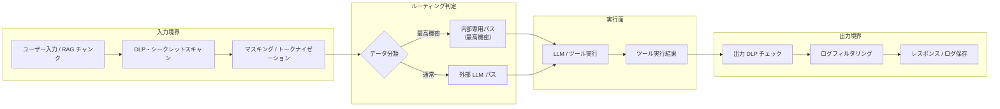

# KM-6 DLP & Redaction Boundary（DLP・マスキング）

## 概要

エージェントの機密漏洩経路は「LLM への入力」だけではありません。LLM の出力・RAG 結果・ツール実行結果・ログ保存——5つの境界すべてにマスキングを配置しなければ穴が残ります。このパターンは PII・秘密鍵・契約金額などを DLP で検出し、マスキングまたはトークナイゼーションで除去します。最高機密データは外部 LLM への送信自体を禁止し、社内推論基盤へルーティングします。

## 解決する企業課題

RAG で取得した顧客の個人情報や契約情報が外部 LLM に送信される事故、エージェントの出力にシークレットキーが混入する事故、詳細なデバッグログに個人情報が平文で記録される事故——これらはエンタープライズエージェントで実際に起きうる漏洩経路です。

「入力だけチェックすればよい」という思い込みが最大のリスクになります。RAG で取得したドキュメントには元の文書の機密情報が含まれている可能性があり、ツール実行結果（データベースのレスポンス等）にも同様のリスクがあります。LLM の出力には入力の機密情報が形を変えて出現することもあります。デバッグのためにログ基盤に送ったプロンプトとレスポンスに機密情報が平文で残留するケースも、見逃せない漏洩経路です。5境界すべてに制御を置く構造が求められます。

!!! tip "最小成立条件（MVP）"
    LLM への入力境界と出力境界の2点に正規表現ベースの PII 検出・マスキングを配置します。ツール結果・ログの境界は次フェーズで追加し、まず入出力の2境界で漏洩リスクを大幅に低減します。

## 価値仮説

機密情報の自動マスキングにより、情報漏洩インシデントのコスト（罰金・信用毀損・対応工数）を未然に防ぎます。安全な情報利用環境はエージェント適用範囲の拡大を可能にします。

## 解決策と設計

データは「入力 → DLP/シークレットスキャン → マスキング/トークナイゼーション → LLM/ツール → 出力 DLP → レスポンス/ログ」の順に5つの境界を通過します。各境界で検出した機密情報の種類と処置をイベントとして記録し、[OB-1 Observability Lake](../ob-observability/ob1-observability-lake.md) へ送ります。



マスキングには二種類のアプローチがあります。一つは不可逆マスキング（PII を `[REDACTED]` に置換し、ログには元に戻らない形で保存）。もう一つはトークナイゼーション（PII を代替トークンに置換し、必要時に復元できるようボールトに保管）。後者は集計・検索が必要なユースケース向けで、復元には別途権限チェックが必要です。

## 向き／不向き

| 向き | 不向き |
|---|---|
| PII・機密情報・シークレットキーを扱う可能性がある全エンタープライズ用途 | 公開情報のみを扱う内部ツール（過剰制御になる可能性） |
| 外部 LLM API（Claude/GPT 等）を使用する | 完全閉域・自社インフラのみで外部送信が物理的に不可能な環境 |
| GDPR/APPI 等でPII処理の制御証跡が求められる | 非常にレイテンシが厳しいリアルタイム処理（DLP スキャンがボトルネックになりうる） |
| ログ基盤に機密データが混入するリスクがある | |

## 要素技術・既存システム連携

- **Microsoft Purview**：テナント全体の情報保護ポリシーとラベリング
- **Google Cloud DLP / Sensitive Data Protection**：API ベースの PII 検出・マスキング
- **Presidio（Microsoft OSS）**：カスタマイズ可能なPII検出・匿名化ライブラリ
- **シークレットスキャン**：GitGuardian API / truffleHog などのシークレット検出ロジックを組み込み
- **トークナイゼーション**：HashiCorp Vault Transit Secrets Engine、Format-Preserving Encryption（FPE）
- **出力フィルタリング**：カスタム正規表現 + ML 分類器によるLLM出力のポストスキャン
- **ログフィルタリング**：ログ収集パイプライン（Fluentd/Logstash）でのマスキングプラグイン

## 落とし穴／選定の勘所

!!! danger "入力だけチェックして出力・ログを見落とす"
    「ユーザー入力さえチェックすれば漏洩しない」は誤りです。RAGで取得したドキュメント、ツール実行結果、LLMの出力——それぞれが独立した漏洩経路です。ログ保存時も平文で機密情報が記録されます。5つの境界すべてに制御を適用します。

!!! warning "DLP ルールの過検知でサービス不能になる"
    過剰に厳しいDLPルールは正常なビジネス情報をマスキングしてエージェントを実質的に使えなくします。検知ルールは業務種別ごとに調整し、定期的に誤検知率を計測してチューニングします。

- マスキングしたトークンの復元ロジックにアクセス制御がなければ、マスキング自体が無意味になります。復元には別途認可チェックを必須とします。
- DLP スキャンのレイテンシが問題になる場合、非同期スキャン（先にレスポンスを返しつつ後でポストスキャンで記録する）と同期スキャン（ブロッキング）を用途で使い分けるとよいです。ただし同期が必要な高リスク操作では非同期化しないようにします。

## Interfaces

以下はこのパターンを実装する際の主要インターフェイスです。コーディングエージェントはこの定義からスタブコードを生成できます。

```yaml
interfaces:
  - name: Input DLP Gate
    description: "Scans user input and RAG chunks for PII and secrets before sending to the LLM; applies masking or tokenization and routes highest-classification data to an internal inference path."
    input:
      request: object
    output:
      response: object
    errors:
      - code: GENERAL_ERROR
        description: "Input DLP Gate の処理中にエラーが発生"
    protocol: "REST / gRPC"
    implementation_hints:
      - "詳細は本文の「解決策と設計」節を参照"
    code_examples:
      typescript: |
        interface InputDlpGateRequest {
          userInput: string;
          ragChunks: string[];
          classification: string;
        }
        interface InputDlpGateResponse {
          sanitizedInput: string;
          maskedTokens: object[];
          routeTo: string;
        }
        interface InputDlpGate {
          inputDlpGate(req: InputDlpGateRequest): Promise<InputDlpGateResponse>;
        }
      python: |
        @dataclass
        class InputDlpGateRequest:
            user_input: str
            rag_chunks: list[str]
            classification: str
        
        @dataclass
        class InputDlpGateResponse:
            sanitized_input: str
            masked_tokens: list[dict]
            route_to: str
        
        class InputDlpGate(Protocol):
            async def input_dlp_gate(self, req: InputDlpGateRequest) -> InputDlpGateResponse: ...
  - name: Output DLP Gate
    description: "Post-scans LLM output and tool results for residual sensitive data before returning to the user or writing to logs."
    input:
      request: object
    output:
      response: object
    errors:
      - code: GENERAL_ERROR
        description: "Output DLP Gate の処理中にエラーが発生"
    protocol: "REST / gRPC"
    implementation_hints:
      - "詳細は本文の「解決策と設計」節を参照"
    code_examples:
      typescript: |
        interface OutputDlpGateRequest {
          llmOutput: string;
          toolResults: object[];
        }
        interface OutputDlpGateResponse {
          sanitizedOutput: string;
          redactedFields: string[];
        }
        interface OutputDlpGate {
          outputDlpGate(req: OutputDlpGateRequest): Promise<OutputDlpGateResponse>;
        }
      python: |
        @dataclass
        class OutputDlpGateRequest:
            llm_output: str
            tool_results: list[dict]
        
        @dataclass
        class OutputDlpGateResponse:
            sanitized_output: str
            redacted_fields: list[str]
        
        class OutputDlpGate(Protocol):
            async def output_dlp_gate(self, req: OutputDlpGateRequest) -> OutputDlpGateResponse: ...
  - name: Log Filter
    description: "Strips PII from log collection pipeline (Fluentd/Logstash) so that audit logs do not contain plaintext sensitive data."
    input:
      request: object
    output:
      response: object
    errors:
      - code: GENERAL_ERROR
        description: "Log Filter の処理中にエラーが発生"
    protocol: "REST / gRPC"
    implementation_hints:
      - "詳細は本文の「解決策と設計」節を参照"
    code_examples:
      typescript: |
        interface LogFilterRequest {
          logEntry: object;
          pipelineStage: string;
        }
        interface LogFilterResponse {
          filteredEntry: object;
          strippedFields: string[];
        }
        interface LogFilter {
          logFilter(req: LogFilterRequest): Promise<LogFilterResponse>;
        }
      python: |
        @dataclass
        class LogFilterRequest:
            log_entry: dict
            pipeline_stage: str
        
        @dataclass
        class LogFilterResponse:
            filtered_entry: dict
            stripped_fields: list[str]
        
        class LogFilter(Protocol):
            async def log_filter(self, req: LogFilterRequest) -> LogFilterResponse: ...
```

## 関連パターン

- [GV-5 Central Model Gateway](../gv-governance/gv5-central-model-gateway.md) — 補完：入出力フィルタリングの統合先モデルゲートウェイ
- [KM-7 Ephemeral Secure Context Bus](km7-ephemeral-secure-context-bus.md) — 類似：さらに高い機密要件でコンテキスト自体を揮発させる極秘処理向けパターン
- [KM-1 Access-Controlled RAG](km1-access-controlled-rag.md) — 補完：RAGチャンクへのDLP適用の前提となるアクセス制御
- [OB-1 Observability Lake](../ob-observability/ob1-observability-lake.md) — 補完：DLPイベントの記録先となる観測基盤
- [ID-1 Workforce/Customer 二面分離](../id-identity/id1-workforce-customer-split.md) — 補完：面別に異なる機密境界の設定

## Decision Summary

```yaml
decision_summary:
  pattern: KM-6
  participates_in:
    - decision: DC-6
      role: enabler
  recommended_if:
    - "エージェント出力に機密データが含まれる可能性がある"
    - "PII・MNPI等の外部漏洩を防止する"
  avoid_if:
    - "扱うデータに機密情報が一切含まれない"
  combines_with: [KM-5, KM-7, ID-7, OB-2]
  conflicts_with: []
  value_outcome:
    drivers: [audit_compliance]
    kpis: [機密データ検出率, 誤マスキング率]
  mvp: "出力パスにDLPルール（PII検出＋マスキング）を設置"
  cost: M
```
