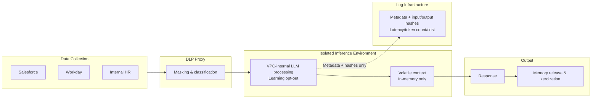

# KM-7 Ephemeral Secure Context Bus (Volatile Confidential Computing)

## Overview

Performance reviews, M&A discussions, insider information — these require a level of confidentiality where "nothing should remain even in logs." This pattern processes context in an isolated inference environment and releases and zeros (zeroization) memory simultaneously with session end. If DLP (KM-6) takes the approach of "finding and removing confidential information," this takes the approach of "leaving nothing behind from the start." Only metadata such as latency and token counts is sent to the log infrastructure. However, application is limited to top-secret data. Most confidential processing is adequately covered by [KM-6](km6-dlp-redaction-boundary.md) + [GV-5](../gv-governance/gv5-central-model-gateway.md) (VPC routing + DLP), and this pattern is for extreme cases where that is insufficient.

## Enterprise Problem Addressed

For processing involving performance reviews, M&A discussions, and insider information, there are cases where normal DLP masking ([KM-6](km6-dlp-redaction-boundary.md)) is insufficient. When context from multiple SaaS is combined, individually non-confidential data combined together can generate confidential information (mosaic effect). For example, combining an internal seating chart, travel records, and external corporate registration information can enable inference of undisclosed M&A contact targets.

When external LLM vendor data transmission, plaintext residue in log infrastructure, and cache leaks need to be structurally eliminated, a design of "leave nothing behind from the start" rather than "remove after processing" becomes necessary. This pattern takes a "volatile" approach where KM-6 takes a "decontamination" approach. At the point when processing completes, context memory is released and zeroed (zeroization), guaranteeing no traces remain. Only metadata is sent to the log infrastructure, reconciling the observability ([OB-1](../ob-observability/ob1-observability-lake.md)) requirements with confidentiality requirements.

!!! note "Reconciling with audit requirements (sealed decision trail)"
    The design of "leaving no content at all" appears to contradict [OB-2](../ob-observability/ob2-unified-audit-lineage.md)'s requirement to "make all actions reconstructable." As a reconciliation measure, maintain a **sealed** decision trail in a separate system. Specifically, do not retain prompt/response content, but record metadata of "who, when, which data classification, with which policy decision was processed" and input/output hashes in tamper-proof storage. Access to this sealed trail requires dual authorization (e.g., CISO + Legal Officer) and is not accessible in normal operations. For domains such as performance reviews and whistleblowing where evidence retention may be legally required after the fact, design the retention period for this sealed metadata to match regulatory requirements.

## Value Hypothesis

Volatile processing of confidential data enables agent application in high-security domains (finance, healthcare, HR). Expanding the application domain broadens the scope of cost savings from business automation company-wide.

## Solution and Design

Data collected from each SaaS is masked by DLP Proxy, LLM processing is performed in an isolated inference environment, and after the response, context memory is released and zeroed. Prompt/response content is never sent to the log infrastructure, and only latency, token counts, and similar metadata plus input/output hashes (sealed trail) are transmitted.



This configuration is the strictest form of observability "degree of tracing." Of the standard three-tier separation (metadata → Trace DB, content → encrypted storage, aggregation → DWH), the content tier is completely eliminated, leaving only the metadata tier.

The means of realizing isolated inference environments are broken down into three controls with different assurance levels:

| Control | Assurance | Implementation | Notes |
|---|---|---|---|
| ① VPC hosting | Network isolation. Blocks external transmission | Dedicated inference instance in VPC, private endpoint | Sufficient for most top-secret processing |
| ② TEE / Hardware memory isolation | Even host OS and admins cannot read memory contents | Confidential VM, **Confidential GPU** (NVIDIA H100 CC mode, etc.) | LLM inference requires GPU, so AWS Nitro Enclaves alone (no GPU, no persistent storage, no external network) cannot run practical-scale LLMs. Applying TEE to LLM inference requires Confidential GPU, which is a separate product from Nitro Enclaves |
| ③ Learning opt-out | Assurance that input is not used for model training | DPA (Data Processing Agreement) contract, API-level opt-out setting | Document not just as a setting but as a contractual obligation |

These are independent controls that can be combined according to requirements. The most common configuration is ① + ③ (VPC hosting + learning opt-out), with ② TEE/Confidential GPU added when regulatory requirements or zero-trust requirements are particularly strict.

!!! tip "Minimum Viable Configuration (MVP)"
    MVP is "① VPC inference + ③ learning opt-out (DPA concluded) + content logging disabled + short-lived in-memory (zeroed at session end)." This configuration provides sufficient assurance for most top-secret processing. Add ② TEE/Confidential GPU only for top-level secrets (when regulations require concealment from host admins).

!!! note "Relative Cost and Operational Burden"
    ① VPC inference can be introduced at approximately the same cost as normal inference. ② Confidential GPU (NVIDIA H100 CC mode, etc.) is limited to specific supported instances and involves roughly 1.5–2× cost increase compared to normal GPU inference, plus several weeks to months for environment setup and verification. Operationally, volatile design makes debugging difficult, so also account for the cost of maintaining a test environment with non-confidential data separate from production.

## When to Use / When Not to Use

| When to Use | When Not to Use |
|---|---|
| Processing of performance reviews, salaries, and top-secret project information | High-volume, low-confidentiality processing (excessive isolation pressures cost and performance). Normal confidential processing is adequately covered by [KM-6](km6-dlp-redaction-boundary.md) + [GV-5](../gv-governance/gv5-central-model-gateway.md) |
| Regulated data (processing that absolutely cannot leave plaintext in logs/cache) | Development phase requiring content logs for debugging and quality improvement |
| M&A and insider-related information processing | Use cases requiring continuous context accumulation (memory does not persist) |
| Only processing that falls under "top secret" in data classification | Business workflows where deterministic RPA or form processing suffices (AI agent adoption itself is unnecessary) |

## Component Technologies and System Integration

- **VPC inference**: Azure OpenAI (VNet integration / private endpoint), AWS Bedrock (VPC endpoint), internal inference infrastructure
- **TEE / Confidential Computing**: Azure Confidential VM, NVIDIA H100 Confidential Computing (Confidential GPU), AMD SEV-SNP. AWS Nitro Enclaves can be used for preprocessing, key management, and lightweight inference, but is not suitable for practical-scale LLM inference due to lacking GPU support
- **DLP**: Presidio, Microsoft Purview, Google DLP
- **Volatile storage**: Redis No-Persistence, in-memory only
- **Encryption**: in-transit encryption (minimizing storage itself)
- **Learning opt-out**: contractual assurance via DPA (Data Processing Agreement), API-level opt-out settings

## Pitfalls and Selection Criteria

!!! danger "Isolation consistency"
    In extreme-security use cases, relaxing isolation for performance or leaving content in logs for debugging purposes is prohibited. "Leaving only some content in plaintext logs" breaks the overall assurance. In top-secret processing, consistently discard.

- "Leaving only some content in plaintext logs" breaks the metadata-only principle. In that case, move the use case itself out of the volatile bus and to standard three-tier separation ([OB-1](../ob-observability/ob1-observability-lake.md)).
- Confidential computing has high latency and cost. Rather than routing all processing through this pattern, apply only to top-secret processing based on data classification. Build mechanisms to automatically determine application scope through data classification.
- Verify LLM vendor learning opt-out settings and obtain assurance through contracts (DPA: Data Processing Agreement). Settings verification alone is insufficient; document as a contractual obligation.
- Since this pattern cannot reference past context, it is unsuitable for business requiring continuous dialogue. If needed, consider designs using encrypted external memory outside confidential computing (though assurance is weakened).

## Interfaces

The following are the key interfaces for implementing this pattern. Coding agents can generate stub code from these definitions.

```yaml
interfaces:
  - name: DLP Proxy
    description: "Masks and classifies data collected from source SaaS systems before it enters the isolated inference environment."
    input:
      request: object
    output:
      response: object
    errors:
      - code: GENERAL_ERROR
        description: "Error occurred during DLP Proxy processing"
    protocol: "REST / gRPC"
    implementation_hints:
      - "See the Solution and Design section for details"
    code_examples:
      typescript: |
        interface DlpProxyRequest {
          rawData: object;
          sourceSystem: string;
          classification: string;
        }
        interface DlpProxyResponse {
          maskedData: object;
          classificationLabel: string;
        }
        interface DlpProxy {
          dlpProxy(req: DlpProxyRequest): Promise<DlpProxyResponse>;
        }
      python: |
        @dataclass
        class DlpProxyRequest:
            raw_data: dict
            source_system: str
            classification: str
        
        @dataclass
        class DlpProxyResponse:
            masked_data: dict
            classification_label: str
        
        class DlpProxy(Protocol):
            async def dlp_proxy(self, req: DlpProxyRequest) -> DlpProxyResponse: ...
  - name: Isolated Inference Environment
    description: "VPC-hosted LLM (or Confidential GPU) with learning opt-out; context lives in-memory only and is zeroed immediately after the session completes."
    input:
      request: object
    output:
      response: object
    errors:
      - code: GENERAL_ERROR
        description: "Error occurred during Isolated Inference Environment processing"
    protocol: "REST / gRPC"
    implementation_hints:
      - "See the Solution and Design section for details"
    code_examples:
      typescript: |
        interface IsolatedInferenceEnvironmentRequest {
          contextPackage: object;
          modelId: string;
          sessionId: string;
        }
        interface IsolatedInferenceEnvironmentResponse {
          response: string;
          tokensUsed: number;
          sessionCleared: boolean;
        }
        interface IsolatedInferenceEnvironment {
          isolatedInferenceEnvironment(req: IsolatedInferenceEnvironmentRequest): Promise<IsolatedInferenceEnvironmentResponse>;
        }
      python: |
        @dataclass
        class IsolatedInferenceEnvironmentRequest:
            context_package: dict
            model_id: str
            session_id: str
        
        @dataclass
        class IsolatedInferenceEnvironmentResponse:
            response: str
            tokens_used: int
            session_cleared: bool
        
        class IsolatedInferenceEnvironment(Protocol):
            async def isolated_inference_environment(self, req: IsolatedInferenceEnvironmentRequest) -> IsolatedInferenceEnvironmentResponse: ...
  - name: Sealed Audit Metadata Sink
    description: "Sends only metadata (latency, token count, cost) and hashed input/output to the observability lake; full content is never persisted."
    input:
      request: object
    output:
      response: object
    errors:
      - code: GENERAL_ERROR
        description: "Error occurred during Sealed Audit Metadata Sink processing"
    protocol: "REST / gRPC"
    implementation_hints:
      - "See the Solution and Design section for details"
    code_examples:
      typescript: |
        interface SealedAuditMetadataSinkRequest {
          sessionId: string;
          latencyMs: number;
          tokenCount: number;
          cost: number;
          inputHash: string;
          outputHash: string;
        }
        interface SealedAuditMetadataSinkResponse {
          sinkId: string;
          recordedAt: Date;
        }
        interface SealedAuditMetadataSink {
          sealedAuditMetadataSink(req: SealedAuditMetadataSinkRequest): Promise<SealedAuditMetadataSinkResponse>;
        }
      python: |
        @dataclass
        class SealedAuditMetadataSinkRequest:
            session_id: str
            latency_ms: int
            token_count: int
            cost: float
            input_hash: str
            output_hash: str
        
        @dataclass
        class SealedAuditMetadataSinkResponse:
            sink_id: str
            recorded_at: datetime
        
        class SealedAuditMetadataSink(Protocol):
            async def sealed_audit_metadata_sink(self, req: SealedAuditMetadataSinkRequest) -> SealedAuditMetadataSinkResponse: ...
```

## Related Patterns

- [KM-6 DLP & Redaction Boundary](km6-dlp-redaction-boundary.md) — Contrast: where KM-6 takes a decontamination approach, this pattern uses a volatile approach to eliminate residual sensitive information
- [GV-5 Central Model Gateway](../gv-governance/gv5-central-model-gateway.md) — Complementary: LLM routing based on data classification (top-secret → VPC-internal)
- [OB-1 Observability Lake](../ob-observability/ob1-observability-lake.md) — Complementary: division of use with standard three-tier separation (this pattern sends metadata only)
- [ID-6 Zero-Trust PDP/PEP](../id-identity/id6-zero-trust-pdp-pep.md) — Complementary: zero-trust authorization for access to isolated environments
