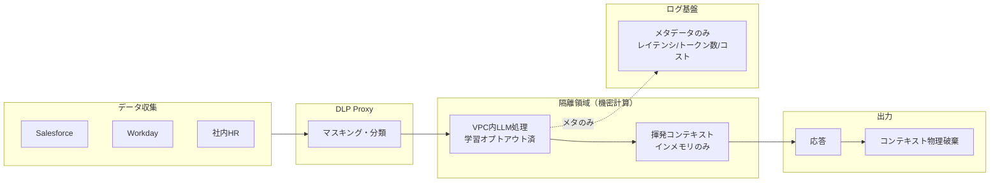

# KM-7 Ephemeral Secure Context Bus（揮発・機密計算）

## 概要

情報漏洩防止とコンプライアンスに極振りし、コンテキスト（プロンプト/記憶）を揮発・暗号化し、隔離領域（Confidential Computing）で処理してセッション終了と同時に物理破棄する。プロンプト・レスポンスの本文はログ基盤に一切残さず、メタデータ（レイテンシ・トークン数・コスト）のみを送信する。

## 解決する企業課題

人事評価・M&A 検討・インサイダー情報に関わる処理では、通常の DLP マスキング（[KM-6](km6-dlp-redaction-boundary.md)）では不十分なケースがある。複数の SaaS を横断して文脈を結合すると、個々では機密ではなかったデータが組み合わさって機密情報を生成するリスクがある（例：給与データ＋組織変更データ＋外部発表データの合成）。

外部 LLM ベンダーへのデータ送信、ログ基盤への平文残存、キャッシュからの漏洩——これらを構造的に排除したい場合、「処理後に消す」ではなく「最初から残さない」設計が必要になる。本パターンは KM-6 が「汚染除去」アプローチをとるのに対し、「揮発」アプローチをとる。処理が終わった時点でコンテキストの痕跡が物理的に存在しないことを保証する。また、ログ基盤に対してはメタデータのみ送信することで、観測性（[OB-1](../ob-observability/ob1-observability-lake.md)）の要件と機密保持の要件を両立する。

## 解決策と設計

各 SaaS から収集したデータを DLP Proxy でマスキングし、機密計算の隔離領域内で LLM 処理を行い、応答後にコンテキストを物理破棄する。プロンプト/レスポンス本文はログ基盤に一切送らず、レイテンシ・トークン数等のメタデータのみ送信する。

この構成は観測性の「トレースの程度」の究極系である。通常の三層分離（メタ→Trace DB、本文→暗号化ストレージ、集計→DWH）のうち、本文層を完全に廃し、メタ層のみ残す。隔離領域は AWS Nitro Enclaves や Azure Confidential Computing で実現し、ホスト OS からもアクセス不能な領域でコンテキストを処理する。LLM は VPC 統合の推論基盤または学習オプトアウト契約済みのエンドポイントを使用する。

## 向き／不向き

| 向き | 不向き |
|---|---|
| 人事評価・給与・極秘プロジェクト情報の処理 | 低機密の大量処理（過剰な隔離はコストと性能を圧迫） |
| 規制データ（絶対にログ/キャッシュに平文を残せない処理） | デバッグ・品質改善のために本文ログが必要な開発フェーズ |
| M&A / インサイダー関連の情報処理 | 継続的な文脈蓄積が必要なユースケース（記憶が残らない） |

## 要素技術・既存システム連携

- **機密計算**：AWS Nitro Enclaves、Azure Confidential Computing
- **DLP**：Presidio、Microsoft Purview、Google DLP
- **LLM 推論**：Azure OpenAI（VPC統合）、社内推論基盤（学習オプトアウト済み）
- **揮発ストレージ**：Redis No-Persistence、インメモリのみ
- **暗号化**：転送時・保管時の暗号化（ただし保管自体を最小化）

## 落とし穴／選定の勘所

!!! danger "隔離の一貫性"
    性能のため隔離を緩めたり、デバッグ目的で本文をログに残すことは、極振り用途では禁忌である。「一部だけ平文ログに残す」は全体の保証を壊す。極秘処理では一貫して破棄する。

- 「一部だけ平文ログに残す」はメタのみの原則を破る。その場合はそのユースケース自体を揮発バスから外し、通常の三層分離（[OB-1](../ob-observability/ob1-observability-lake.md)）に移す。
- 機密計算はレイテンシとコストが高い。全処理をこのパターンに通すのではなく、データ分類に基づき極秘処理のみに適用する。適用範囲をデータ分類で自動決定する仕組みを作る。
- LLM ベンダーの学習オプトアウト設定を確認し、契約（DPA: Data Processing Agreement）でも保証を取る。設定の確認だけでは不十分で、契約上の義務として文書化する。
- このパターンでは過去の文脈を参照できないため、継続的な対話が必要な業務には不向きである。必要であれば、機密計算の外で暗号化された外部メモリを使う設計を検討する（ただし保証は弱まる）。

## 関連パターン

- [KM-6 DLP & Redaction Boundary](km6-dlp-redaction-boundary.md) — 対比：KM-6 が汚染除去アプローチをとるのに対し、本パターンは揮発アプローチで機密情報の残留を根絶する
- [GV-5 Central Model Gateway](../gv-governance/gv5-central-model-gateway.md) — 補完：データ分類に基づく LLM ルーティング（極秘→VPC内）
- [OB-1 Observability Lake](../ob-observability/ob1-observability-lake.md) — 補完：通常の三層分離との使い分け（本パターンはメタのみ送信）
- [ID-6 Zero-Trust PDP/PEP](../id-identity/id6-zero-trust-pdp-pep.md) — 補完：隔離領域へのアクセスもゼロトラストで認可する
