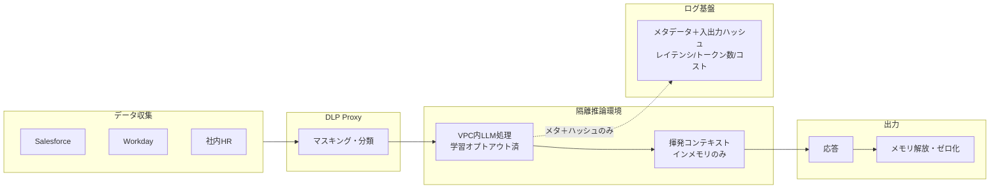

# KM-7 Ephemeral Secure Context Bus（揮発・機密計算）

## 概要

人事評価・M&A 検討・インサイダー情報——これらは「ログにも残さない」レベルの機密性が求められます。このパターンはコンテキストを隔離された推論環境で処理し、セッション終了と同時にメモリを解放・ゼロ化（zeroization）します。DLP（KM-6）が「機密を見つけて消す」アプローチなら、こちらは「最初から何も残さない」揮発アプローチです。ログ基盤にはレイテンシやトークン数などのメタデータだけを送ります。ただし適用は最高機密に限定してください。大半の機密処理は [KM-6](km6-dlp-redaction-boundary.md)＋[GV-5](../gv-governance/gv5-central-model-gateway.md)（VPC 内ルーティング＋DLP）で十分であり、本パターンはそれでも不足する極端なケース向けの設計です。

## 解決する企業課題

人事評価・M&A 検討・インサイダー情報に関わる処理では、通常の DLP マスキング（[KM-6](km6-dlp-redaction-boundary.md)）では不十分なケースがあります。複数の SaaS を横断して文脈を結合すると、単体では非機密のデータが組み合わさって機密情報を生成するリスクが生じます（モザイク効果／mosaic effect）。例えば、社内座席表＋出張記録＋外部の登記情報を突き合わせると、未公開の M&A 接触先を推測できてしまいます。

外部 LLM ベンダーへのデータ送信、ログ基盤への平文残存、キャッシュからの漏洩——これらを構造的に排除したい場合、「処理後に消す」ではなく「最初から残さない」設計が必要になります。本パターンは KM-6 の「汚染除去」アプローチに対し、「揮発」アプローチをとります。処理が終わった時点でコンテキストのメモリが解放・ゼロ化（zeroization）され、痕跡が残らないことを保証する仕組みです。ログ基盤にはメタデータのみ送信することで、観測性（[OB-1](../ob-observability/ob1-observability-lake.md)）の要件と機密保持の要件を両立させます。

!!! note "監査要件との両立（封緘された判断証跡）"
    「本文を一切残さない」設計は [OB-2](../ob-observability/ob2-unified-audit-lineage.md) の「全行為を再構成可能にする」要件と一見矛盾します。両立策として、**封緘（sealed）された判断証跡**を別系統で保持します。具体的には、プロンプト/レスポンスの本文は残さないが、「誰が・いつ・どの分類のデータを・どのポリシー判断で処理したか」のメタデータと入出力ハッシュは改ざん不能ストレージに記録します。この封緘証跡の開示は二者承認（例：CISO ＋ 法務責任者）を要件とし、通常運用ではアクセスできません。人事評価や内部通報など、後日の証跡保持が法的に要件化されうる領域では、この封緘メタデータの保持期間を規制要件に合わせて設計します。

## 価値仮説

機密データの揮発処理により、高セキュリティ領域（金融・医療・人事）へのエージェント適用を可能にします。適用領域の拡大は業務自動化による全社コスト削減幅を広げます。

## 解決策と設計

各 SaaS から収集したデータを DLP Proxy でマスキングし、隔離された推論環境で LLM 処理を行います。応答後はコンテキストのメモリを解放・ゼロ化します。プロンプト/レスポンス本文はログ基盤に一切送らず、レイテンシ・トークン数等のメタデータと入出力ハッシュ（封緘証跡）のみを送信します。



この構成は観測性の「トレースの程度」の最も厳格な形です。通常の三層分離（メタ→Trace DB、本文→暗号化ストレージ、集計→DWH）のうち、本文層を完全に廃し、メタ層のみ残します。

隔離推論環境の実現手段は、保証レベルの異なる3つの統制に分解されます。

| 統制 | 保証 | 実現手段 | 備考 |
|---|---|---|---|
| ①VPC 内ホスティング | ネットワーク隔離。外部への送信を遮断 | VPC 内の専用推論インスタンス、プライベートエンドポイント | 大半の極秘処理はこれで十分 |
| ②TEE／ハードウェアメモリ隔離 | ホスト OS・管理者からもメモリ内容を読めない | Confidential VM、**Confidential GPU**（NVIDIA H100 CC モード等） | LLM 推論には GPU が必要なため、AWS Nitro Enclaves（GPU 非搭載・永続ストレージなし・外部 NW なし）単体では実用規模の LLM を動かせない。LLM に TEE を適用する場合は Confidential GPU 系が必要であり、Nitro Enclaves とは別物である |
| ③学習オプトアウト | 入力がモデル学習に使われないことの保証 | DPA（Data Processing Agreement）での契約、API設定でのオプトアウト | 設定だけでなく契約上の義務として文書化する |

これらは独立した統制であり、要件に応じて組み合わせます。最も一般的な構成は①＋③（VPC 内ホスティング＋学習オプトアウト）であり、②の TEE/Confidential GPU は規制要件やゼロトラスト要件が特に厳しい場合に追加します。

!!! tip "最小成立条件（MVP）"
    MVP は「①VPC 内推論＋③学習オプトアウト（DPA 締結）＋本文ログ無効化＋短命インメモリ（セッション終了時ゼロ化）」です。大半の極秘処理はこの構成で十分な保証が得られます。②TEE/Confidential GPU は最上位機密（規制上ホスト管理者からの秘匿が要件化される場合）に限定して追加します。

!!! note "導入コスト・運用負荷の相対感"
    ①VPC 内推論は通常推論とほぼ同等のコストで導入できます。②Confidential GPU（NVIDIA H100 CC モード等）は対応インスタンスが限定的であり、通常 GPU 推論比で 1.5〜2 倍程度のコスト増と、対応環境の構築・検証に数週間〜数か月を要します。運用面では、揮発設計によりデバッグが困難になるため、本番とは別に非機密データでの検証環境を維持するコストも考慮します。

## 向き／不向き

| 向き | 不向き |
|---|---|
| 人事評価・給与・極秘プロジェクト情報の処理 | 低機密の大量処理（過剰な隔離はコストと性能を圧迫）。通常の機密処理は [KM-6](km6-dlp-redaction-boundary.md)＋[GV-5](../gv-governance/gv5-central-model-gateway.md) で十分 |
| 規制データ（絶対にログ/キャッシュに平文を残せない処理） | デバッグ・品質改善のために本文ログが必要な開発フェーズ |
| M&A / インサイダー関連の情報処理 | 継続的な文脈蓄積が必要なユースケース（記憶が残らない） |
| データ分類で「最高機密」に該当する処理のみ | 決定論的 RPA やフォーム処理で十分な業務（AI エージェント化自体が不要） |

## 要素技術・既存システム連携

- **VPC 内推論**：Azure OpenAI（VNet統合／プライベートエンドポイント）、AWS Bedrock（VPC エンドポイント）、社内推論基盤
- **TEE／Confidential Computing**：Azure Confidential VM、NVIDIA H100 Confidential Computing（Confidential GPU）、AMD SEV-SNP。AWS Nitro Enclaves は前処理・鍵管理・軽量推論には使えるが、GPU 非搭載のため実用規模の LLM 推論には不向き
- **DLP**：Presidio、Microsoft Purview、Google DLP
- **揮発ストレージ**：Redis No-Persistence、インメモリのみ
- **暗号化**：転送時の暗号化（保管自体を最小化）
- **学習オプトアウト**：DPA（Data Processing Agreement）による契約保証、API レベルのオプトアウト設定

## 落とし穴／選定の勘所

!!! danger "隔離の一貫性"
    性能のため隔離を緩めたり、デバッグ目的で本文をログに残すことは、極振り用途では禁忌です。「一部だけ平文ログに残す」は全体の保証を壊します。極秘処理では一貫して破棄します。

- 「一部だけ平文ログに残す」はメタのみの原則を破ります。そうなる場合は、そのユースケース自体を揮発バスから外して通常の三層分離（[OB-1](../ob-observability/ob1-observability-lake.md)）に移します。
- 機密計算はレイテンシとコストが高いです。全処理をこのパターンに通すのではなく、データ分類に基づき極秘処理のみに適用します。適用範囲はデータ分類で自動決定する仕組みを設けると管理が楽になります。
- LLM ベンダーの学習オプトアウト設定を確認し、契約（DPA: Data Processing Agreement）でも保証を取ってください。設定確認だけでは不十分であり、契約上の義務として文書化します。
- このパターンでは過去の文脈を参照できないため、継続的な対話が必要な業務には不向きです。必要であれば、機密計算の外で暗号化された外部メモリを使う設計を検討します（ただし保証は弱まる点に注意）。

## Interfaces

以下はこのパターンを実装する際の主要インターフェイスです。コーディングエージェントはこの定義からスタブコードを生成できます。

```yaml
interfaces:
  - name: DLP Proxy
    description: "Masks and classifies data collected from source SaaS systems before it enters the isolated inference environment."
    input:
      request: object
    output:
      response: object
    errors:
      - code: GENERAL_ERROR
        description: "DLP Proxy の処理中にエラーが発生"
    protocol: "REST / gRPC"
    implementation_hints:
      - "詳細は本文の「解決策と設計」節を参照"
    code_examples:
      typescript: |
        interface DlpProxyRequest {
          rawData: object;
          sourceSystem: string;
          classification: string;
        }
        interface DlpProxyResponse {
          maskedData: object;
          classificationLabel: string;
        }
        interface DlpProxy {
          dlpProxy(req: DlpProxyRequest): Promise<DlpProxyResponse>;
        }
      python: |
        @dataclass
        class DlpProxyRequest:
            raw_data: dict
            source_system: str
            classification: str
        
        @dataclass
        class DlpProxyResponse:
            masked_data: dict
            classification_label: str
        
        class DlpProxy(Protocol):
            async def dlp_proxy(self, req: DlpProxyRequest) -> DlpProxyResponse: ...
  - name: Isolated Inference Environment
    description: "VPC-hosted LLM (or Confidential GPU) with learning opt-out; context lives in-memory only and is zeroed immediately after the session completes."
    input:
      request: object
    output:
      response: object
    errors:
      - code: GENERAL_ERROR
        description: "Isolated Inference Environment の処理中にエラーが発生"
    protocol: "REST / gRPC"
    implementation_hints:
      - "詳細は本文の「解決策と設計」節を参照"
    code_examples:
      typescript: |
        interface IsolatedInferenceEnvironmentRequest {
          contextPackage: object;
          modelId: string;
          sessionId: string;
        }
        interface IsolatedInferenceEnvironmentResponse {
          response: string;
          tokensUsed: number;
          sessionCleared: boolean;
        }
        interface IsolatedInferenceEnvironment {
          isolatedInferenceEnvironment(req: IsolatedInferenceEnvironmentRequest): Promise<IsolatedInferenceEnvironmentResponse>;
        }
      python: |
        @dataclass
        class IsolatedInferenceEnvironmentRequest:
            context_package: dict
            model_id: str
            session_id: str
        
        @dataclass
        class IsolatedInferenceEnvironmentResponse:
            response: str
            tokens_used: int
            session_cleared: bool
        
        class IsolatedInferenceEnvironment(Protocol):
            async def isolated_inference_environment(self, req: IsolatedInferenceEnvironmentRequest) -> IsolatedInferenceEnvironmentResponse: ...
  - name: Sealed Audit Metadata Sink
    description: "Sends only metadata (latency, token count, cost) and hashed input/output to the observability lake; full content is never persisted."
    input:
      request: object
    output:
      response: object
    errors:
      - code: GENERAL_ERROR
        description: "Sealed Audit Metadata Sink の処理中にエラーが発生"
    protocol: "REST / gRPC"
    implementation_hints:
      - "詳細は本文の「解決策と設計」節を参照"
    code_examples:
      typescript: |
        interface SealedAuditMetadataSinkRequest {
          sessionId: string;
          latencyMs: number;
          tokenCount: number;
          cost: number;
          inputHash: string;
          outputHash: string;
        }
        interface SealedAuditMetadataSinkResponse {
          sinkId: string;
          recordedAt: Date;
        }
        interface SealedAuditMetadataSink {
          sealedAuditMetadataSink(req: SealedAuditMetadataSinkRequest): Promise<SealedAuditMetadataSinkResponse>;
        }
      python: |
        @dataclass
        class SealedAuditMetadataSinkRequest:
            session_id: str
            latency_ms: int
            token_count: int
            cost: float
            input_hash: str
            output_hash: str
        
        @dataclass
        class SealedAuditMetadataSinkResponse:
            sink_id: str
            recorded_at: datetime
        
        class SealedAuditMetadataSink(Protocol):
            async def sealed_audit_metadata_sink(self, req: SealedAuditMetadataSinkRequest) -> SealedAuditMetadataSinkResponse: ...
```

## 関連パターン

- [KM-6 DLP & Redaction Boundary](km6-dlp-redaction-boundary.md) — 対比：KM-6 が汚染除去アプローチをとるのに対し、本パターンは揮発アプローチで機密情報の残留を根絶します
- [GV-5 Central Model Gateway](../gv-governance/gv5-central-model-gateway.md) — 補完：データ分類に基づく LLM ルーティング（極秘→VPC内）
- [OB-1 Observability Lake](../ob-observability/ob1-observability-lake.md) — 補完：通常の三層分離との使い分け（本パターンはメタのみ送信）
- [ID-6 Zero-Trust PDP/PEP](../id-identity/id6-zero-trust-pdp-pep.md) — 補完：隔離領域へのアクセスもゼロトラストで認可します

## Decision Summary

```yaml
decision_summary:
  pattern: KM-7
  participates_in:
    - decision: DC-6
      role: option_a
    - decision: TO-10
      role: enabler
  recommended_if:
    - "最高機密データを処理後に残存させない保証が必要"
    - "規制上メモリ上でのみ処理しログを残せない"
  avoid_if:
    - "通常機密レベルでVPC内推論＋DLP(KM-6)で十分"
  combines_with: [KM-6, ID-6, GV-4]
  conflicts_with: []
  value_outcome:
    drivers: [audit_compliance]
    kpis: [揮発性保証達成率, 機密データの処理後残存ゼロ確認率]
  mvp: "VPC内推論＋ログ無効化＋短命メモリ。TEEは最上位機密のみ"
  cost: L
```
