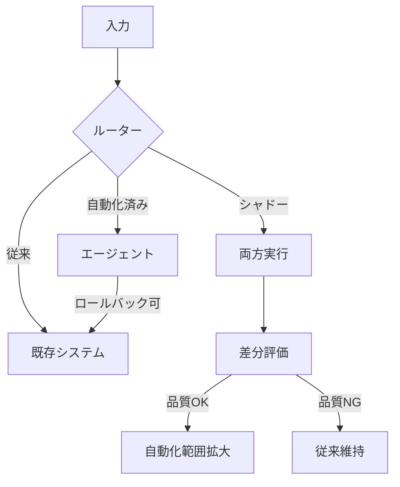

# L-1 Shadow Mode & Progressive Autonomy（シャドー運用→段階的自律）

## 概要

本番処理は人間/既存システムが行い、裏でエージェントに同じタスクを解かせて比較する。十分な品質の領域から段階的に自動化を広げる（ストラングラー的移行）。

## 設計

エージェント出力はユーザーに出さず、既存結果と差分評価する。フロントのルーターが対象ケースを「従来処理/エージェント処理」に振り分け、品質ゲートを満たすたびに担当範囲を拡大し、最終的に従来処理を退役する。常にロールバック可能を保つ。

## 解決する課題

- ビッグバン置換のリスク
- 実データでの安全な性能検証
- 組織的な信頼形成

## ユースケース

- 業務自動化の導入初期
- PoCから本番への移行

## 向き

リスク許容度が低い組織の漸進的移行に適する。

## 不向き

裏側実行やログ取得が許されない処理、置換対象のない新規機能には不向きである。

## 要素技術

- **トラフィック制御**：shadow traffic、feature flag
- **評価**：offline eval、difference analysis
- **品質基準**：human benchmark、品質ゲート

## 関連パターン

- [I-4 Version Pinning & Change Management](../i-observability/i4-version-pinning.md) — カナリアリリースとの連携
- [F-5 Human Approval Checkpoint](../f-reliability/f5-human-approval.md) — 承認範囲の段階的縮小
- [I-2 Evaluation CI/CD](../i-observability/i2-evaluation-cicd.md) — 品質ゲートの判定
- [L-3 Agent Constitution](l3-agent-constitution.md) — 移行を導く統治
