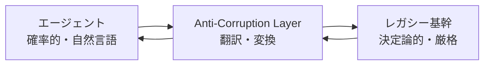

# L-2 Anti-Corruption Layer（アンチコラプション層）

## 概要

確率的・自然言語的なエージェントの世界と、決定論的・厳格なレガシー基幹システムの世界の間に翻訳層を置き、互いの概念汚染を防ぐ。

## 設計

エージェントの曖昧な意図/自然言語出力を、レガシーの厳格なドメインモデル/APIへ翻訳する（逆も）。レガシーのエラー/制約をエージェントが理解できる形に変換する。エージェント側の変化（モデル差し替え等）をレガシーへ波及させない。

## 解決する課題

- レガシー連携時の概念不一致
- エージェントの不安定さの伝播
- 双方の独立進化

## ユースケース

- 既存の堅牢な基幹システムへエージェントを後付けする統合

## 向き

レガシー資産が大きい組織に適する。

## 不向き

両側を同時設計できる新規グリーンフィールドには過剰である。

## 要素技術

- **設計パターン**：DDDのACL
- **変換**：アダプタ/変換器
- **マッピング**：ドメインモデルマッピング
- **契約**：明示的I/O契約

## 関連パターン

- [B-1 Deterministic Backbone](../b-composition/b1-deterministic-backbone.md) — 決定論的バックボーンとの連携
- [C-1 Natural Language Boundary Adapter](../c-io-contract/c1-nl-boundary-adapter.md) — 入力側の境界変換
- [C-2 Structured Output Contract](../c-io-contract/c2-structured-output-contract.md) — 出力の契約化
- [L-1 Shadow Mode & Progressive Autonomy](l1-shadow-progressive-autonomy.md) — 段階的移行との併用
