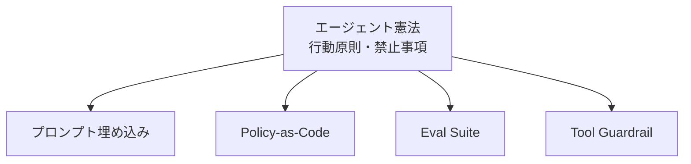

# L-3 Agent Constitution（エージェント憲法）

## 概要

行動原則・禁止事項・優先順位・組織ルールを「憲法」として一元管理し、プロンプト・ポリシー・eval・レビューに展開する。

## 設計

「顧客データを外部送信しない」「根拠なしに断定しない」「削除前に承認を取る」等を体系化し、以下へ落とし込む。

- プロンプト埋め込み
- policy-as-code（F-4）
- eval suite（I-2）
- tool guardrail（D-2）

## 解決する課題

組織ルールがプロンプト断片に散らばり、運用品質が属人化する問題を解決する。

## ユースケース

- 企業AI基盤
- 複数エージェント環境
- 社内ルールが重要な業務

## 向き

統治が必要な組織に適する。

## 不向き

個人用途の軽量AIには過剰である。

## 要素技術

- **管理**：policy/rule repository
- **プロンプト**：constitution prompt
- **実行**：policy-as-code
- **評価**：eval suite

## 関連パターン

- [F-4 Policy-as-Code Guardrail](../f-reliability/f4-policy-as-code.md) — ポリシーのコード化
- [D-2 Least-Privilege Tool Binding](../d-tools-mcp/d2-least-privilege-binding.md) — ツール権限の統制
- [I-2 Evaluation CI/CD](../i-observability/i2-evaluation-cicd.md) — 憲法準拠の評価
- [L-1 Shadow Mode & Progressive Autonomy](l1-shadow-progressive-autonomy.md) — 段階的な信頼獲得
