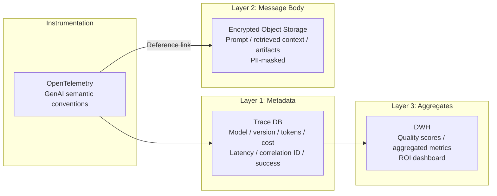

# OB-1 Enterprise Agent Observability Lake

## Overview

When an agent causes a problem, the inability to trace "why it made that decision" makes root cause analysis and regulatory response impossible. This pattern is an observability platform that integrates execution logs, distributed traces, token consumption, tool calls, RAG-retrieved context, approval status, and quality evaluation results. Storage is separated into three layers — metadata in the Trace DB, message bodies in PII-masked encrypted storage, and aggregated metrics in the DWH. The system conforms to OpenTelemetry GenAI semantic conventions.

## Enterprise Problem Solved

When an agent causes a problem in a production environment, the inability to trace "why it made that decision" is a serious risk for any enterprise. If there is no record of which prompt was used, what data was retrieved, and which tools were called, incident root cause analysis becomes impossible, as does any explanation to regulators.

An observability platform is equally indispensable from a cost perspective. Without knowing LLM API fees, SaaS API call counts, and vector DB query counts at the granularity of department, project, and agent, neither chargeback nor budget planning can function. From a quality improvement perspective, if there is no way to measure which prompt version improved answer accuracy or which user segment had low ratings, continuous improvement becomes a matter of guesswork. The absence of an observability platform is the root cause of all these problems.

!!! tip "Minimum Viable Requirements (MVP)"
    Use the OpenTelemetry SDK to record run_id, user_id, token_usage, and latency for every agent execution, and send them to an existing Trace Store (Jaeger, Datadog, etc.). Three-layer separation and full storage can wait — the first goal is to reach a state where "what happened can be traced."

## Value Hypothesis

Visibility into agent behavior supports bottleneck identification and faster improvement cycles. Data-driven agent improvement generates a virtuous cycle of quality improvement → higher adoption → increased value.

## Solution and Design

Record the following attributes for each execution.

| Attribute | Description |
|---|---|
| run_id / session_id | Execution and session identifiers |
| user_id / agent_id | Requester and agent |
| model / prompt_version | Model and prompt version |
| tool_calls / retrieved_context | Tool calls and retrieved context |
| approval_status | Approval status |
| token_usage / cost / latency | Tokens, cost, and latency |
| error / risk_tier | Error and risk tier |

Storage is separated into three layers.



The system conforms to OpenTelemetry GenAI semantic conventions, instrumenting agents, models, and tool calls in a standardized way. Layer 1 (metadata) is stored in a Trace DB for fast queries, enabling cross-cutting searches by run_id and correlation ID. Layer 2 (message body) is stored in PII-masked encrypted object storage and linked to Layer 1 via reference links. Layer 3 (aggregates) aggregates quality scores and ROI metrics in the DWH. For highly confidential processing ([KM-7](../km-knowledge/km7-ephemeral-secure-context-bus.md)), no message bodies are retained in logs — only metadata is sent.

## Fit / Not a Fit

| Fit | Not a Fit |
|---|---|
| All production AI (there are essentially no cases where this does not fit) | — |
| Storage scope and confidentiality management design are required | Logging all prompts without restriction is excessive |

## Component Technologies and System Integrations

- **Instrumentation standard**: OpenTelemetry, GenAI semantic conventions
- **Trace Store**: Jaeger, Tempo, Datadog APM
- **Object storage**: S3 (encrypted), GCS
- **DWH**: BigQuery, Snowflake, Redshift
- **Monitoring**: Datadog, CloudWatch, Grafana
- **Replay**: Prompt Store + Replay Tool for reproducing past executions

## Pitfalls / Selection Considerations

!!! warning "Directly Injecting All Prompts into the Log Platform"
    Putting all prompts directly into a logging platform creates enormous volumes, high cost, and PII risk. Enforce three-layer separation strictly — metadata to Trace DB, bodies to encrypted storage, aggregates to DWH. Mixing metadata and bodies simultaneously raises both metadata query costs and confidentiality management costs.

- Use sampling — full storage only for errors, low-rated results, and a random N% — to balance cost and coverage.
- For highly confidential processing ([KM-7](../km-knowledge/km7-ephemeral-secure-context-bus.md)), restrict to metadata only. Eliminating the body layer while retaining the metadata layer achieves both confidentiality and observability.
- Use correlation IDs (run_id/session_id) to enable cross-cutting tracing with audit logs from each SaaS. A design that can correlate internal agent traces with SaaS-side audit logs using the same ID is decisive for the efficiency of failure investigation.

## Interfaces

The following are the key interfaces for implementing this pattern. Coding agents can generate stub code from these definitions.

```yaml
interfaces:
  - name: OTel Instrumentation Layer
    description: "Records run_id, session_id, user_id, agent_id, model, prompt_version, tool_calls, retrieved_context, approval_status, token_usage, cost, latency, error, and risk_tier per execution using OpenTelemetry GenAI conventions."
    input:
      request: object
    output:
      response: object
    errors:
      - code: GENERAL_ERROR
        description: "Error occurred during OTel Instrumentation Layer processing"
    protocol: "REST / gRPC"
    implementation_hints:
      - "See the Solution and Design section for details"
    code_examples:
      typescript: |
        interface OtelInstrumentationLayerRequest {
          runId: string;
          sessionId: string;
          userId: string;
          agentId: string;
          modelId: string;
        }
        interface OtelInstrumentationLayerResponse {
          traceId: string;
          spanId: string;
          recordedAt: Date;
        }
        interface OtelInstrumentationLayer {
          otelInstrumentationLayer(req: OtelInstrumentationLayerRequest): Promise<OtelInstrumentationLayerResponse>;
        }
      python: |
        @dataclass
        class OtelInstrumentationLayerRequest:
            run_id: str
            session_id: str
            user_id: str
            agent_id: str
            model_id: str
        
        @dataclass
        class OtelInstrumentationLayerResponse:
            trace_id: str
            span_id: str
            recorded_at: datetime
        
        class OtelInstrumentationLayer(Protocol):
            async def otel_instrumentation_layer(self, req: OtelInstrumentationLayerRequest) -> OtelInstrumentationLayerResponse: ...
  - name: Three-Layer Storage
    description: "Layer 1 (Trace DB) for fast metadata queries; Layer 2 (encrypted object store, PII-masked) for full content keyed by run_id; Layer 3 (DWH) for quality scores and ROI aggregations."
    input:
      request: object
    output:
      response: object
    errors:
      - code: GENERAL_ERROR
        description: "Error occurred during Three-Layer Storage processing"
    protocol: "REST / gRPC"
    implementation_hints:
      - "See the Solution and Design section for details"
    code_examples:
      typescript: |
        interface ThreeLayerStorageRequest {
          runId: string;
          traceData: object;
          fullContent: object;
          qualityScores: object;
        }
        interface ThreeLayerStorageResponse {
          stored: boolean;
          layer1Id: string;
          layer2Key: string;
        }
        interface ThreeLayerStorage {
          threeLayerStorage(req: ThreeLayerStorageRequest): Promise<ThreeLayerStorageResponse>;
        }
      python: |
        @dataclass
        class ThreeLayerStorageRequest:
            run_id: str
            trace_data: dict
            full_content: dict
            quality_scores: dict
        
        @dataclass
        class ThreeLayerStorageResponse:
            stored: bool
            layer1_id: str
            layer2_key: str
        
        class ThreeLayerStorage(Protocol):
            async def three_layer_storage(self, req: ThreeLayerStorageRequest) -> ThreeLayerStorageResponse: ...
  - name: Replay Tool
    description: "Reconstructs past executions from stored metadata and content for incident investigation and quality regression testing."
    input:
      request: object
    output:
      response: object
    errors:
      - code: GENERAL_ERROR
        description: "Error occurred during Replay Tool processing"
    protocol: "REST / gRPC"
    implementation_hints:
      - "See the Solution and Design section for details"
    code_examples:
      typescript: |
        interface ReplayToolRequest {
          runId: string;
          replayMode: string;
        }
        interface ReplayToolResponse {
          reconstructedExecution: object;
          replayedAt: Date;
          differences: object[];
        }
        interface ReplayTool {
          replayTool(req: ReplayToolRequest): Promise<ReplayToolResponse>;
        }
      python: |
        @dataclass
        class ReplayToolRequest:
            run_id: str
            replay_mode: str
        
        @dataclass
        class ReplayToolResponse:
            reconstructed_execution: dict
            replayed_at: datetime
            differences: list[dict]
        
        class ReplayTool(Protocol):
            async def replay_tool(self, req: ReplayToolRequest) -> ReplayToolResponse: ...
```

## Related Patterns

- [OB-2 Unified Audit & Lineage](ob2-unified-audit-lineage.md) — Complement: uses observability data as audit evidence for regulatory reporting and accountability
- [GV-7 Evaluation & Governance Pipeline](../gv-governance/gv7-evaluation-governance-pipeline.md) — Complement: feeds observability data into quality evaluation and governance pipeline as input
- [GV-9 Incident Response & Kill Switch](../gv-governance/gv9-incident-response-kill-switch.md) — Complement: trace preservation and replay during failure investigation
- [GV-8 Cost Quota & Chargeback](../gv-governance/gv8-cost-quota-chargeback.md) — Complement: serves as the source of cost metering data supporting per-department chargeback
- [KM-7 Ephemeral Secure Context Bus](../km-knowledge/km7-ephemeral-secure-context-bus.md) — Contrast: the pattern of recording only metadata for highly confidential processing (the most stringent configuration, with the body layer eliminated)
