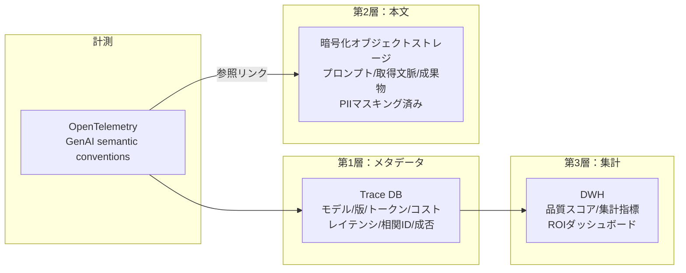

# OB-1 Enterprise Agent Observability Lake

## 概要

実行ログ・トレース・コスト・ツール呼び出し・取得文脈・承認・評価結果を統合する観測基盤。「なぜその判断をしたか」を後から再構成可能にし、コスト発生源の特定・障害調査・品質改善を支える。

## 設計

各実行に以下の属性を記録する。

| 属性 | 説明 |
|---|---|
| run_id / session_id | 実行・セッション識別子 |
| user_id / agent_id | 依頼者・エージェント |
| model / prompt_version | モデル・プロンプト版 |
| tool_calls / retrieved_context | ツール呼び出し・取得文脈 |
| approval_status | 承認状態 |
| token_usage / cost / latency | トークン・コスト・レイテンシ |
| error / risk_tier | エラー・リスク階層 |

保存は三層に分離する。

OpenTelemetry GenAI semantic conventions に準拠し、エージェント・モデル・ツール呼び出しの標準的な計測を行う。極秘処理（[KM-7](../km-knowledge/km7-ephemeral-secure-context-bus.md)）は本文を一切ログに残さずメタのみ送信する。

## 解決する企業課題

なぜその判断をしたか不明、コスト発生源が不明、障害調査・監査・品質改善ができない。これらすべてが観測基盤の不在から生じる。

## 向き／不向き

| 向き | 不向き |
|---|---|
| 本番 AI 全般（基本的に不向きなケースはない） | — |
| 保存範囲と機密管理の設計は必須 | 全プロンプトを無制限にログするのは過剰 |

## 要素技術・既存システム連携

- **計測標準**：OpenTelemetry、GenAI semantic conventions
- **Trace Store**：Jaeger、Tempo、Datadog APM
- **オブジェクトストレージ**：S3（暗号化）、GCS
- **DWH**：BigQuery、Snowflake、Redshift
- **監視**：Datadog、CloudWatch、Grafana
- **リプレイ**：Prompt Store + Replay Tool で過去実行を再現

## 落とし穴／選定の勘所

!!! warning "全プロンプトのログ直接投入"
    全プロンプトをログ基盤に直接入れると巨大・高コスト・PIIリスクになる。三層分離（メタ→Trace DB、本文→暗号化ストレージ、集計→DWH）を徹底する。

- エラー時・低評価時・ランダム N% のみフル保存というサンプリングも併用し、コストと網羅性のバランスを取る。
- 極秘処理（[KM-7](../km-knowledge/km7-ephemeral-secure-context-bus.md)）ではメタのみに限定する。
- 相関 ID（run_id/session_id）で各 SaaS の監査ログと横断追跡を可能にする。

## 関連パターン

- [OB-2 Unified Audit & Lineage](ob2-unified-audit-lineage.md) — 観測データを監査証跡に活用
- [GV-7 Evaluation & Governance Pipeline](../gv-governance/gv7-evaluation-governance-pipeline.md) — 観測データを評価の入力にする
- [GV-9 Incident Response & Kill Switch](../gv-governance/gv9-incident-response-kill-switch.md) — 障害調査時のトレース保全
- [GV-8 Cost Quota & Chargeback](../gv-governance/gv8-cost-quota-chargeback.md) — コスト計測データの供給元
- [KM-7 Ephemeral Secure Context Bus](../km-knowledge/km7-ephemeral-secure-context-bus.md) — 極秘処理のメタのみ記録
