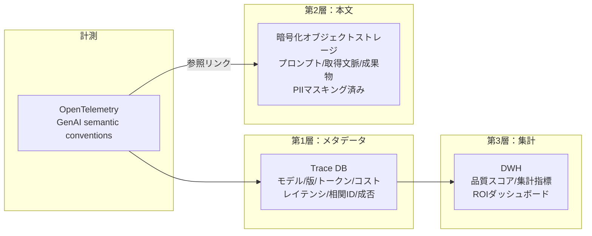

# OB-1 Enterprise Agent Observability Lake

## 概要

エージェントが問題を起こしたとき、「なぜその判断をしたか」を追跡できなければ原因究明も規制対応もできない。このパターンは、実行ログ・分散トレース・トークン消費・ツール呼び出し・RAG 取得文脈・承認状態・品質評価結果を統合する観測基盤だ。保存は三層に分離する——メタデータは Trace DB、本文は PII マスキング済みの暗号化ストレージ、集計指標は DWH。OpenTelemetry GenAI semantic conventions に準拠する。

## 解決する企業課題

エージェントが本番環境で問題を起こしたとき、「なぜその判断をしたか」を追跡できない状況は企業にとって深刻なリスクだ。どのプロンプトが使われたか、どのデータが検索で取得されたか、どのツールが呼ばれたか——これらが記録されていなければ、インシデントの原因究明も規制当局への説明も不可能になる。

コスト面でも観測基盤は不可欠だ。LLM の API 利用料・SaaS API 呼び出し数・ベクトル DB のクエリ数を部門・プロジェクト・エージェント単位で把握できなければ、チャージバックも予算計画も成立しない。品質改善の観点では、どのプロンプトバージョンで回答精度が上がったか、どのユーザーセグメントで評価が低いかを計測する手段がなければ、継続的な改善が行き当たりばったりになる。観測基盤の不在はこれらすべての問題の根本原因だ。

!!! tip "最小成立条件（MVP）"
    OpenTelemetry SDK でエージェントの各実行に run_id・user_id・token_usage・latency を記録し、既存の Trace Store（Jaeger / Datadog 等）に送信する。三層分離やフル保存は後続でよく、まず「何が起きたか追跡できる」状態を作る。

## 価値仮説

エージェント行動の可視化により、ボトルネック特定と改善サイクルの高速化を支える。データに基づくエージェント改善は品質向上→利用率向上→価値増大の好循環を生む。

## 解決策と設計

各実行に以下の属性を記録する。

| 属性 | 説明 |
|---|---|
| run_id / session_id | 実行・セッション識別子 |
| user_id / agent_id | 依頼者・エージェント |
| model / prompt_version | モデル・プロンプト版 |
| tool_calls / retrieved_context | ツール呼び出し・取得文脈 |
| approval_status | 承認状態 |
| token_usage / cost / latency | トークン・コスト・レイテンシ |
| error / risk_tier | エラー・リスク階層 |

保存は三層に分離する。



OpenTelemetry GenAI semantic conventions に準拠し、エージェント・モデル・ツール呼び出しを標準的な方法で計測する。第1層（メタデータ）は高速クエリ用の Trace DB に格納し、run_id や相関 ID での横断検索を可能にする。第2層（本文）は PII マスキング済みで暗号化オブジェクトストレージに保存し、参照リンクで第1層と結合する。第3層（集計）は DWH で品質スコアや ROI 指標を集計する。極秘処理（[KM-7](../km-knowledge/km7-ephemeral-secure-context-bus.md)）は本文をログに残さずメタのみ送信する点に注意すること。

## 向き／不向き

| 向き | 不向き |
|---|---|
| 本番 AI 全般（基本的に不向きなケースはない） | — |
| 保存範囲と機密管理の設計は必須 | 全プロンプトを無制限にログするのは過剰 |

## 要素技術・既存システム連携

- **計測標準**：OpenTelemetry、GenAI semantic conventions
- **Trace Store**：Jaeger、Tempo、Datadog APM
- **オブジェクトストレージ**：S3（暗号化）、GCS
- **DWH**：BigQuery、Snowflake、Redshift
- **監視**：Datadog、CloudWatch、Grafana
- **リプレイ**：Prompt Store + Replay Tool で過去実行を再現

## 落とし穴／選定の勘所

!!! warning "全プロンプトのログ直接投入"
    全プロンプトをログ基盤に直接入れると巨大・高コスト・PII リスクになる。三層分離（メタ→Trace DB、本文→暗号化ストレージ、集計→DWH）を徹底する。メタデータと本文を混在させると、メタ検索のコストと機密管理コストが同時に上昇する。

- エラー時・低評価時・ランダム N% のみフル保存するサンプリングも併用し、コストと網羅性のバランスを取る。
- 極秘処理（[KM-7](../km-knowledge/km7-ephemeral-secure-context-bus.md)）ではメタのみに限定する。本文層を廃止してメタ層のみ残すことで、機密保持と観測性を両立する。
- 相関 ID（run_id/session_id）で各 SaaS の監査ログと横断追跡を可能にする。エージェント内の trace と SaaS 側の audit log を同一 ID で突合できる設計が、障害調査の効率を決定的に変える。

## Interfaces

以下はこのパターンを実装する際の主要インターフェイスである。コーディングエージェントはこの定義からスタブコードを生成できる。

```yaml
interfaces:
  - name: OTel Instrumentation Layer
    description: "Records run_id, session_id, user_id, agent_id, model, prompt_version, tool_calls, retrieved_context, approval_status, token_usage, cost, latency, error, and risk_tier per execution using OpenTelemetry GenAI conventions."
    input:
      request: object
    output:
      response: object
    errors:
      - code: GENERAL_ERROR
        description: "OTel Instrumentation Layer の処理中にエラーが発生"
    protocol: "REST / gRPC"
    implementation_hints:
      - "詳細は本文の「解決策と設計」節を参照"
  - name: Three-Layer Storage
    description: "Layer 1 (Trace DB) for fast metadata queries; Layer 2 (encrypted object store, PII-masked) for full content keyed by run_id; Layer 3 (DWH) for quality scores and ROI aggregations."
    input:
      request: object
    output:
      response: object
    errors:
      - code: GENERAL_ERROR
        description: "Three-Layer Storage の処理中にエラーが発生"
    protocol: "REST / gRPC"
    implementation_hints:
      - "詳細は本文の「解決策と設計」節を参照"
  - name: Replay Tool
    description: "Reconstructs past executions from stored metadata and content for incident investigation and quality regression testing."
    input:
      request: object
    output:
      response: object
    errors:
      - code: GENERAL_ERROR
        description: "Replay Tool の処理中にエラーが発生"
    protocol: "REST / gRPC"
    implementation_hints:
      - "詳細は本文の「解決策と設計」節を参照"
```

## 関連パターン

- [OB-2 Unified Audit & Lineage](ob2-unified-audit-lineage.md) — 補完：観測データを監査証跡として規制報告・説明責任に活用する
- [GV-7 Evaluation & Governance Pipeline](../gv-governance/gv7-evaluation-governance-pipeline.md) — 補完：観測データを品質評価・ガバナンスパイプラインの入力にする
- [GV-9 Incident Response & Kill Switch](../gv-governance/gv9-incident-response-kill-switch.md) — 補完：障害調査時のトレース保全とリプレイ
- [GV-8 Cost Quota & Chargeback](../gv-governance/gv8-cost-quota-chargeback.md) — 補完：コスト計測データの供給元として部門別チャージバックを支える
- [KM-7 Ephemeral Secure Context Bus](../km-knowledge/km7-ephemeral-secure-context-bus.md) — 対比：極秘処理でメタのみ記録するパターン（本文層を廃した最も厳格な構成）
