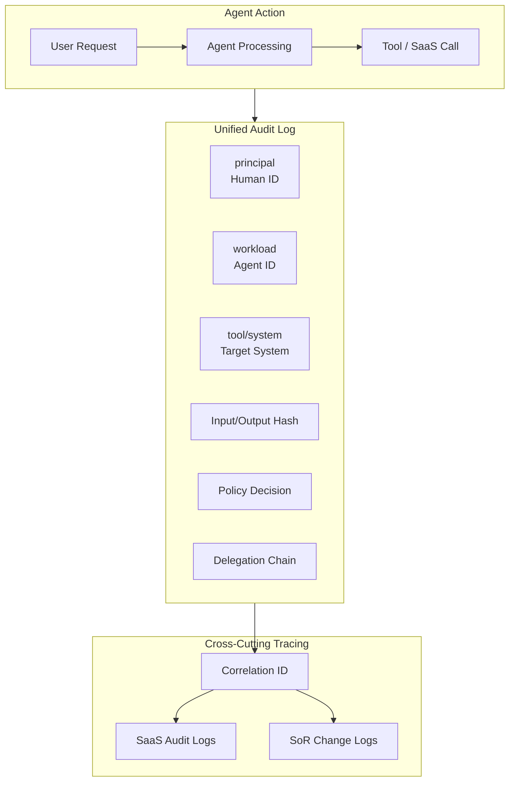

# OB-2 Unified Audit & Lineage (Three-Party Attribution)

## Overview

"Who changed this record in Salesforce?" — "The agent" is not a sufficient answer for an investigation. This pattern records every agent action in a tamper-proof form attributable to three parties: the person (requester), the agent (workload), and the target system. Using the OpenTelemetry Trace ID as a correlation ID, it unifies internal agent audit with the audit logs of each SaaS (Salesforce Shield, Okta System Log, etc.) into a unified audit platform capable of incident replay and regulatory authority reporting.

## Enterprise Problem Solved

In traditional systems, "who performed the operation (a person's identity)" was the basic unit of auditing. When an agent is involved, the operator is the agent, with a human behind it — a two-tier structure. A record that merely says "the agent updated Salesforce" leaves unclear whose request it was based on and what authority authorized it.

In regulated industries — finance, healthcare, manufacturing — an incident requires explaining to regulators "who, what, why, under what authority, and when" it was executed. When agent actions are mixed in logs alongside direct human operations, separating and tracing them after the fact becomes difficult. If internal agent audit and SaaS audits are siloed, cross-cutting investigation becomes impossible. Three-party attribution (human + agent + system) as a record format, combined with cross-cutting tracing via correlation IDs, is the structural solution to this challenge.

!!! tip "Minimum Viable Requirements (MVP)"
    Attach three fields — principal (human ID), workload (agent ID), tool (target system) — plus a correlation ID to every agent action, and record them in an append-only log. SIEM integration and complete delegation chain recording can follow later.

## Value Hypothesis

Audit trails with three-party attribution reduce regulatory response costs and compress the effort required for external audits. Establishing an audit framework enables agent deployment in regulated industries such as finance and healthcare, expanding the scope for value creation.

## Solution and Design

Record the following information for each action.

| Record Item | Description |
|---|---|
| principal | Requester (human ID) |
| workload | Agent (workload ID) |
| tool/system | Target system and tool |
| Input/output hash | Hash of input and output (tamper detection) |
| Policy decision | Reason for allow / deny / require_approval |
| Delegation chain | Delegation path: user → agent → tool |
| Cost | Token and API call costs |

The correlation ID (reusing the OpenTelemetry Trace ID / Span ID) threads through both the internal agent audit and each SaaS audit, enabling reconciliation with SoR (System of Record) changes. Recording the delegation chain (user → agent → tool) makes it possible to reliably trace "whose request initiated this tool call." Input/output hashes detect tampering and guarantee audit integrity. During incidents, replay ([GV-9](../gv-governance/gv9-incident-response-kill-switch.md)) reproduces past executions to identify the cause.

## Fit / Not a Fit

| Fit | Not a Fit |
|---|---|
| Required for all production AI | — |
| Regulated industries where compliance is mandatory | There are essentially no cases where this is not a fit |

## Component Technologies and System Integrations

- **SIEM**: Splunk, Microsoft Sentinel
- **SaaS audit logs**: Salesforce Shield, Google Workspace Audit, Okta System Log
- **Correlation ID**: OpenTelemetry Trace ID / Span ID
- **Event store**: Event Store, tamper-proof log
- **Replay**: Integrates with replay functionality in [GV-9](../gv-governance/gv9-incident-response-kill-switch.md)

## Pitfalls / Selection Considerations

!!! warning "Agent and SaaS Audit Siloed"
    The greatest pitfall is when agent-side audit and SaaS-side audit are siloed, making cross-cutting tracing impossible. Unify them with a correlation ID and make reconciliation with SoR changes possible. A situation where "the agent-side log has a record but the SaaS side doesn't" — or vice versa — makes investigation fatally difficult.

- Store audit logs in tamper-proof storage (append-only, WORM). Design write-only permissions so that the agent and application layer cannot overwrite logs.
- Record direct human operations and agent-mediated operations in the same format to enable cross-cutting search. If formats differ, correlation analysis in SIEM becomes complex.
- Set log retention periods to match regulatory requirements (finance: 7 years, healthcare: 10 years, etc.). Finalize retention policies before agent usage becomes full-scale.

!!! note "Compatibility with Highly Confidential Processing (KM-7)"
    [KM-7 Ephemeral Secure Context Bus](../km-knowledge/km7-ephemeral-secure-context-bus.md) is designed to retain no prompt/response body whatsoever, but this does not contradict this pattern's requirement of making all actions reconstructible. Even in KM-7 processing, a **sealed judgment trail** — "who, when, what classification of data, under what policy decision was processed" as metadata and input/output hashes — is recorded in tamper-proof storage. Full body reconstruction is not possible, but the fact of the action, attribution, and policy decision remain traceable. Disclosure of sealed trails requires dual-authority approval (CISO + General Counsel, etc.) and is not accessible in normal operations. For areas where evidence retention may be legally required after the fact — such as HR evaluations and internal reporting — design retention periods to match regulatory requirements.

## Related Patterns

- [OB-1 Observability Lake](ob1-observability-lake.md) — Complement: observability data (traces, costs, quality) is used as material for audit evidence
- [GV-9 Incident Response & Kill Switch](../gv-governance/gv9-incident-response-kill-switch.md) — Complement: supports replay and investigation during incidents
- [ID-2 Identity Federation & OBO](../id-identity/id2-identity-federation-obo.md) — Complement: recording the delegation chain (user → agent → tool) and tracing OBO tokens
- [ID-6 Zero-Trust PDP/PEP](../id-identity/id6-zero-trust-pdp-pep.md) — Complement: source of policy decision records (allow / deny / require_approval)
- [RT-6 SoR Write Boundary](../rt-runtime/rt6-sor-write-boundary.md) — Complement: complete tracking of write operations through reconciliation with SoR changes
