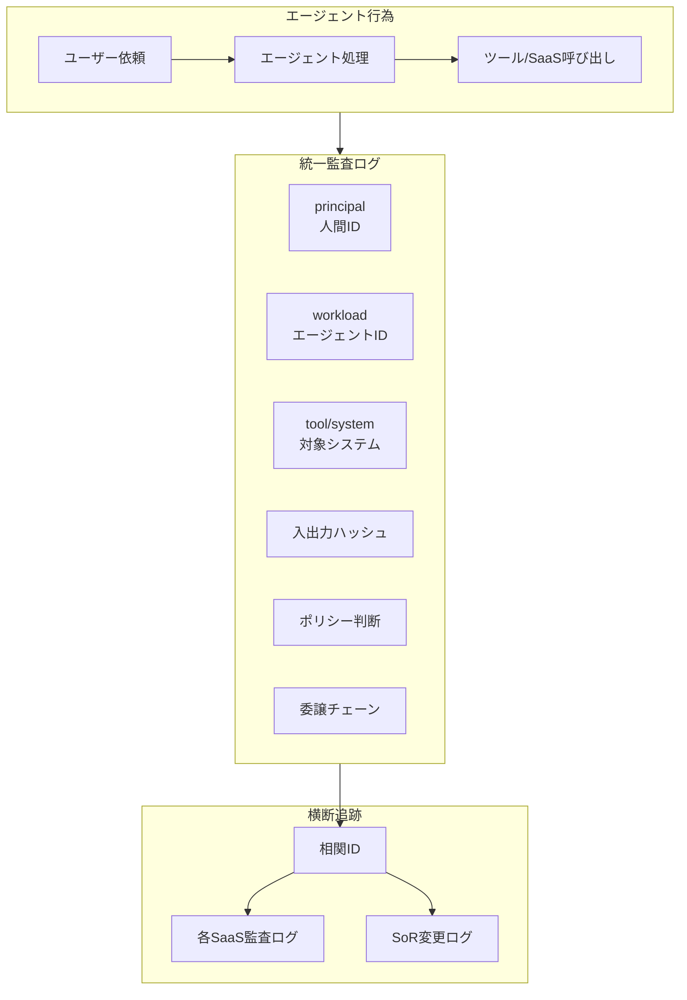

# OB-2 Unified Audit & Lineage（三者帰責）

## 概要

すべてのエージェント行為を「人（principal）＋エージェント（workload）＋対象システム」で改ざん不能に記録し、後から完全再構成・規制報告できる統一監査基盤である。

## 設計

各アクションに以下の情報を記録する。

| 記録項目 | 説明 |
|---|---|
| principal | 依頼者（人間のID） |
| workload | エージェント（ワークロードID） |
| tool/system | 対象システム・ツール |
| 入出力ハッシュ | 入力・出力のハッシュ（改ざん検知） |
| ポリシー判断 | allow/deny/require_approval の理由 |
| 委譲チェーン | user → agent → tool の委譲経路 |
| コスト | トークン・API呼び出しコスト |

相関 ID でエージェント内監査と各 SaaS 監査を貫き、SoR の変更と突合可能にする。インシデント時はリプレイ（[GV-9](../gv-governance/gv9-incident-response-kill-switch.md)）で過去実行を再現する。

## 解決する企業課題

インシデント原因究明、規制対応の証跡、説明責任の確保、エージェント内と各 SaaS 監査の分断。「誰が・何を・なぜ・どの権限で」を後から完全に再構成できなければ、規制当局への報告も社内調査もできない。

## 向き／不向き

| 向き | 不向き |
|---|---|
| 本番 AI 全般に必須 | — |
| 規制対応が求められる業界 | 不向きなケースは基本的にない |

## 要素技術・既存システム連携

- **SIEM**：Splunk、Microsoft Sentinel
- **SaaS 監査ログ**：Salesforce Shield、Google Workspace Audit、Okta System Log
- **相関 ID**：OpenTelemetry Trace ID / Span ID
- **イベントストア**：Event Store、改ざん不能ログ
- **リプレイ**：[GV-9](../gv-governance/gv9-incident-response-kill-switch.md) のリプレイ機能と連携

## 落とし穴／選定の勘所

!!! warning "エージェントとSaaSの監査分断"
    エージェント側の監査と各 SaaS の監査が分断され横断追跡できないのが最大の落とし穴。相関 ID で一本化し、SoR の変更と突合可能にする。

- 監査ログは改ざん不能なストレージに保管する（append-only、WORM）。
- 人間の直接操作とエージェント経由の操作を同一フォーマットで記録し、横断検索を可能にする。
- ログの保持期間は規制要件に合わせる（金融：7年、医療：10年等）。

## 関連パターン

- [OB-1 Observability Lake](ob1-observability-lake.md) — 観測データを監査証跡の素材にする
- [GV-9 Incident Response & Kill Switch](../gv-governance/gv9-incident-response-kill-switch.md) — インシデント時のリプレイ・調査
- [ID-2 Identity Federation & OBO](../id-identity/id2-identity-federation-obo.md) — 委譲チェーンの記録
- [ID-6 Zero-Trust PDP/PEP](../id-identity/id6-zero-trust-pdp-pep.md) — ポリシー判断の記録
- [RT-6 SoR Write Boundary](../rt-runtime/rt6-sor-write-boundary.md) — SoR 変更との突合
