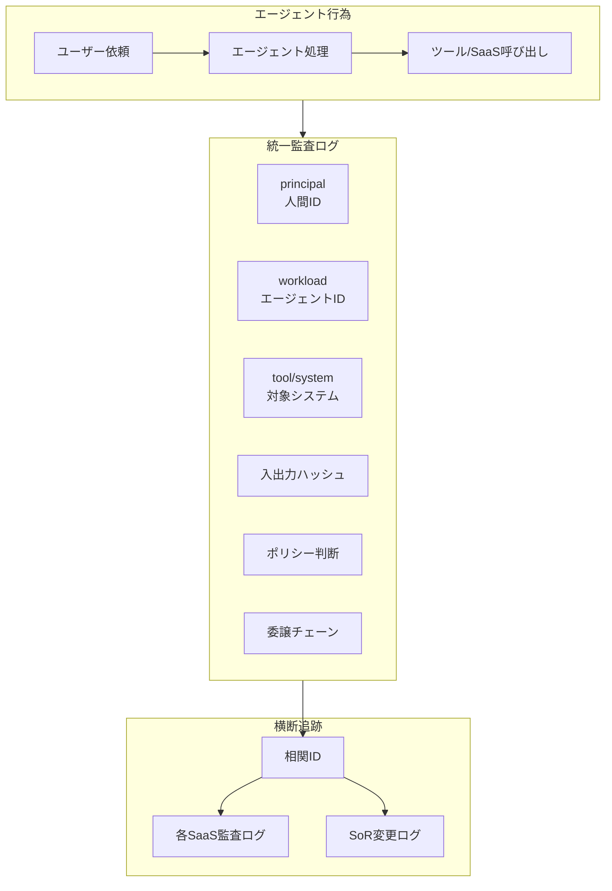

# OB-2 Unified Audit & Lineage（三者帰責）

## 概要

「Salesforce のこのレコード、誰が変えたの？」——答えが「エージェント」では調査になりません。このパターンはすべてのエージェント行為を「人（依頼者）＋エージェント（ワークロード）＋対象システム」の三者で改ざん不能に記録します。OpenTelemetry の Trace ID を相関 ID として、エージェント内部の監査と各 SaaS（Salesforce Shield・Okta System Log 等）の監査ログを一本化し、インシデント時のリプレイと規制当局への報告に対応する統一監査基盤です。

## 解決する企業課題

従来のシステムでは「誰が操作したか（人間の ID）」が監査の基本単位でした。エージェントが介在すると、操作者はエージェントであり、その背後に人間がいるという二層構造になります。「エージェントが Salesforce を更新した」という記録だけでは、誰の依頼によるものか、どの権限に基づくものかが不明です。

金融・医療・製造など規制対象業界では、インシデント時に「誰が・何を・なぜ・どの権限で・いつ」実行したかを規制当局に説明しなければなりません。エージェント行為が人間の直接操作と混在してログに残ると、後から分離して追跡することが困難になります。エージェント内の監査と各 SaaS の監査が分断されると、横断的な調査は不可能になります。三者帰責（human + agent + system）という記録フォーマットと相関 ID による横断追跡が、これらの課題を構造的に解決します。

!!! tip "最小成立条件（MVP）"
    エージェントの全アクションに principal（人間 ID）・workload（エージェント ID）・tool（対象システム）の3項目と相関 ID を付与して append-only ログに記録します。SIEM 連携や委譲チェーンの完全記録は後続でよいです。

## 価値仮説

三者帰責の監査証跡により、規制対応コストを削減し外部監査の工数を圧縮します。監査体制の整備は金融・医療等の規制業種へのエージェント適用を可能にし、価値創出領域を広げます。

## 解決策と設計

各アクションに以下の情報を記録します。

| 記録項目 | 説明 |
|---|---|
| principal | 依頼者（人間のID） |
| workload | エージェント（ワークロードID） |
| tool/system | 対象システム・ツール |
| 入出力ハッシュ | 入力・出力のハッシュ（改ざん検知） |
| ポリシー判断 | allow/deny/require_approval の理由 |
| 委譲チェーン | user → agent → tool の委譲経路 |
| コスト | トークン・API呼び出しコスト |



相関 ID（OpenTelemetry の Trace ID / Span ID を流用）でエージェント内監査と各 SaaS 監査を貫き、SoR（System of Record）の変更との突合を可能にします。委譲チェーン（user → agent → tool）を記録することで、「このツール呼び出しは誰の依頼から始まったか」を確実に追跡できます。入出力ハッシュで改ざんを検知し、監査の整合性を保ちます。インシデント時はリプレイ（[GV-9](../gv-governance/gv9-incident-response-kill-switch.md)）で過去実行を再現し、原因を特定します。

## 向き／不向き

| 向き | 不向き |
|---|---|
| 本番 AI 全般に必須 | — |
| 規制対応が求められる業界 | 不向きなケースは基本的にない |

## 要素技術・既存システム連携

- **SIEM**：Splunk、Microsoft Sentinel
- **SaaS 監査ログ**：Salesforce Shield、Google Workspace Audit、Okta System Log
- **相関 ID**：OpenTelemetry Trace ID / Span ID
- **イベントストア**：Event Store、改ざん不能ログ
- **リプレイ**：[GV-9](../gv-governance/gv9-incident-response-kill-switch.md) のリプレイ機能と連携

## 落とし穴／選定の勘所

!!! warning "エージェントとSaaSの監査分断"
    エージェント側の監査と各 SaaS の監査が分断されて横断追跡できないのが最大の落とし穴です。相関 ID で一本化し、SoR の変更と突合可能にします。「エージェント側のログには記録があるが SaaS 側には残っていない」または逆の状況は、調査を致命的に困難にします。

- 監査ログは改ざん不能なストレージに保管します（append-only、WORM）。エージェントやアプリケーション層から書き換えられないよう、書き込み専用の権限設計にします。
- 人間の直接操作とエージェント経由の操作は同一フォーマットで記録し、横断検索を可能にします。フォーマットが分かれると SIEM での相関分析が複雑になります。
- ログの保持期間は規制要件に合わせます（金融：7年、医療：10年等）。エージェントの利用が本格化する前に保持ポリシーを確定しておきましょう。

!!! note "極秘処理（KM-7）との両立"
    [KM-7 Ephemeral Secure Context Bus](../km-knowledge/km7-ephemeral-secure-context-bus.md) はプロンプト/レスポンス本文を一切残さない設計ですが、「全行為を再構成可能にする」本パターンの要件と矛盾するわけではありません。KM-7 の処理でも、**封緘（sealed）された判断証跡**——「誰が・いつ・どの分類のデータを・どのポリシー判断で処理したか」のメタデータと入出力ハッシュ——は改ざん不能ストレージに記録されます。本文の再構成はできませんが、行為の事実・帰責・ポリシー判断は追跡可能です。封緘証跡の開示は二者承認（CISO ＋ 法務責任者等）を要件とし、通常運用ではアクセスできません。人事評価・内部通報など、後日の証跡保持が法的に要件化されうる領域では、保持期間を規制要件に合わせて設計します。

## Interfaces

以下はこのパターンを実装する際の主要インターフェイスです。コーディングエージェントはこの定義からスタブコードを生成できます。

```yaml
interfaces:
  - name: Three-Party Audit Record
    description: "Appends principal (human ID), workload (agent ID), tool/system, input/output hashes, policy decision (allow/deny/require_approval), delegation chain, and cost to an append-only immutable log per action."
    input:
      request: object
    output:
      response: object
    errors:
      - code: GENERAL_ERROR
        description: "Three-Party Audit Record の処理中にエラーが発生"
    protocol: "REST / gRPC"
    implementation_hints:
      - "詳細は本文の「解決策と設計」節を参照"
    code_examples:
      typescript: |
        interface ThreePartyAuditRecordRequest {
          principalId: string;
          agentId: string;
          toolId: string;
          inputHash: string;
          outputHash: string;
          policyDecision: string;
          delegationChain: string[];
        }
        interface ThreePartyAuditRecordResponse {
          auditId: string;
          appendedAt: Date;
        }
        interface ThreePartyAuditRecord {
          threePartyAuditRecord(req: ThreePartyAuditRecordRequest): Promise<ThreePartyAuditRecordResponse>;
        }
      python: |
        @dataclass
        class ThreePartyAuditRecordRequest:
            principal_id: str
            agent_id: str
            tool_id: str
            input_hash: str
            output_hash: str
            policy_decision: str
            delegation_chain: list[str]
        
        @dataclass
        class ThreePartyAuditRecordResponse:
            audit_id: str
            appended_at: datetime
        
        class ThreePartyAuditRecord(Protocol):
            async def three_party_audit_record(self, req: ThreePartyAuditRecordRequest) -> ThreePartyAuditRecordResponse: ...
  - name: Correlation ID Stitcher
    description: "Uses OpenTelemetry Trace ID / Span ID to join agent-side audit records with SaaS-side audit logs (Salesforce Shield, Okta System Log) enabling cross-system investigation."
    input:
      request: object
    output:
      response: object
    errors:
      - code: GENERAL_ERROR
        description: "Correlation ID Stitcher の処理中にエラーが発生"
    protocol: "REST / gRPC"
    implementation_hints:
      - "詳細は本文の「解決策と設計」節を参照"
    code_examples:
      typescript: |
        interface CorrelationIdStitcherRequest {
          traceId: string;
          spanId: string;
          saasName: string;
          timeWindowStart: Date;
          timeWindowEnd: Date;
        }
        interface CorrelationIdStitcherResponse {
          stitchedEvents: object[];
          crossSystemView: object;
        }
        interface CorrelationIdStitcher {
          correlationIdStitcher(req: CorrelationIdStitcherRequest): Promise<CorrelationIdStitcherResponse>;
        }
      python: |
        @dataclass
        class CorrelationIdStitcherRequest:
            trace_id: str
            span_id: str
            saas_name: str
            time_window_start: datetime
            time_window_end: datetime
        
        @dataclass
        class CorrelationIdStitcherResponse:
            stitched_events: list[dict]
            cross_system_view: dict
        
        class CorrelationIdStitcher(Protocol):
            async def correlation_id_stitcher(self, req: CorrelationIdStitcherRequest) -> CorrelationIdStitcherResponse: ...
  - name: SIEM Integration
    description: "Forwards normalized audit events to Splunk or Microsoft Sentinel so that agent actions appear alongside human actions in the same correlation queries."
    input:
      request: object
    output:
      response: object
    errors:
      - code: GENERAL_ERROR
        description: "SIEM Integration の処理中にエラーが発生"
    protocol: "REST / gRPC"
    implementation_hints:
      - "詳細は本文の「解決策と設計」節を参照"
    code_examples:
      typescript: |
        interface SiemIntegrationRequest {
          auditEvent: object;
          eventType: string;
          severity: string;
        }
        interface SiemIntegrationResponse {
          forwarded: boolean;
          siemEventId: string;
          forwardedAt: Date;
        }
        interface SiemIntegration {
          siemIntegration(req: SiemIntegrationRequest): Promise<SiemIntegrationResponse>;
        }
      python: |
        @dataclass
        class SiemIntegrationRequest:
            audit_event: dict
            event_type: str
            severity: str
        
        @dataclass
        class SiemIntegrationResponse:
            forwarded: bool
            siem_event_id: str
            forwarded_at: datetime
        
        class SiemIntegration(Protocol):
            async def siem_integration(self, req: SiemIntegrationRequest) -> SiemIntegrationResponse: ...
```

## 関連パターン

- [OB-1 Observability Lake](ob1-observability-lake.md) — 補完：観測データ（トレース・コスト・品質）を監査証跡の素材として活用します
- [GV-9 Incident Response & Kill Switch](../gv-governance/gv9-incident-response-kill-switch.md) — 補完：インシデント時のリプレイ・調査を支えます
- [ID-2 Identity Federation & OBO](../id-identity/id2-identity-federation-obo.md) — 補完：委譲チェーン（user → agent → tool）の記録と OBO トークンの追跡
- [ID-6 Zero-Trust PDP/PEP](../id-identity/id6-zero-trust-pdp-pep.md) — 補完：ポリシー判断（allow/deny/require_approval）の記録源
- [RT-6 SoR Write Boundary](../rt-runtime/rt6-sor-write-boundary.md) — 補完：SoR 変更との突合による書き込み操作の完全追跡

## Decision Summary

```yaml
decision_summary:
  pattern: OB-2
  participates_in:
    - decision: DC-3
      role: primary
    - decision: TO-7
      role: enabler
  recommended_if:
    - "監査で任意時点の操作来歴を追跡する必要がある"
    - "人・エージェント・システムの三者帰責を記録する"
  avoid_if:
    - "内部ツールのみで監査要件なし"
  combines_with: [OB-1, ID-2, ID-3, GV-1]
  conflicts_with: []
  value_outcome:
    drivers: [audit_compliance]
    kpis: [監査追跡可能率, 来歴完全性]
  mvp: "全書き込み操作の来歴を不変ログに記録"
  cost: M
```
