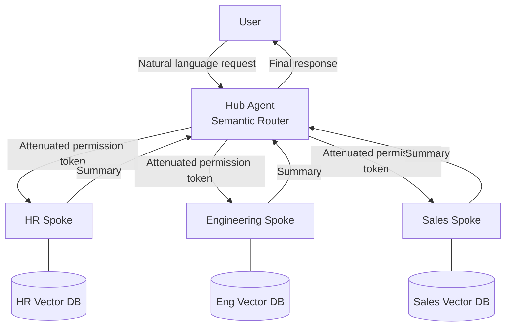

# RT-1 Org-Hierarchical Hub & Spoke (Intent Routing + Domain Spokes)

## Overview

Employees ask things like "How many vacation days do I have left?" and "Update the status on this deal." Delegating everything to a single omnipotent agent inflates context and concentrates permissions. In this pattern, employees only need to interact with a company-wide portal (Hub), which classifies intent and delegates processing to specialized agents (Spokes) for HR, Engineering, Sales, and other domains. Each Spoke handles only its own SaaS, and permissions are attenuated exclusively in the Hub → Spoke direction.

## Enterprise Problem Addressed

In enterprise agent platforms, designs that pack all departments' tools, policies, and data into a single prompt are common. Beyond context window exhaustion, problems arise from cascading impacts: "the Sales agent can access HR data" and "an HR API change breaks Sales functionality."

From a permission silo perspective, each department has its own data classification and access policies, but giving a single agent all tools eliminates any mechanism for isolating permissions by department. This directly violates enterprise governance requirements (least privilege, separation of duties).

From a change management perspective, a structure where a specific SaaS API change propagates across the entire system severely impairs CI/CD cycles and organizational autonomy. When the HR department upgrades a Workday API version, it should not affect Sales or Engineering functionality.

This pattern resolves context partitioning, permission attenuation, and change localization with a single design.

!!! tip "Minimum Viable Configuration (MVP)"
    Set up one hub and two spokes (e.g., HR and Sales) with intent classification to route between them. Permission attenuation can initially be achieved with per-spoke service accounts and scope restrictions rather than OBO tokens.

## Value Hypothesis

Routing aligned with organizational structure allows employees to immediately reach the appropriate specialized agent. Eliminating runaround improves employee experience, increasing both agent adoption rates and operational efficiency.

## Solution and Design

The core of the solution is "mapping organizational responsibility boundaries to agent topology." In enterprises where departmental units are also units of permission boundaries, tool ownership, and SaaS integration, aligning agent structure with those boundaries is the most natural design. The hub handles only intent classification and routing, while domain-specific knowledge is held by each spoke.

The hub functions as a semantic router, classifying the domain of a request. Based on the classification result, it selects the target spoke and calls it with an attenuated permission token (OBO token). Each spoke has tools, vector DBs, and capabilities specialized for its domain. After processing, spokes return a summary to the hub, which assembles the final response for the user.



Permission attenuation is enforced on all routes. The hub converts the calling user's permissions into a delegation token and passes it to the spoke. The spoke cannot request operations beyond that permission scope. This prevents the structural flaw where the Sales spoke could unauthorizedly access HR data.

Because spokes return summaries, raw data from all domains does not accumulate in the hub's context window. Each spoke can scale and upgrade independently, with hub impact localized.

## When to Use / When Not to Use

| When to Use | When Not to Use |
|---|---|
| Large organizations with distinct permission boundaries, SaaS integrations, and vector DBs per department | Small-scale use cases with only 1–2 domains where spoke overhead outweighs benefits |
| Scale where cross-domain requests are frequent and context management in a single agent is impractical | Cases where most requests are cross-domain and nearly all spokes must be called each time (fan-out latency becomes problematic) |
| When each domain team needs to develop and update spokes independently | Business flows that require tightly coupled interaction between spokes (frequent shared state reads/writes) |
| — | Routine tasks where deterministic RPA or form processing suffices (AI agent adoption itself is unnecessary) |

## Component Technologies and System Integration

- Semantic router: intent classification models, embedding vector similarity search
- Multi-agent frameworks: LangGraph, AutoGen, CrewAI
- Domain-specific vector DBs: Pinecone, Weaviate, pgvector (tenant-isolated per department)
- Capability registry: central catalog managing the list of tools each spoke exposes
- Permission attenuation: integrates with ID-4 Permission Mirror, delegating to spokes via OBO tokens (RFC 8693)
- Departmental SaaS integration: Workday (HR), Salesforce (Sales), GitHub/Jira (Engineering)

## Pitfalls and Selection Criteria

**Monolithic mega-agent.** The anti-pattern of "putting all tools and policies in one agent for now" causes context pollution, over-privileging, and widespread change impact. Problems are invisible at small scale but escalate as the number of domains and tools grows.

**Insufficient semantic router accuracy.** Misclassification by the router means requests reach the wrong domain's spoke. Ensure test coverage for the router and design fallbacks for low-confidence cases (human confirmation, parallel calls to multiple spokes).

**Implicit permission dependencies between spokes.** When one spoke needs data from another, direct calls without going through the hub tend to emerge. This breaks permission attenuation consistency. Spoke-to-spoke communication must always route through the hub and pass permission checks.

**Abandoning the capability registry.** As spokes multiply, tracking which spoke holds which tools becomes scattered. Centrally manage the registry and integrate with GV-2 Agent Catalog.

**Mixing workforce and customer-facing concerns.** Designs where spokes handle both employee and customer requests violate [ID-1 Workforce/Customer Split](../id-identity/id1-workforce-customer-split.md). Separate workforce and customer-facing concerns at the hub stage; each spoke should handle only one side.

## Interfaces

The following are the key interfaces for implementing this pattern. Coding agents can generate stub code from these definitions.

```yaml
interfaces:
  - name: Hub Agent (Semantic Router)
    description: "Classifies the intent of incoming user requests and routes to the appropriate spoke with an attenuated OBO token."
    input:
      request: object
    output:
      response: object
    errors:
      - code: GENERAL_ERROR
        description: "Error occurred during Hub Agent (Semantic Router) processing"
    protocol: "REST / gRPC"
    implementation_hints:
      - "See the Solution and Design section for details"
    code_examples:
      typescript: |
        interface HubAgentRequest {
          userRequest: string;
          principalId: string;
          oboToken: string;
        }
        interface HubAgentResponse {
          targetSpoke: string;
          attenuatedToken: string;
          intent: string;
        }
        interface HubAgent {
          hubAgent(req: HubAgentRequest): Promise<HubAgentResponse>;
        }
      python: |
        @dataclass
        class HubAgentRequest:
            user_request: str
            principal_id: str
            obo_token: str
        
        @dataclass
        class HubAgentResponse:
            target_spoke: str
            attenuated_token: str
            intent: str
        
        class HubAgent(Protocol):
            async def hub_agent(self, req: HubAgentRequest) -> HubAgentResponse: ...
  - name: Domain Spoke Agent
    description: "Handles domain-specific tools and vector DB; returns a summary to the hub rather than raw data."
    input:
      request: object
    output:
      response: object
    errors:
      - code: GENERAL_ERROR
        description: "Error occurred during Domain Spoke Agent processing"
    protocol: "REST / gRPC"
    implementation_hints:
      - "See the Solution and Design section for details"
    code_examples:
      typescript: |
        interface DomainSpokeAgentRequest {
          query: string;
          oboToken: string;
          domain: string;
        }
        interface DomainSpokeAgentResponse {
          summary: string;
          toolsUsed: string[];
          sourceRefs: string[];
        }
        interface DomainSpokeAgent {
          domainSpokeAgent(req: DomainSpokeAgentRequest): Promise<DomainSpokeAgentResponse>;
        }
      python: |
        @dataclass
        class DomainSpokeAgentRequest:
            query: str
            obo_token: str
            domain: str
        
        @dataclass
        class DomainSpokeAgentResponse:
            summary: str
            tools_used: list[str]
            source_refs: list[str]
        
        class DomainSpokeAgent(Protocol):
            async def domain_spoke_agent(self, req: DomainSpokeAgentRequest) -> DomainSpokeAgentResponse: ...
  - name: Capability Registry
    description: "Central catalog that manages the list of tools each spoke exposes, integrated with GV-2 Agent Catalog."
    input:
      request: object
    output:
      response: object
    errors:
      - code: GENERAL_ERROR
        description: "Error occurred during Capability Registry processing"
    protocol: "REST / gRPC"
    implementation_hints:
      - "See the Solution and Design section for details"
    code_examples:
      typescript: |
        interface CapabilityRegistryRequest {
          spokeId: string;
        }
        interface CapabilityRegistryResponse {
          tools: object[];
          updatedAt: Date;
        }
        interface CapabilityRegistry {
          capabilityRegistry(req: CapabilityRegistryRequest): Promise<CapabilityRegistryResponse>;
        }
      python: |
        @dataclass
        class CapabilityRegistryRequest:
            spoke_id: str
        
        @dataclass
        class CapabilityRegistryResponse:
            tools: list[dict]
            updated_at: datetime
        
        class CapabilityRegistry(Protocol):
            async def capability_registry(self, req: CapabilityRegistryRequest) -> CapabilityRegistryResponse: ...
```

## Related Patterns

- [RT-2 RACI-based Multi-Agent Orchestration](rt2-raci-multi-agent.md): Complementary. Combining RACI responsibility assignment with Hub & Spoke spoke coordination clarifies responsibility boundaries between domains.
- [ID-4 Permission Mirror & Least-of](../id-identity/id4-permission-mirror-least-of.md): Complementary. The foundational pattern for implementing permission-attenuated delegation to spokes via OBO tokens.
- [EX-1 Enterprise Agent Gateway](../ex-experience/ex1-enterprise-agent-gateway.md): Complementary. Used as the gateway that precedes user requests reaching the Hub.
- [KM-4 Scoped Memory Hierarchy](../km-knowledge/km4-scoped-memory-hierarchy.md): Complementary. Referenced when designing per-spoke domain-specific vector DBs and memory scope management.
