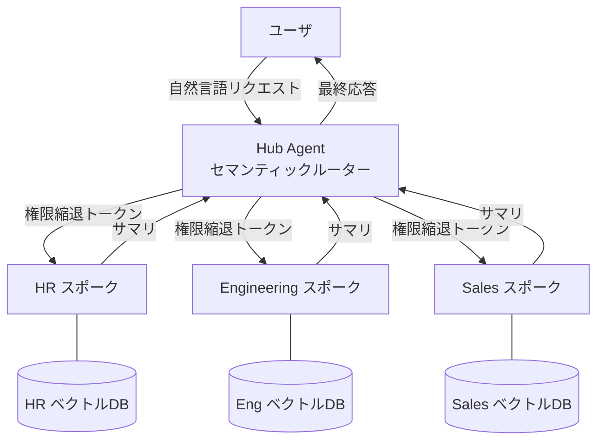

# RT-1 Org-Hierarchical Hub & Spoke（意図ルーティング＋ドメインスポーク）

## 概要

従業員は「有給の残日数を教えて」とも「この商談のステータスを更新して」とも問いかけます。そのすべてを万能エージェントに任せると、コンテキストは膨れ、権限も一カ所に集中してしまいます。このパターンでは、従業員は全社ポータル（Hub）に話しかけるだけで済みます。Hub が意図を判別し、HR・Engineering・Sales などの専門エージェント（Spoke）に処理を委譲します。各 Spoke は自分の担当 SaaS だけを扱い、権限は Hub → Spoke の方向にのみ減衰して渡されます。

## 解決する企業課題

エンタープライズのエージェント基盤では、単一のプロンプトに全部門のツール・ポリシー・データを詰め込む設計が頻出します。コンテキストウィンドウが枯渇するだけでなく、「Sales エージェントが HR データにアクセスできる」「HR の API 変更が Sales 機能を壊す」という影響の連鎖が実害につながります。

権限の観点でも問題は深刻です。部門ごとに異なるデータ分類・アクセスポリシーが存在するにもかかわらず、単一エージェントに全ツールを持たせると、権限を部門ごとに分離する仕組みが設計上なくなってしまいます。最小権限原則・職務分離というガバナンス要件に正面から違反する形になります。

変更管理の面でも同様です。特定 SaaS の API 変更がシステム全体に波及する構造は、CI/CD サイクルと組織の自律性を著しく損ないます。HR 部門が Workday の API バージョンをアップグレードしても、Sales や Engineering の機能に影響が及ぶべきではありません。

このパターンはコンテキスト分割・権限縮退・変更局所化の3つを一つの設計で解決します。

!!! tip "最小成立条件（MVP）"
    1つのハブと2つのスポーク（例：HR と Sales）を用意し、意図分類で振り分ける構成。権限縮退は OBO トークンでなくスポークごとのサービスアカウント＋スコープ制限でも初期は成立します。

## 価値仮説

組織構造に沿ったルーティングにより、従業員が適切な専門エージェントに即座に到達できます。たらい回しの排除は従業員体験を向上させ、エージェント定着率と業務効率の双方を高めます。

## 解決策と設計

解決策の核心は「組織の責任境界をエージェントのトポロジに写像すること」です。部門が権限境界・ツール所有・SaaS 連携の単位でもある企業では、エージェント構成をその境界に揃えるのが最も自然な設計になります。ハブは意図分類とルーティングのみを担い、ドメイン固有の知識は各スポークが保持します。

ハブはセマンティックルーターとして機能し、リクエストのドメインを分類します。分類結果に基づいて対象スポークを選択し、権限縮退トークン（OBO トークン）を付けて呼び出す形です。各スポークは自身のドメインに特化したツール・ベクトル DB・ケイパビリティを保有します。処理が完了するとスポークはサマリをハブへ返し、ハブがユーザへ最終応答を組み立てます。



権限の減衰（permission attenuation）は全ルートで強制されます。ハブは呼び出し元ユーザの権限を委譲トークンに変換してスポークに渡すため、スポークはその権限スコープを超えた操作を要求できません。Sales スポークが HR データに無認可でアクセスするような構造的欠陥を、設計として防げます。

スポークはサマリを返すだけなので、ハブのコンテキストウィンドウに全ドメインの生データが蓄積されることもありません。各スポークは独立してスケールアップ・バージョンアップでき、ハブへの影響は局所化される点も利点です。

## 向き／不向き

| 向き | 不向き |
|---|---|
| 部門ごとに異なる権限境界・SaaS連携・ベクトルDBが存在する大規模組織 | ドメインが1〜2つしかなく、スポーク分割のオーバーヘッドがメリットを上回る小規模な用途 |
| ドメイン横断リクエストが多く、単一エージェントでのコンテキスト管理が現実的でない規模 | リクエストの大半がドメイン横断的で、ほぼ全スポークを毎回呼び出すケース（ファンアウトによるレイテンシが問題になる） |
| 各ドメインチームが独立してスポークを開発・更新する必要がある場合 | スポーク間の密結合な連携（共有状態の頻繁な読み書きなど）が前提となる業務フロー |
| — | 決定論的な RPA やフォーム処理で十分な定型業務（AI エージェント化自体が不要） |

## 要素技術・既存システム連携

- セマンティックルーター：意図分類モデル、埋め込みベクトル類似度検索
- マルチエージェントフレームワーク：LangGraph、AutoGen、CrewAI
- ドメイン別ベクトルDB：Pinecone、Weaviate、pgvector（部門ごとにテナント分離）
- ケイパビリティレジストリ：各スポークが公開するツール一覧を管理する中央カタログ
- 権限縮退：ID-4 Permission Mirror と連携し、OBO トークン（RFC 8693）でスポークに委譲
- 部門SaaS連携：Workday（HR）、Salesforce（Sales）、GitHub/Jira（Engineering）

## 落とし穴／選定の勘所

**単一メガエージェント化**。「とりあえず1エージェントに全ツール・全ポリシーを持たせる」構成は、コンテキスト汚染・権限過多・変更影響の広域化を引き起こす典型的なアンチパターンです。規模が小さいうちは問題が見えにくいですが、ドメイン数・ツール数が増えるにつれて破綻します。

**セマンティックルーターの精度不足**。ルーティングの誤分類は、リクエストが誤ったドメインのスポークに届くことを意味します。ルーターのテストカバレッジを確保し、低信頼度時のフォールバック（人間確認、複数スポーク並列呼び出しなど）も設計に組み込んでおきましょう。

**スポーク間の暗黙的な権限依存**。あるスポークが別スポークのデータを必要とする場合、ハブを経由せず直接呼び出す設計が生まれやすいです。これは権限縮退の一貫性を破壊します。スポーク間の連携は必ずハブを中継させ、権限チェックを通過させてください。

**ケイパビリティレジストリの放棄**。スポークが増えるにつれ、どのスポークがどのツールを持つかの管理が散漫になりがちです。レジストリを中央管理し、GV-2 Agent Catalog と統合しておけば崩壊を防ぎやすくなります。

**従業員面・顧客面の混在**。スポークが従業員向けと顧客向けの両方のリクエストを処理する設計は、[ID-1 二面分離](../id-identity/id1-workforce-customer-split.md)に違反します。従業員面と顧客面はハブの段階で分離し、スポークは片面のみを担当させてください。

## Interfaces

以下はこのパターンを実装する際の主要インターフェイスです。コーディングエージェントはこの定義からスタブコードを生成できます。

```yaml
interfaces:
  - name: Hub Agent (Semantic Router)
    description: "Classifies the intent of incoming user requests and routes to the appropriate spoke with an attenuated OBO token."
    input:
      request: object
    output:
      response: object
    errors:
      - code: GENERAL_ERROR
        description: "Hub Agent (Semantic Router) の処理中にエラーが発生"
    protocol: "REST / gRPC"
    implementation_hints:
      - "詳細は本文の「解決策と設計」節を参照"
    code_examples:
      typescript: |
        interface HubAgentRequest {
          userRequest: string;
          principalId: string;
          oboToken: string;
        }
        interface HubAgentResponse {
          targetSpoke: string;
          attenuatedToken: string;
          intent: string;
        }
        interface HubAgent {
          hubAgent(req: HubAgentRequest): Promise<HubAgentResponse>;
        }
      python: |
        @dataclass
        class HubAgentRequest:
            user_request: str
            principal_id: str
            obo_token: str
        
        @dataclass
        class HubAgentResponse:
            target_spoke: str
            attenuated_token: str
            intent: str
        
        class HubAgent(Protocol):
            async def hub_agent(self, req: HubAgentRequest) -> HubAgentResponse: ...
  - name: Domain Spoke Agent
    description: "Handles domain-specific tools and vector DB; returns a summary to the hub rather than raw data."
    input:
      request: object
    output:
      response: object
    errors:
      - code: GENERAL_ERROR
        description: "Domain Spoke Agent の処理中にエラーが発生"
    protocol: "REST / gRPC"
    implementation_hints:
      - "詳細は本文の「解決策と設計」節を参照"
    code_examples:
      typescript: |
        interface DomainSpokeAgentRequest {
          query: string;
          oboToken: string;
          domain: string;
        }
        interface DomainSpokeAgentResponse {
          summary: string;
          toolsUsed: string[];
          sourceRefs: string[];
        }
        interface DomainSpokeAgent {
          domainSpokeAgent(req: DomainSpokeAgentRequest): Promise<DomainSpokeAgentResponse>;
        }
      python: |
        @dataclass
        class DomainSpokeAgentRequest:
            query: str
            obo_token: str
            domain: str
        
        @dataclass
        class DomainSpokeAgentResponse:
            summary: str
            tools_used: list[str]
            source_refs: list[str]
        
        class DomainSpokeAgent(Protocol):
            async def domain_spoke_agent(self, req: DomainSpokeAgentRequest) -> DomainSpokeAgentResponse: ...
  - name: Capability Registry
    description: "Central catalog that manages the list of tools each spoke exposes, integrated with GV-2 Agent Catalog."
    input:
      request: object
    output:
      response: object
    errors:
      - code: GENERAL_ERROR
        description: "Capability Registry の処理中にエラーが発生"
    protocol: "REST / gRPC"
    implementation_hints:
      - "詳細は本文の「解決策と設計」節を参照"
    code_examples:
      typescript: |
        interface CapabilityRegistryRequest {
          spokeId: string;
        }
        interface CapabilityRegistryResponse {
          tools: object[];
          updatedAt: Date;
        }
        interface CapabilityRegistry {
          capabilityRegistry(req: CapabilityRegistryRequest): Promise<CapabilityRegistryResponse>;
        }
      python: |
        @dataclass
        class CapabilityRegistryRequest:
            spoke_id: str
        
        @dataclass
        class CapabilityRegistryResponse:
            tools: list[dict]
            updated_at: datetime
        
        class CapabilityRegistry(Protocol):
            async def capability_registry(self, req: CapabilityRegistryRequest) -> CapabilityRegistryResponse: ...
```

## 関連パターン

- [RT-2 RACI-based Multi-Agent Orchestration](rt2-raci-multi-agent.md)：補完関係。Hub & Spoke のスポーク間調整に RACI の責任割り当てを組み合わせると、ドメイン間の責任境界が明確になります。
- [ID-4 Permission Mirror & Least-of](../id-identity/id4-permission-mirror-least-of.md)：補完関係。スポークへの権限縮退委譲を OBO トークンで実装する際の基盤パターンです。
- [EX-1 Enterprise Agent Gateway](../ex-experience/ex1-enterprise-agent-gateway.md)：補完関係。ユーザリクエストが Hub に届く前段のゲートウェイとして組み合わせます。
- [KM-4 Scoped Memory Hierarchy](../km-knowledge/km4-scoped-memory-hierarchy.md)：補完関係。スポークごとのドメイン別ベクトルDBとメモリのスコープ管理を設計する際に参照します。

## Decision Summary

```yaml
decision_summary:
  pattern: RT-1
  participates_in:
    - decision: TO-3
      role: option_a
    - decision: TO-8
      role: enabler
  recommended_if:
    - "複数部門をまたぐ意図ルーティングが必要"
    - "組織階層に沿ったエスカレーションが必要"
  avoid_if:
    - "単一部門のみ"
  combines_with: [RT-2, RT-3, EX-1, GV-1]
  conflicts_with: []
  value_outcome:
    drivers: [automation, employee_efficiency]
    kpis: [ルーティング精度, スポーク応答率]
  mvp: "ハブ＋2〜3スポーク構成でパイロット"
  cost: M
```
